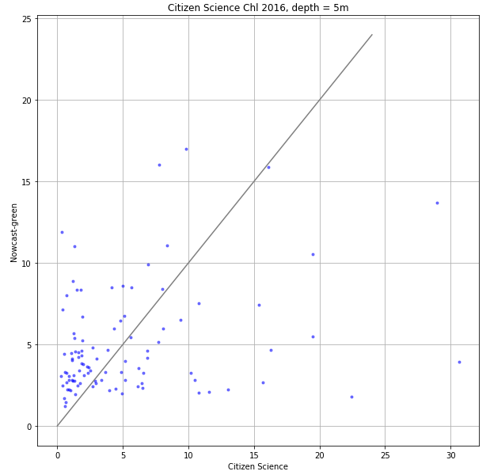
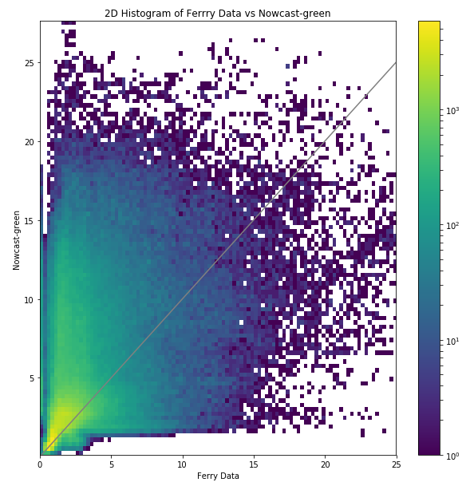

.. _Chlorophyll:

********************
Chlorophyll
********************

Citizen Science
====================

2016 chlorophyll measurements from the Citizen Science program was compared with the model. 
Samples with quality flag of 4 were not compared, leading to 99 usuable sample. 

+-------------------------+-----------------+
|    Statistic            | Value           |
+=========================+=================+
| bias                    | -0.250162993682 |
+-------------------------+-----------------+
| RMSE                    | 5.88331979575   |
+-------------------------+-----------------+
| Willmott Skill Score    | 0.512476372038  |
+-------------------------+-----------------+

`CitSci Chl notebook`_

.. _CitSci Chl notebook: https://nbviewer.jupyter.org/urls/bitbucket.org/salishsea/analysis-vicky/raw/tip/notebooks/ModelEvaluations/CitSciChl2016-hourly.ipynb

Ferry
=======================

In addition to not using chlorophyll data where the one or more of longitude, 
latitude, chlorophyll, or time is masked, ferry chlorophyll values > 25 :math:`\mu` g / L were excluded. 

+-------------------------+-----------------+
|    Statistic            | Value           |
+=========================+=================+
| bias                    | 2.18282683221   |
+-------------------------+-----------------+
| RMSE                    | 4.86143879112   |
+-------------------------+-----------------+
| Willmott Skill Score    | 0.498952254572  |
+-------------------------+-----------------+

`Ferry Chl notebook`_

`Ferry Chl separated by longitude notebook`_

.. _Ferry Chl notebook: https://nbviewer.jupyter.org/urls/bitbucket.org/salishsea/analysis-vicky/raw/tip/notebooks/ModelEvaluations/FerryChlVsNowcastGreen.ipynb
.. _Ferry Chl separated by longitude notebook: https://nbviewer.jupyter.org/urls/bitbucket.org/salishsea/analysis-vicky/raw/tip/notebooks/ModelEvaluations/FerryChlVsNowcastGreen-bylongitude.ipynb
