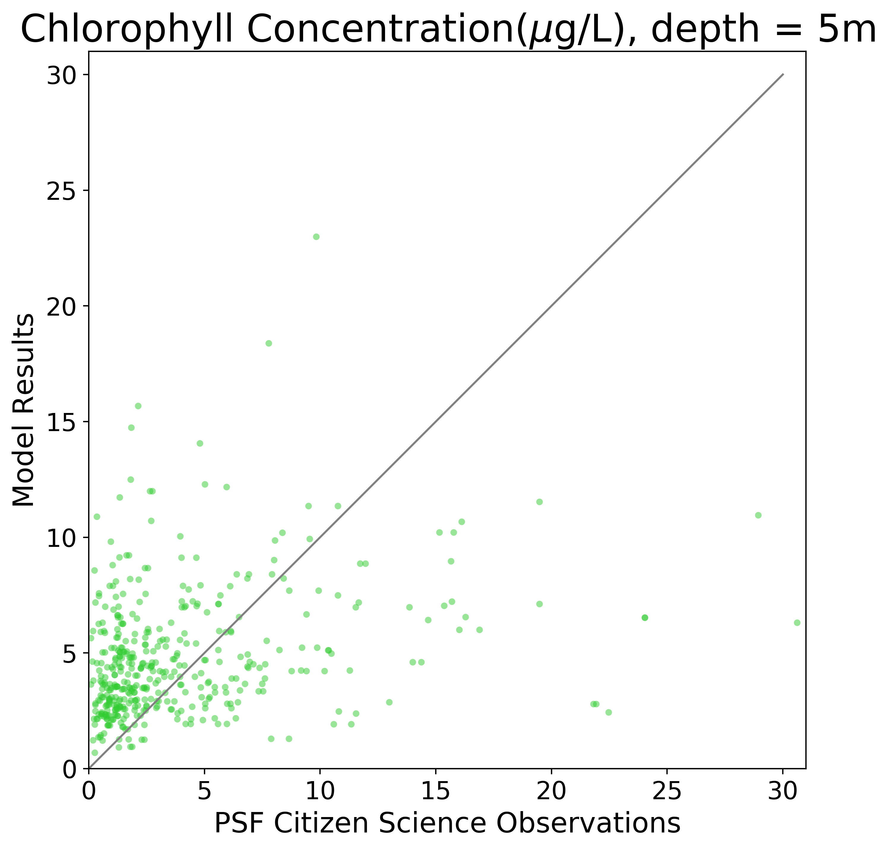

.. _Chlorophyll:

********************
Chlorophyll
********************

Citizen Science
====================

2015-2017 chlorophyll measurements from the Citizen Science program was compared with the model. 

+-------------------------+-------------------+
|    Statistic            | Value             |
+=========================+===================+
| bias                    | 0.864778575809408 |
+-------------------------+-------------------+
| RMSE                    | 4.599369232848489 |
+-------------------------+-------------------+
| Willmott Skill Score    | 0.5048541500786355|
+-------------------------+-------------------+

`CitSci Chl 2015`_

`CitSci Chl 2016`_

`CitSci Chl 2017`_

.. _CitSci Chl 2015: https://nbviewer.jupyter.org/urls/bitbucket.org/salishsea/analysis-vicky/raw/tip/notebooks/ModelEvaluations/CitSciChl2015.ipynb

.. _CitSci Chl 2016: https://nbviewer.jupyter.org/urls/bitbucket.org/salishsea/analysis-vicky/raw/tip/notebooks/ModelEvaluations/CitSciChl2016-hourly.ipynb

.. _CitSci Chl 2017: https://nbviewer.jupyter.org/urls/bitbucket.org/salishsea/analysis-vicky/raw/tip/notebooks/ModelEvaluations/CitSciChl2017-hourly.ipynb
Ferry
=======================

In addition to not using chlorophyll data where one or more of longitude, 
latitude, chlorophyll, or time is masked, ferry chlorophyll values > 25 :math:`\mu` g / L were excluded. 

+-------------------------+-----------------+
|    Statistic            | Value           |
+=========================+=================+
| bias                    | 2.18282683221   |
+-------------------------+-----------------+
| RMSE                    | 4.86143879112   |
+-------------------------+-----------------+
| Willmott Skill Score    | 0.498952254572  |
+-------------------------+-----------------+

.. figure:: images/ferrychl.png

`Ferry Chl notebook`_

`Time series notebook`_

.. _Ferry Chl notebook: https://nbviewer.jupyter.org/urls/bitbucket.org/salishsea/analysis-vicky/raw/tip/notebooks/ModelEvaluations/FerryChlVsNowcastGreen-bylongitude-Copy1.ipynb

.. _Time series notebook: https://nbviewer.jupyter.org/urls/bitbucket.org/salishsea/analysis-vicky/raw/tip/notebooks/ModelEvaluations/FerryChl2017-lon.ipynb

IOS cruises
=====================

+-------------------------+--------------------+
|    Statistic            | Value              |
+=========================+====================+
| bias                    | 1.1295675984707625 |
+-------------------------+--------------------+
| RMSE                    | 3.1130318776174235 |
+-------------------------+--------------------+
| Willmott Skill Score    | 0.6498509292361905 |
+-------------------------+--------------------+

