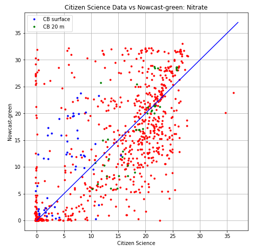
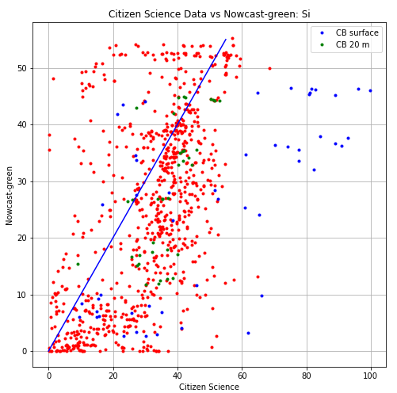

.. _Nutrients:

******************
Nutrients
******************

Citizen Science
=========================

Nitrate and silicon were compared with the model. Samples taken from Cowichan Bay were not taken into account when calculating the statistics. 

+-----------------------+-----------------+----------------+
|    Statistic          |  Nitrogen       |    Silicon     |         
+=======================+=================+================+
| bias                  | 0.111189908639  | -6.08137196845 | 
+-----------------------+-----------------+----------------+
| RMSE                  | 7.98429582412   | 15.6308770771  | 
+-----------------------+-----------------+----------------+
| Willmott Skill Score  | 0.822351425613  | 0.735129802424 |
+-----------------------+-----------------+----------------+

`CitSci Nutrients notebook`_

.. _CitSci Nutrients notebook: https://nbviewer.jupyter.org/urls/bitbucket.org/salishsea/analysis-vicky/raw/tip/notebooks/smelt_diag/CitizenScienceNutrients-surface.ipynb
