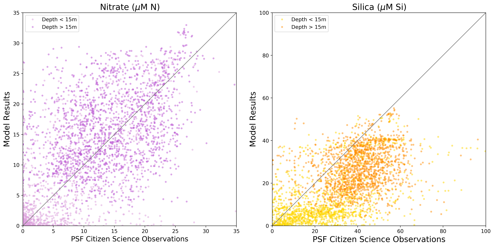
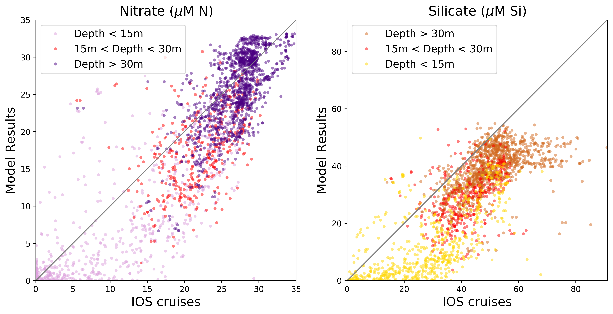
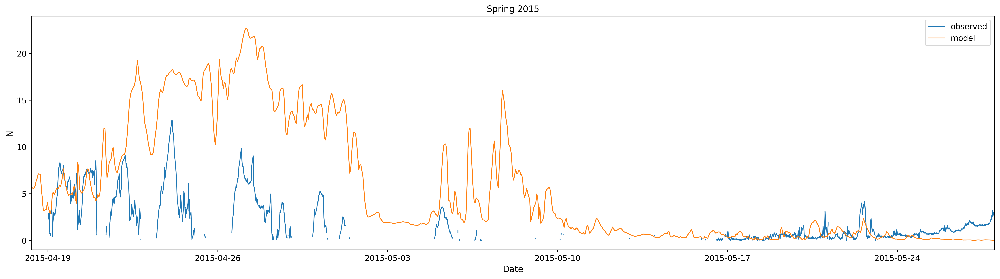

.. _Nutrients:

******************
Nutrients
******************

Citizen Science
=========================

Nitrate and silica observation were compared with the model. 

+-----------------------+-------------------+---------------------+
|    Statistic          |  Nitrate          |    Silica           |         
+=======================+===================+=====================+
| bias                  | 0.8947724863656923| -13.375982797018917 | 
+-----------------------+-------------------+---------------------+
| RMSE                  | 7.026915453406394 | 19.691922315063145  | 
+-----------------------+-------------------+---------------------+
| Willmott Skill Score  | 0.8232355848913526| 0.6499662706883669  |
+-----------------------+-------------------+---------------------+

`CitSci Nutrients 2015`_

`CitSci Nutrients 2016`_

`CitSci Nutrients 2017`_

.. _CitSci Nutrients 2015: https://nbviewer.jupyter.org/urls/bitbucket.org/salishsea/analysis-vicky/raw/tip/notebooks/smelt_diag/CitizenScienceNutrients-surface.ipynb

.. _CitSci Nutrients 2016: https://nbviewer.jupyter.org/urls/bitbucket.org/salishsea/analysis-vicky/raw/tip/notebooks/ModelEvaluations/CitSciNutrients2016-hourly.ipynb

.. _CitSci Nutrients 2017: https://nbviewer.jupyter.org/urls/bitbucket.org/salishsea/analysis-vicky/raw/tip/notebooks/ModelEvaluations/CitSciNutrients2017-hourly.ipynb

IOS cruises
======================

+-----------------------+-------------------+---------------------+
|    Statistic          |  Nitrate          |    Silica           |
+=======================+===================+=====================+
| bias                  | -2.35359531664837 | -12.516292687941863 |
+-----------------------+-------------------+---------------------+
| RMSE                  | 5.36571883921976  | 15.864570645189147  |
+-----------------------+-------------------+---------------------+
| Willmott Skill Score  | 0.912549833123462 | 0.7493683577201395  |
+-----------------------+-------------------+---------------------+

`IOS notebook`_

.. _IOS notebook: https://nbviewer.jupyter.org/urls/bitbucket.org/salishsea/analysis-vicky/raw/tip/notebooks/ModelEvaluations/DFO-comparison.ipynb

Sentry Shoal
=====================

Observations were made at 1m.

+-----------------------+--------------------+
|    Statistic          |  Nitrate           |   
+=======================+====================+
| bias                  | -1.8818928507550012| 
+-----------------------+--------------------+
| RMSE                  | 5.801877196234966  | 
+-----------------------+--------------------+
| Willmott Skill Score  | 0.8469078330784996 |
+-----------------------+--------------------+

`SS notebook`_

.. _SS notebook: https://nbviewer.jupyter.org/urls/bitbucket.org/salishsea/analysis-vicky/raw/8ca381f44ed2a112e9fa749e7508d36d74a50eb8/notebooks/ModelEvaluations/SentryShoalNitrate.ipynb 
