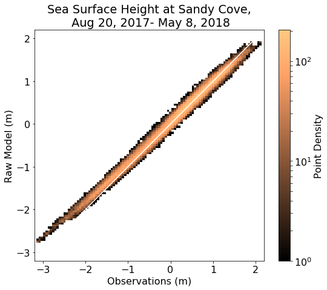
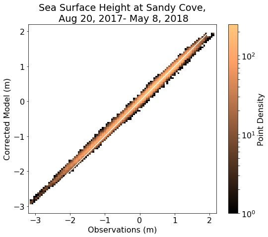
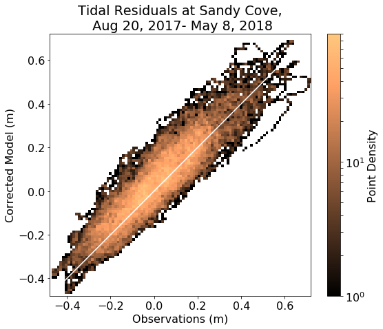

.. _StormSurgeSSH:

**************
Storm Surge
**************

Sea level height for Sandy Cove was extracted from the CHS water level observations and compared to the model results using a `notebook`_.

.. _notebook: https://nbviewer.org/github/SalishSeaCast/analysis-susan/blob/master/notebooks/TideData/SandyCoveStats.ipynb

Raw Sea level from the Model is well-correlated with the observations and when the unmodelled constituents are added, the correlation improves.  Even when removing the tides, the sea level is very well predicted.

+-------------------------+--------------+-------------------+----------+
|    Statistic            | Model (Raw)  | Model (Corrected) | Residual |
+=========================+==============+===================+==========+
| bias                    | 0.03         | 0.03              | 0.03     |
+-------------------------+--------------+-------------------+----------+
| RMSE                    | 0.11         | 0.08              | 0.08     |
+-------------------------+--------------+-------------------+----------+
| Willmott Skill Score    | 0.997        | 0.998             | 0.947    |
+-------------------------+--------------+-------------------+----------+

One note, the maximum amplitude of the tides seems small.  See the first two figures.

