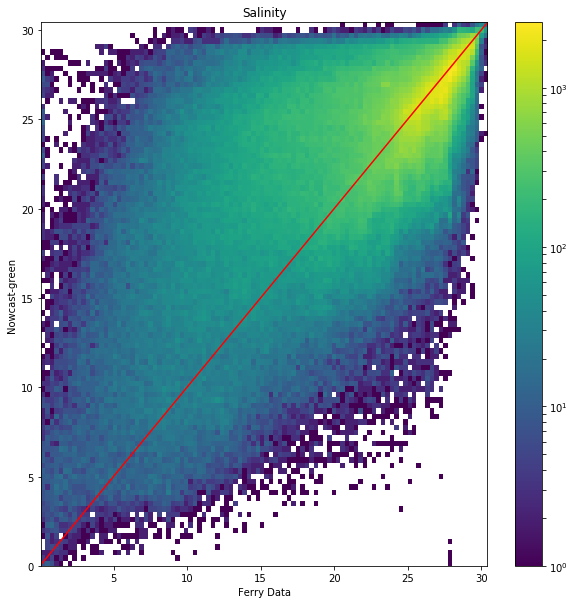
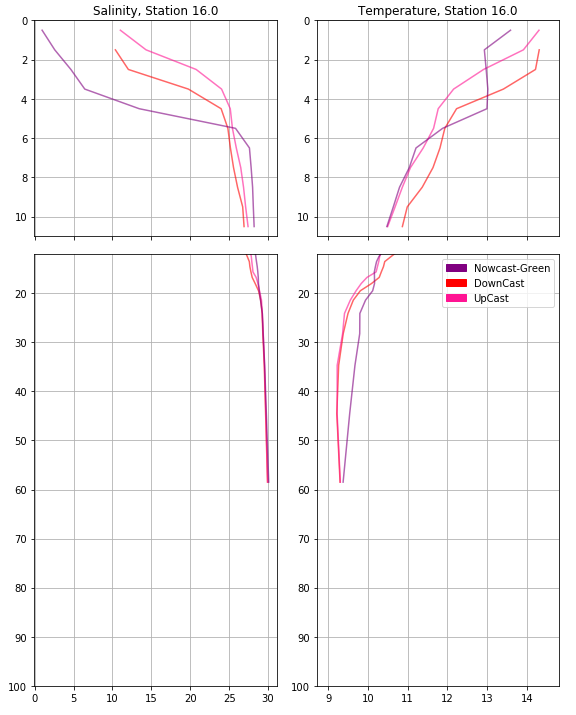
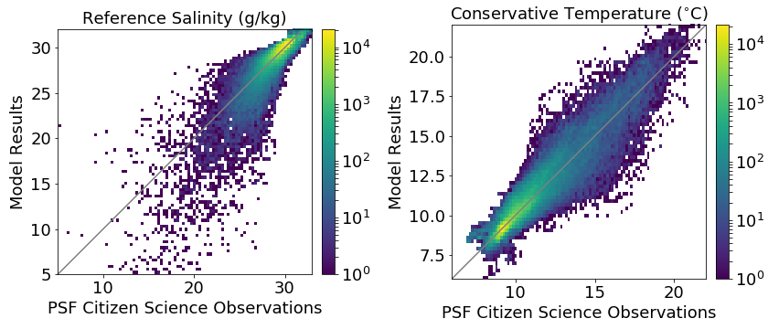
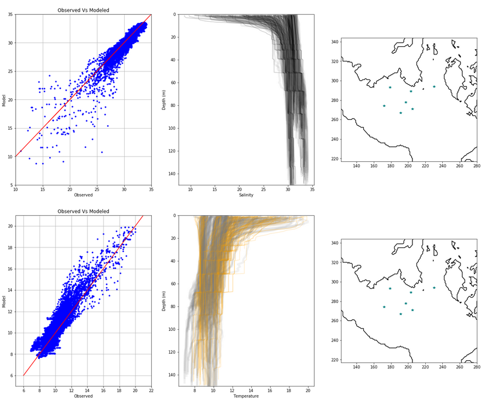
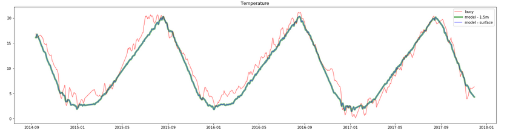
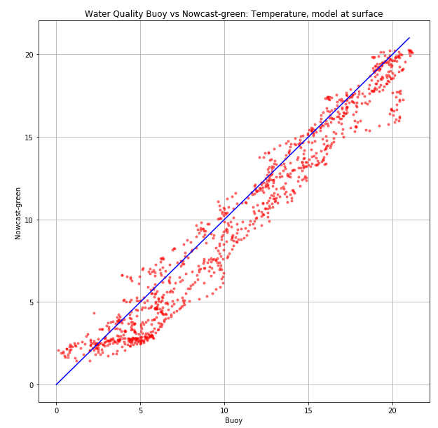
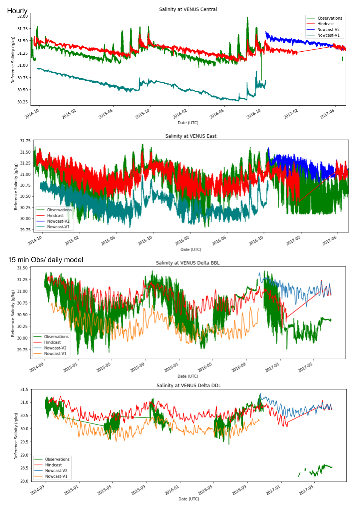

.. _Temperature and Salinity:

*************************
Temperature and Salinity
*************************

Ferry
=================
Only samples with valid times, longitude, latitude, and salinity values were used in the compairson. 

+-------------------------+-----------------+
|    Statistic            | Value           |
+=========================+=================+
| bias                    | 1.31896498726   |
+-------------------------+-----------------+
| RMSE                    | 4.87441305346   |
+-------------------------+-----------------+
| Willmott Skill Score    | 0.826853348807  |
+-------------------------+-----------------+

`Ferry salinity notebook`_

`Ferry salinity separted by longitude notebook`_

.. _Ferry salinity notebook: https://nbviewer.jupyter.org/urls/bitbucket.org/salishsea/analysis-vicky/raw/tip/notebooks/ferrysalinityvsnowcastgreen.ipynb
.. _Ferry salinity separated by longitude notebook: https://nbviewer.jupyter.org/urls/bitbucket.org/salishsea/analysis-vicky/raw/tip/notebooks/ModelEvaluations/ferrysalinityvsnowcastgreen-by-longitude.ipynb 

Fraser Plume ctd
========================

Statistics, available in the notebook below, were calculated for each depth. 
An example depth profile from May 31, 2017 is shown below.

`CTD casts notebook`_

.. _CTD casts notebook: https://nbviewer.jupyter.org/urls/bitbucket.org/salishsea/analysis-vicky/raw/tip/notebooks/ModelEvaluations/CTDvsNowcastgreen.ipynb

Citizen Science
======================

In addition to an observation - model plot that includes both 2015 and 2016, separate comparisons were also made fo each region. The Victoria stations are shows below. 

`CitSci - full notebook`_

`CitSci - single days notebook`_

`CitSci - single depth profiles notebook`_

.. _CitSci - full notebook: https://nbviewer.jupyter.org/urls/bitbucket.org/salishsea/analysis-vicky/raw/tip/notebooks/ModelEvaluations/updated-nowcast-comparisons.ipynb
.. _CitSci - single days notebook: https://nbviewer.jupyter.org/urls/bitbucket.org/salishsea/analysis-vicky/raw/tip/notebooks/ModelEvaluations/updated-nowcast-comparisons-singledays.ipynb
.. _CitSci - single depth profiles notebook: https://nbviewer.jupyter.org/urls/bitbucket.org/salishsea/analysis-vicky/raw/tip/notebooks/ModelEvaluations/CitSci-single-depth-profiles.ipynb

Water quality buoy
=========================

Comparison to the model temperature was made at the model's surface and depth = 1.5m, as well as daily and hourly averaged values. 
Below, statistics and plots are for model surface, and the observation - model plot is using the daily average. 

+-----------------------+-----------------+-------------------+
|    Statistic          |  Hourly Averaged| Daily Averaged    |
+=======================+=================+===================+
| bias                  | -0.834625751208 | -0.832611264165   |
+-----------------------+-----------------+-------------------+
| RMSE                  | 1.48700936448   | 1.47607008425     |
+-----------------------+-----------------+-------------------+
| Willmott Skill Score  | 0.983537985575  | 0.983654461941    |
+-----------------------+-----------------+-------------------+

`Water quality buoy notebook (daily averages)`_

`Water quality buoy notebook (hourly interpolated averages)`_

.. _Water quality buoy notebook (daily averages): https://nbviewer.jupyter.org/urls/bitbucket.org/salishsea/analysis-vicky/raw/tip/notebooks/ModelEvaluations/waterqualitybuoy-daily.ipynb
.. _Water quality buoy notebook (hourly interpolated averages): https://nbviewer.jupyter.org/urls/bitbucket.org/salishsea/analysis-vicky/raw/tip/notebooks/ModelEvaluations/waterqualitybuoy-hourly.ipynb

VENUS nodes
======================

Comparison to the observed salinity were made to the model's (then called hindcast) salinity. 

