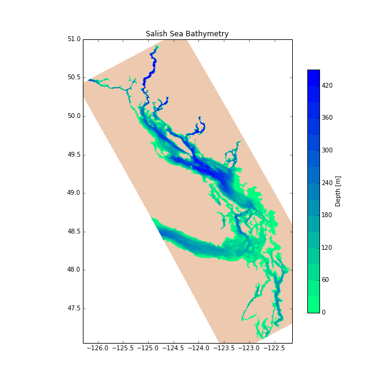

.. _about:

About the Project
======================================

The Salish Sea is home to a large population of Canadians living in coastal communities at risk to ocean related hazards. There is an ongoing need to assess the impact of these hazards on human and marine environments through a multidisciplinary approach involving Canadian oceanographers, biologists, and social scientists. The Marine Environmental Observation Prediction and Response network (`MEOPAR <http://meopar.ca/>`_) provides a platform to accelerate this type of research. 

The Salish Sea MEOPAR project team is developing a three-dimensional ocean model for the Strait of Georgia and Salish Sea.  Using the `NEMO <http://www.nemo-ocean.eu/>`_ modelling architecture the Salish Sea model will be used to evaluate storm surge risk in coastal communities.  Long term goals include data assimilation from the VENUS network and a coupled biogeochemical modelling component.

