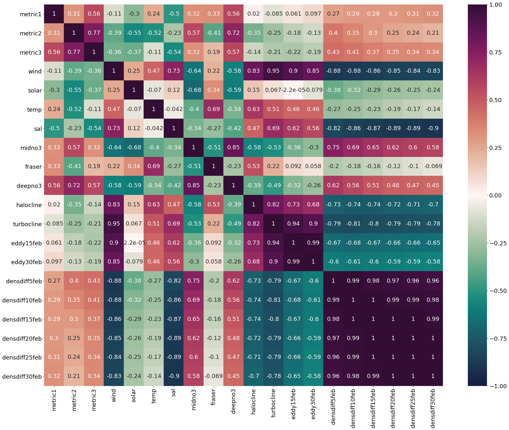
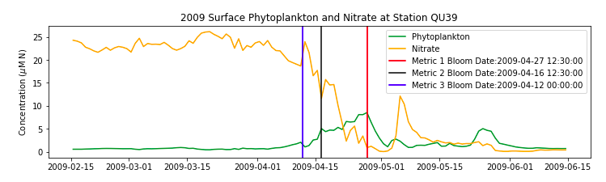
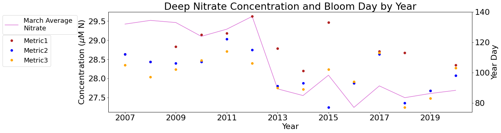
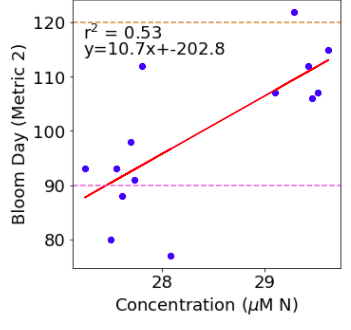

.. _QU39_analysis:

=================================================
Northern SoG Bloom Timing Analysis (Station QU39)
=================================================

Station QU39 is located in the Northern Strait of Georgia, at the southern end of Sutil Channel, between Quadra Island and Cortes Island. QU39 is an oceanographic field station, and is regularly sampled by the Hakai Institute [1]_.

A time series of phytoplankton concentrations, environmental forcings and bloom timing at 
Station QU39 from 2007-2020 can be found in this notebook_. As with Station S3, the environmental drivers were averaged over each month for January, February and March. Unlike with the Station S3 analysis, the correlations between environmental drivers and bloom dates for each of the metrics were inconsistent at this location (Figure 1). Through visual examination of time series of spring phytoplankton concentrations and bloom dates for each year (2007-2020), metric 2 was assessed to be the most appropriate bloom timing diagnostic at this location and was solely analyzed in the subsequent analyses (Figure 2). These time series of phytoplankton concentrations for each year (2007-2020) can be found here_.

   **Figure 1.** Heatmap of correlation coefficients between bloom dates for each definition (metric 1, metric 2 and metric 3) and environmental drivers averaged through March. 

   **Figure 2.** Time series of daily phytoplankton and nitrate concentrations from February 15-June 14th 2009 at Station QU39. Vertical lines represent the spring bloom date according to each of the 3 metrics. For this year, Metric 2 bloom date occurs when phytoplankton concentration reaches the first sustained peak, which is when a visual interpretation of the spring bloom would be considered. This situation is consistent throughout the time series. 

Next, correlation, residuals analysis and multiple linear regression (Table 1) were done on environmental forcings and bloom timing. All of these analyses_ are included in a single notebook. By looking at 3 correlation plots between bloom date and environmental driver averages for January, February and March, the most significant correlations were once again seen in the March averages (Figure 1). 

The most correlated driver with bloom timing at Station QU39 was deep nitrate concentrations averaged across the Strait of Georgia. The strong positive relationship with this driver could be associated with deep water renewal. A second possible reason for this correlation could be due to a drift in the model that was corrected in 2013 (Figure 3, Figure 4), which is why we cannot confidently consider deep nitrate as a spring bloom driver from this analysis. 

   **Figure 3.** Time series of March average deep nitrate concentrations (below 250m) across the entire SoG and spring phytoplankton bloom timing according to three different metrics. Notice the drastic drop in nitrate concentrations from 2013 on. 

   **Figure 4.** Correlation between March average deep nitrate concentration and spring 
   phytoplankton bloom timing according to metric 2. The cluster on the left hand side are the years after 2012, and the cluster on the right are the years before 2013.

Correlation and multiple linear regression analysis suggests solar radiation to be a primary driver of spring bloom timing at Station QU39, with surface temperature being a secondary driver. The mechanisms in which these environmental factors relate to bloom timing are explained in-depth on the Central SoG Bloom Timing Analysis page. 

Density differences from the surface to 30m in depth looked to be the third most correlated driver with spring bloom timing, indicating that stratification plays a large role in bloom timing.
Halocline depth is another factor that relates to stratification, which is considered the next key environmental driver at this location. At Station S3, salinity differences in the water column are controlled by the Fraser river due to its proximity to the river mouth, whereas at Station QU39, it is more so dependent on local rivers. The depth of the halocline is the depth at which the largest rate of change in salinity is found, indicating that mixing may be occurring above, but does not mix deeper than the halocline depth. This mixing has important implications for bloom timing, as deep mixing limits the phytoplankton’s exposure to light, and could delay a bloom. 

To summarize, the analysis for Station QU39 determined four key environmental drivers of spring phytoplankton bloom timing at this location. In order from most to least correlated, the most important drivers are solar radiation, surface temperature, density differences in the upper 30m, and the depth of the halocline. These findings are different from the environmental drivers at Station S3. A comparison can be found on the following page. 

**References:**

.. [1] Evans W., Pocock K., Hare A., Weekes C., Hales B., Jackson J., Gurney-Smith H., Mathis J. T., Alin S. R. & Feely R. A., 2019. Marine CO2 patterns in the northern Salish Sea. Frontiers in Marine Science 5: 536. doi: 10.3389/fmars.2018.00536

.. _notebook: bloom_notebooks/201905EnvironmentalDrivers_QU39.ipynb

.. _here: bloom_notebooks/bloom_func_check.ipynb#Time-series

.. _analyses: bloom_notebooks/201905analysis_QU39.ipynb

