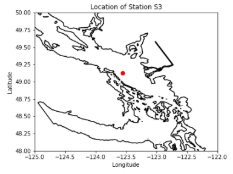
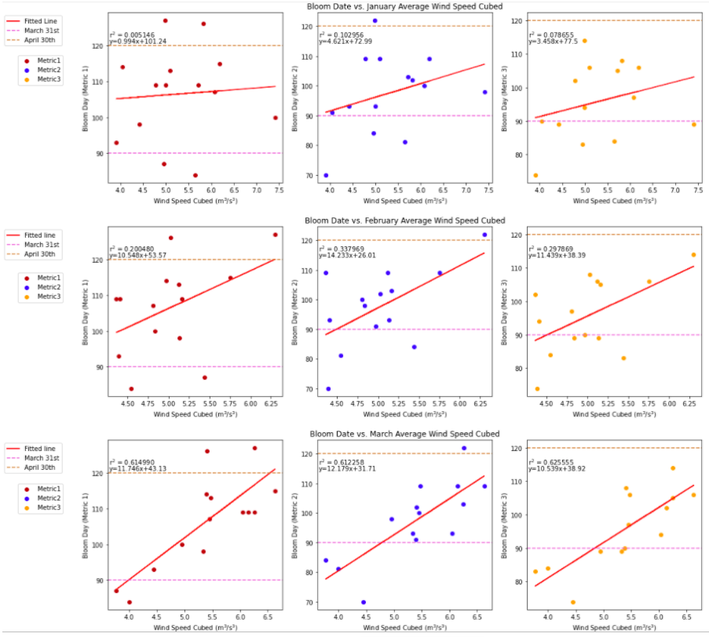
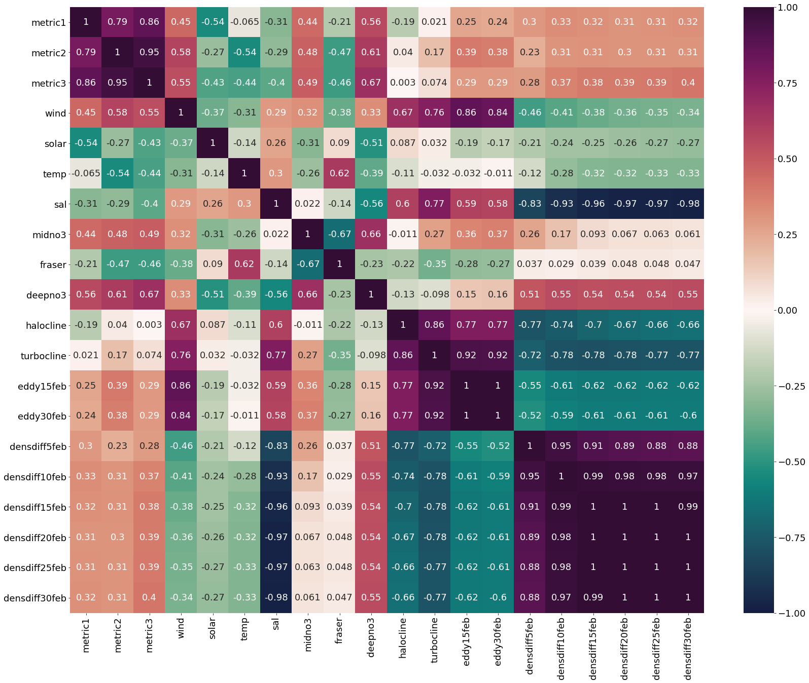
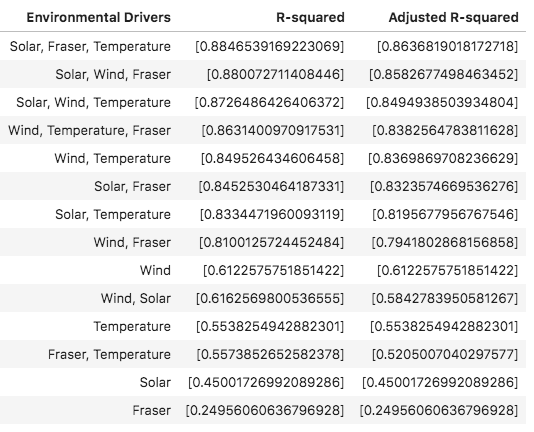

.. _S3_analysis:

==============================================
Central SoG Bloom Timing Analysis (Station S3)
==============================================

Station S3 is a location off the central/south east coast of Vancouver Island. It was chosen as 
the first location to examine in order to compare to the results of a previous environmental driver 
analysis of spring bloom timing based on a 1-dimensional model [1]_ that served as a starting 
point from which the present 3-dimensional implementation was developed.

   **Figure 1.** Location of Station S3, indicated by the red dot.
												
A time series of phytoplankton concentrations, environmental forcings and bloom timing at 
Station S3 from 2007-2020 can be found in this notebook_. The environmental drivers were 
averaged over each month for January, February and March. It was found that the most 
significant relationships between bloom date and drivers occurred in March. This is apparent for 
wind speeds (Figure 2), as well as other bloom date versus environmental driver plots found in 
this time series notebook_. Although a strong negative relationship between March zooplankton 
concentrations and bloom timing was observed, it was decided to not explore that correlation further, 
as the variation in zooplankton concentration was likely a direct result of the timing of the spring 
phytoplankton bloom.

   **Figure 2.** Correlation between monthly averaged wind speed cubed and bloom timing 
   according to three different metrics. The bottom three plots show that the highest R-squared 
   values of the regression between bloom date and average wind speed cubed occurs in March, 
   relative to the regressions for January and February. 

Next, correlation, residuals analysis and multiple linear regression (Table 1) were done on 
environmental forcings and bloom timing. The notebook can be found here_. By looking at 3 
correlation plots between bloom date and environmental driver averages for January, February 
and March, the most significant correlations were once again seen in the March averages 
(Figure 3). 

   **Figure 3.** Heatmap of correlation coefficients between bloom dates for each definition 
   (metric 1, metric 2 and metric 3) and environmental drivers averaged through March.

It was found that the most correlated driver with bloom date was wind speed cubed, with 
turbocline depth being a close second. While turbocline depth has strong correlations with 
bloom timing, it is also very highly correlated with wind speed variability. Due to the causal 
relationship between wind speeds and turbocline depth through wind driven mixing, our 
interpretation is that wind is the key environmental driver in this location. There is a strong 
positive relationship between wind and bloom timing because stronger wind leads to increased 
mixing near the surface. When phytoplankton are mixed to greater depth, their average 
exposure to light is reduced, leading to slower growth and a delayed bloom. Additionally, the 
surface phytoplankton concentration is reduced through dilution. In contrast, early stratification 
allows phytoplankton to remain concentrated near the surface and be exposed to greater light 
levels than when mixed to greater depths, leading to an earlier bloom. 

.. figure::wind_timeseries_S3.png

   **Figure 4.** Time series from 2007-2020 of monthly averaged wind speed cubed (left axis) and 
   bloom dates (right axis) according to three different metrics. The lines connecting the 
   interannual variability in wind speed cubed hold no meaning, and are simply present to easily 
   distinguish between the environmental driver and the bloom date. 

The next strongest correlation with bloom timing was solar radiation. Higher solar radiation 
(reduced cloud cover) in March exposes phytoplankton to greater light levels, which promotes 
faster growth and, consequently, an earlier bloom (Figure 5). Additionally, solar radiation 
increases near-surface temperature. Solar radiation is strongly anti-correlated with wind, 
meaning years with low winds also experience high solar radiation. These combining effects 
have a strong influence on bloom development.

.. figure::solar_timeseries_S3.png

   **Figure 5.** Time series from 2007-2020 of monthly averaged solar radiation (left axis) and 
   bloom dates (right axis) according to three different metrics. The lines connecting the 
   interannual variability in solar radiation hold no meaning, and are simply present to easily 
   distinguish between the environmental driver and the bloom date. 

.. figure::solar_vs_bloom_S3.png

   **Figure 6.** Correlation between March average solar radiation and spring phytoplankton 
   bloom timing according to three different metrics. A negative relationship is observed between 
   this environmental driver and bloom timing. 

Temperature itself was the third environmental condition that was highly correlated with bloom 
timing at station S3. Temperature can influence bloom timing in multiple ways. All biological 
rates in the model have temperature dependence. Phytoplankton growth rates increase at 
warmer temperatures, but so do grazing and mortality. However, during the spring bloom period, 
a time of net primary production, the increase in phytoplankton growth rate at warmer 
temperatures can be expected to outweigh the increase in loss terms. Lower dominant 
zooplankton biomass has been observed during warmer years, which would decrease grazing 
pressure on phytoplankton and result in an earlier bloom [2]_. Although temperature 
can affect stratification due to vertical differences in density, the effects are small compared to 
the temperature dependence on the rates of mortality, grazing and growth [1]_.

.. figure::temp_timeseries_S3.png

   **Figure 7.** Time series from 2007-2020 of monthly averaged surface conservative 
   temperature (left axis) and bloom dates (right axis) according to three different metrics. The 
   lines connecting the interannual variability in surface temperature hold no meaning, and are 
   simply present to easily distinguish between the environmental driver and the bloom date. 

.. figure::temp_vs_bloom_S3.png

   **Figure 8.** Correlation between March average surface conservative temperature and spring 
   phytoplankton bloom timing according to three different metrics. A negative relationship is 
   observed between this environmental driver and bloom timing.  

Another possible tertiary environmental driver for spring bloom timing at station S3 is the Fraser 
river input. Although the Fraser flow initially had a weak correlation with bloom timing, residual 
analysis showed that when wind or solar radiation effects were subtracted, there was a strong 
negative relationship of the residuals with Fraser flow. The Fraser river is the most significant 
single source of freshwater to the Salish Sea. When Fraser flow rates are high in March, it 
creates strong stratification between low salinity surface waters and high salinity deep waters. 
Similarly to the effects of wind, this stratification allows phytoplankton to be mixed at shallower 
depths, which exposes them to more light and results in fast growth and an early bloom. 
Although mid-depth nitrate concentrations (30-90m) had high correlations with bloom timing, it 
was determined from examining a time series that the variation of this environmental factor 
likely resulted from rather than drove bloom timing. 

.. figure::fraser_vs_bloom_S3.png

   **Figure 10.** Correlation between March average Fraser river flow and spring phytoplankton 
   bloom timing according to three different metrics. A negative relationship is observed between 
   this environmental driver and bloom timing.

.. figure::windresid_vs_fraser_S3.png

   **Figure 10.** Correlation between March average Fraser river flow and the residuals from 
   regression of March wind speed cubed and bloom timing according to three different metrics. 
   This signifies that when the variability from wind is removed, a strong relationship between 
   Fraser flow and bloom timing is observed. 

In summary, this analysis identifies the four strongest environmental drivers of spring 
phytoplankton bloom timing at Station S3. The primary driver was found to be wind speeds, the 
secondary driver was solar radiation, and sea surface temperatures and Fraser flow rates were 
found to be equally strong tertiary drivers. This is partially consistent with the findings of Collins 
et. al (2009), which determined through analysis of a 1D model at Station S3 that the primary 
driver of the spring bloom was wind speed, with solar radiation being a secondary driver [1]_. 
They did not, however, find any effect from surface temperatures or Fraser input on 
phytoplankton bloom timing, whereas the present analysis did identify a strong impact from both 
of these factors. The effect of the Fraser River was parameterized in Collins et al. (2009) but is 
more fully represented in the present model, which could be a leading cause in this discrepancy. 

   **Table 1.** R-squared and adjusted R-squared values from regression between bloom timing 
   and one or more environmental drivers. 

**References:**

.. [1] Collins, A. K., Allen, S. E., & Pawlowicz, R. (2009). The role of wind in determining the timing of the spring bloom in the Strait of Georgia. Canadian Journal of Fisheries and Aquatic Sciences, 66(9), 1597-1616. doi:10.1139/f09-071

.. [2] Suchy, K. D., Baron, N. L., Hilborn, A., Perry, R. I., & Costa, M. (2019). Influence of environmental drivers on spatio-temporal dynamics of satellite-derived chlorophyll a in the Strait of Georgia. Progress in Oceanography, 176, 102134. doi:10.1016/j.pocean.2019.102134

.. _notebook: bloom_notebooks/201905EnvironmentalDrivers_S3.ipynb

.. _here: bloom_notebooks/201905analysis_S3.ipynb

