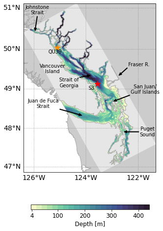

.. _bloom_timing:

********************************************
Environmental Drivers of Spring Bloom Timing
********************************************

**Spring 2021 Co-op Project by Aline Isabelle**

SalishSeaCast is a 3-dimensional NEMO-based coupled biophysical model of the Salish Sea.
The model includes many interacting processes, from important physical oceanography
dynamics to a biological food web structure, with mesozooplankton as the highest trophic level.

This analysis utilized data from the 201905 model hindcast to determine the major
environmental factors that affect the timing of the spring phytoplankton bloom in different
locations of the Salish Sea. Once time series were extracted, the relationships between
interannual variation of bloom timing and various environmental conditions were visually
examined. A suite of factors were then further investigated with correlation and linear regression
analysis.

The following pages outline the methodology used and the relevant findings.

   **Figure 1.** The two locations chosen for this analysis, Station S3 is located in the Central Strait of Georgia, and Station QU39 in the Northern Strait.

.. toctree::
   :maxdepth: 2

   bloom_definitions
   environmental_drivers
   S3_analysis
   QU39_analysis
   station_comparison
   bloom_notebooks/index
