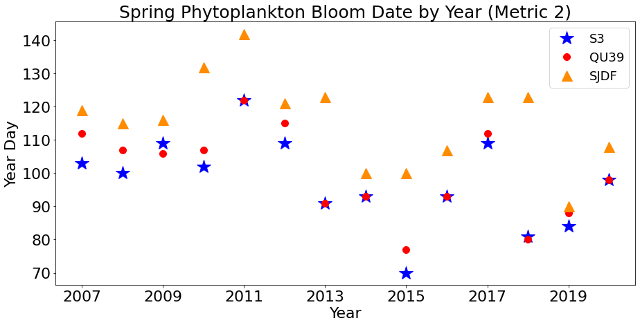
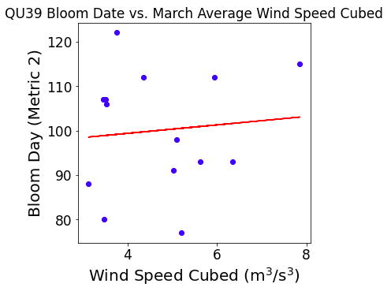
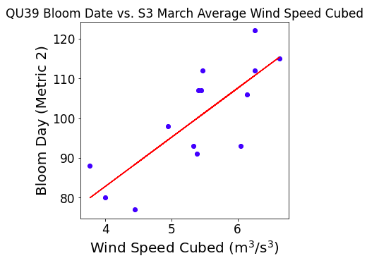
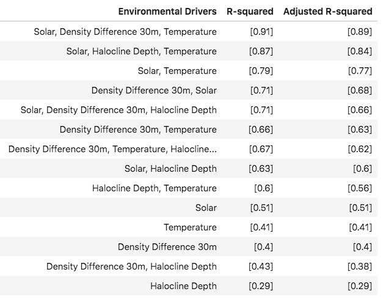

.. _station_comparison:

==============================
Comparing Stations S3 and QU39
==============================

While wind was determined to be the primary driver of spring bloom timing at Station S3, it had weak correlation at Station QU39. There is significant tidal mixing in this area of the Northern SoG [1]_, so it is possible that wind does not play as considerable a role in mixing as it does at Station S3. There is a chance that the direction of wind is more important than wind speed at Station QU39, which would influence wind driven upwelling, but it was not explored in this analysis. Additionally, it is possible that bloom timing at QU39 is more strongly influenced by non-local winds, or winds at a basin rather than local scale. Solar radiation and surface temperatures were identified as key drivers at both locations, which suggests that these factors may have a strong influence on bloom timing independent of location, although this would need to be explored further at more locations to be conclusive. Fraser river flow was another environmental driver at Station S3, but little correlation between this driver and spring bloom timing was found at Station QU39. This difference is expected, as the Fraser river mouth is located much closer to the Central SoG location than the northern SoG station.

   **Figure 1.** Time series of spring phytoplankton bloom dates at Stations S3 and QU39 and a location in the central Strait of Georgia.

The spring phytoplankton bloom time at Station QU39, according to metric 2, consistently occurred within 10 days of the bloom at Station S3 (Figure 1). Exactly half of the years of the time series saw an earlier bloom at Station S3 than at QU39. Only two years saw the reverse, and 5 of the years had the exact same bloom date. Furthermore, bloom timing at QU39 has a much stronger relationship with the model wind speeds at S3 compared to wind speeds at QU39 (Figure 2). One explanation could be that a bloom in the central Strait seeds bloom in the northern Strait, but more analysis would be needed to confirm or reject this hypothesis.

   **Figure 2.**  (a) Correlation between March average wind speed cubed and spring phytoplankton bloom timing according to metric 2 at Station QU39.
   (b) Correlation between March average wind speed cubed at Station S3 and spring
   phytoplankton bloom timing at Station QU39 according to metric 2.

   **Table 1.** R-squared and adjusted R-squared values from regression between bloom timing
   and one or more environmental drivers.

**References:**

.. [1] Olson, E. M., Allen, S. E., Do, V., Dunphy, M., & Ianson, D. (2020). Assessment of nutrient supply by a tidal jet in the northern Strait of Georgia based on a biogeochemical model. Journal of Geophysical Research: Oceans, 125, e2019JC015766. `https://doi.org/10.1029/2019JC015766`_

.. _https://doi.org/10.1029/2019JC015766: https://onlinelibrary.wiley.com/doi/10.1029/2019JC015766
