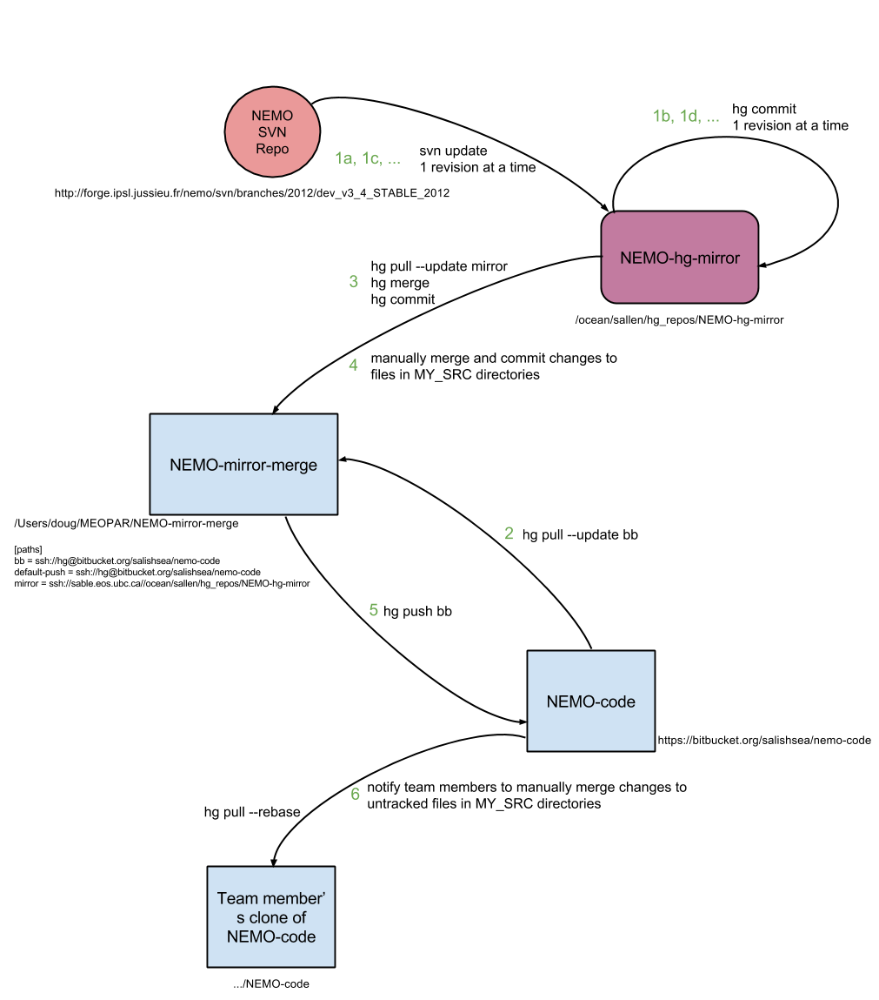

.. _NEMO-code:

********************
NEMO-code Repository
********************

These notes describe the Salish Sea MEOPAR project `NEMO-code`_ repository and its maintenance.
They are a narrative guide to the Mercurial log and diffs that can be obtained from the repository itself or via the Bitbucket interface.

The `NEMO-code`_ repo is a Mercurial repository in which is maintained the merger of the trunk of the main NEMO :command:`svn` repository and the changes made by the Salish Sea MEOPAR project team.

.. note::

    The `NEMO-code`_ repository is a private repository for members of the Salish Sea MEOPAR project team.
    That is because it contains parts of the NEMO_ codebase.
    Although that codebase is openly licensed it's developers require registration_ to access the code.

    If you have completed that registration and would like access to the `NEMO-code`_,
    please contact `Susan Allen`_,
    the Salish Sea MEOPAR project leader.

    .. _NEMO: http://www.nemo-ocean.eu/
    .. _registration: http://www.nemo-ocean.eu/user/register
    .. _Susan Allen: mailto://sallen@eos.ubc.ca

Getting the Code
================

Team members using SSH key authentication on Bitbucket may clone the `NEMO-code`_ repo with:

.. code-block:: bash

    hg clone ssh://hg@bitbucket.org/salishsea/nemo-code NEMO-code

For password authentication use:

.. code-block:: bash

    hg clone https://<you>@bitbucket.org/salishsea/nemo-code NEMO-code

where :kbd:`<you>` is your Bitbucket user id.

Managing Configurations
=======================

Building an Existing Configuration
----------------------------------

To build the executable code for an already defined configurations,
for example,
:kbd:`SalishSea`,
use:

.. code-block:: bash

    cd NEMO-code/NEMOGCM/CONFIG
    ./makenemo -n SalishSea -m salish -j8

That will compile the full domain Salish Sea NEMO configuration and the IOM output server with the :kbd:`salish` architecture definitions with the compilation distributed over 8 cores.
The resulting executables are located in :file:`NEMO-code/NEMOGCM/CONFIG/SalishSea/BLD/bin/`.

Available Configurations
~~~~~~~~~~~~~~~~~~~~~~~~

In addition to the configurations from the NEMO :program:`svn` checkout,
the repo contains:

* :file:`SalishSea`: The initial full domain Salish Sea development configuration
* :file:`SalishSea_no_IOM`: A copy of the :file:`SalishSea` configuration compiled without the :kbd:`key_iom_put` CPP key
* :file:`SALISH_amm`: A very early stepping-stone configuration created during the learning process of creating a Salish Sea configuration based on the :file:`AMM12` configuration
* :file:`SALISH_JPP`: The Salish Sea sub-domain configuration used to compare with CONCEPTS-110

Available Architecture Definitions
~~~~~~~~~~~~~~~~~~~~~~~~~~~~~~~~~~

In addition to the collection of architecture definitions that the NEMO consortium provides,
the `NEMO-code`_ repo includes definitions for:

* :kbd:`mpif90_jasper`: OpenMPI builds on :kbd:`jasper.westgrid.ca`
* :kbd:`ifort_jasper`: Intel MPI builds on :kbd:`jasper.westgrid.ca`
* :kbd:`salish`: MPI builds on :kbd:`salish.eos.ubc.ca`
* :kbd:`ocean`: single processor builds on UBC-EOAS :kbd:`ocean`
  cluster workstations and :kbd:`salish`
* :kbd:`gfortran_osx`: single processor builds on Mac-OSX

Creating a New Configuration
----------------------------

To create a new configuration based on,
for example,
`AMM12`_ use:

.. _AMM12: http://www.nemo-ocean.eu/Using-NEMO/Configurations/AMM

.. code-block:: bash

    cd NEMO-code/NEMOGCM/CONFIG
    ./makenemo -r AMM12 -n MY_AMM12 -m salish -j8 add_key "key_netcdf4 key_nosignedzero"

That will use the existing :kbd:`AMM12` configuration as a basis to build a new configuration called :kbd:`MY_AMM12` with the :kbd:`salish` architecture definitions and with compilation distributed over 8 cores.
The C Pre-Processor (CPP) keys :kbd:`key_netcdf4` and :kbd:`key_nosignedzero` will be added to configurations.
The resulting configuration,
including a compiled and link NEMO executable,
is located in :file:`NEMO-code/NEMOGCM/CONFIG/MY_AMM12`.

See :command:`./makenemo -h` for details of options and sub-commands.

Running the Model
=================

We don't want to clutter the :ref:`NEMO-code-repo` repo with files from development and exploration run-sets
(aka experiments),
run results,
etc.,
so runs are done in directories outside the :file:`NEMO-code/` tree.

The :ref:`SS-run-sets` repo contains example run description,
namelist,
and output server control files that define a run.
Run description files define the names and locations of files and directories that the :ref:`SalishSeaCmdProcessor` tool uses to manage Salish Sea NEMO runs and their results.
See :ref:`RunDescriptionFileStructure` for details of the run description file syntax.

After copying and/or editing the run description,
namelist,
and output server control files to define a run use the :program:`salishsea` :ref:`salishsea-prepare` to set up a temporary run directory from which to execute the run.
For example:

.. code-block:: bash

    salishsea prepare SalishSea.yaml iodef.xml

Use the run description and output server definitions files names that are appropriate for your run.
See the :ref:`salishsea-prepare` docs for details of the files and symbolic links that are created in the run directory.
The path to the run directory is printed upon completion of the command.

Go to the run directory and start the run with a command like:

.. code-block:: bash

    mpiexec -n 16 ./nemo.exe > stdout 2> stderr &

That command runs the model in the background on 16 processors,
redirecting the stdout and stderr streams to :file:`stdout` and :file:`stderr` files.
The number of processors to run is must match the domain decomposition defined in the :file:`namelist.compute` file.

A convenient command to monitor the memory use of a run and its time step progress is:

.. code-block:: bash

    watch -n 5 "(free -m; cat time.step)"

The :command:`salishsea gather` sub-command collects the run definition and results files from a Salish Sea NEMO run into a results directory.
The collection process includes combining the per-processors netCDF results files into files in the results directory.
It has a number of option flags to define how it works;
see :command:`salishsea gather -h` for details.
A typical use on :kbd:`salish` is:

.. code-block:: bash

    salishsea gather --no-compress SalishSea.yaml ../results/15-21Sep2002

The files that define the run,
and the non-netCDF results files produced by the run are also moved to the results directory by :command:`salishsea gather`.

.. _NEMO-MirrorMaintenance:

NEMO :command:`svn` Repo Mirror Maintenance
===========================================

The :file:`/ocean/sallen/hg_repos/NEMO-hg-mirror` repository is an :command:`svn` checkout of http://forge.ipsl.jussieu.fr/nemo/svn/branches/2012/dev_v3_4_STABLE_2012 and also a read-only Mercurial repository.
It was initialized with:

.. code-block:: bash

    $ cd /ocean/sallen/hg_repos
    $ svn --username "dlatornell" co -r 3819 http://forge.ipsl.jussieu.fr/nemo/svn/branches/2012/dev_v3_4_STABLE_2012 NEMO-hg-mirror
    $ hg init NEMO-hg-mirror
    $ cd NEMO-hg-mirror
    $ cat > .hgignore
    .svn
    DOC/NEMO_book.pdf
    ctrl-d
    $ hg add
    $ hg ci -m"Initialize NEMO svn mirror at r3819 of ^/branches/2012/dev_v3_4_STABLE_2012."

:command:`svn` v1.7.5 was used on :kbd:`salish` for the :command:`svn` part of the initialization.

   NEMO code repositories and workflow to update and merge SVN and local changes

.. _PullChangesFromNEMOsvn:

Workflow to Pull Changes from NEMO :command:`svn` Repo
------------------------------------------------------

The workflow to pull changes from the master NEMO :command:`svn` repo and commit them to our :file:`NEMO-hg-mirror` repo is somewhat automated by the :ref:`Marlin`.

#. Review the upstream changes in the source browser at https://forge.ipsl.jussieu.fr/nemo/log/branches/2012/dev_v3_4_STABLE_2012 to select a range of changes to be pulled into our :file:`NEMO-hg-mirror` repo.

   .. note::

      Pay special attention to changes in the :file:`OPA_SRC/` tree that involve files that have been copied into :file:`NEMOGCM/CONFIG/SalishSea/MY_SRC/` or team members' :file:`MY_SRC/` directories.
      Those files must be *manually* merged with their :file:`MY_SRC/` counterparts.

#. Working on :kbd:`salish` in the :file:`/ocean/sallen/hg_repos/NEMO-hg-mirror` repo with an activated virtualenv in which :command:`marlin` is installed:

   .. code-block:: bash

       $ ssh salish
       $ workon marlin
       (marlin)$ cd /ocean/sallen/hg_repos/NEMO-hg-mirror

#. Use :kbd:`marlin incoming` information about the next SVN revision that will be pulled from upstream and confirm that it is the expected revision:

   .. code-block:: bash

       (marlin)$ marlin incoming
       r3843 2013-03-20 09:29:58 UTC
         correct ice output filename for limwri.F90

   The :kbd:`--limit` option can be used to see more incoming revisions;
   see :command:`marlin help incoming` for details.

#. Use :kbd:`marlin update` to update the working copy to the next upstream commit and commit the SVN update as a Mercurial changeset with the SVN commit message as the body of the Mercurial commit message and echo that message:

   .. code-block:: bash

       (marlin)$ marlin update
       Update to svn r3843.

       correct ice output filename for limwri.F90

   The :kbd:`--to-rev` option can be used to apply a series of upstream updates,
   committing them to Mercurial one at a time;
   see :command:`marlin help update` for details.

Workflow to Merge NEMO :command:`svn` Repo and Salish Sea Revisions
-------------------------------------------------------------------

Merging changes from NEMO :command:`svn` and the Salish Sea central `NEMO-code` repo on Bitbucket is done in a repo that is used for only that purpose.
Doug does the merges on his laptop.
The repo in which the merging is done was created by cloning the :file:`/ocean/sallen/hg_repos/NEMO-hg-mirror` repo:

.. code-block:: bash

    hg clone ssh://sable.eos.ubc.ca//ocean/sallen/hg_repos/NEMO-hg-mirror NEMO-mirror-merge

and setting the paths in its :file:`.hg/hgrc` to:

.. code-block:: ini

    [paths]
    bb = ssh://hg@bitbucket.org/salishsea/nemo-code
    default-push = ssh://hg@bitbucket.org/salishsea/nemo-code
    mirror = ssh://sable.eos.ubc.ca//ocean/sallen/hg_repos/NEMO-hg-mirror

Those paths mean that the repo for :command:`hg pull` and :command:`hg incoming` commands must be specified explicitly.
The :kbd:`bb` and :kbd:`mirror` paths are provided to facilitate pulling from `NEMO-code`_ on Bitbucket and :file:`/ocean/sallen/hg_repos/NEMO-hg-mirror`,
respectively.
:command:`hg push` and :command:`hg outgoing` commands will act on the `NEMO-code`_ repo,
unless otherwise specified.

After the :ref:`PullChangesFromNEMOsvn` has been completed the workflow to merge those changes with Salish Sea MEOPAR project revisions is:

#. Pull and update recent changes from `NEMO-code`_ into :kbd:`NEMO-mirror-merge`:

   .. code-block:: bash

       cd NEMO-mirror-merge
       hg pull --update bb

#. Pull and update the changes from :file:`/ocean/sallen/hg_repos/NEMO-hg-mirror` into :kbd:`NEMO-mirror-merge`:

   .. code-block:: bash

       hg pull mirror

#. Because the changesets pulled from `NEMO-code`_ are public a branch merge is necessary:

   .. code-block:: bash

       hg merge
       hg commit -m"Merge svn updates."

#. Manually merge and commit changes that involve files that have been copied into :file:`NEMOGCM/CONFIG/SalishSea/MY_SRC/` or team members' :file:`MY_SRC/` directories.
   Those files are most likely to be in :file:`OPA_SRC/`.

#. Push the result of the updates and merges to `NEMO-code`_:

   .. code-block:: bash

       hg push bb

   If other users have pushed changes to `NEMO-code`_ while merge conflicts were being handled :command:`hg pull --rebase` can be used to bring in those changes and deal with any additional merge conflicts.

#. Notify team members of the upstream merge,
   especially if manual merges of :file:`MY_SRC/` files were required,
   so that they can manage merging changes into any untracked :file:`MY_SRC/` files they may have.

.. _NEMO-3.6Migration:

Migration to NEMO-3.6
=====================

In February 2015 the process of migrating the Salish Sea NEMO model from NEMO-3.4 to NEMO-3.6 was started.
A collection of mirror repos similar to that described in :ref:`NEMO-MirrorMaintenance` was created.
NEMO-3.6 uses a separately distributed output server package called `XIOS`_ so the maintenance of Mercurial mirror repos for the Salish Sea NEMO project is expanded to deal with 2 upstream SVN repos.
For NEMO:

* :file:`/ocean/sallen/hg_repos/NEMO-3.6-hg-mirror`
* :file:`/Users/doug/MEOPAR/NEMO-3.6-mirror-merge`
* :file:`https://bitbucket.org/salishsea/nemo-3.6-code`

and for XIOS:

* :file:`/ocean/sallen/hg_repos/XIOS-hg-mirror`
* :file:`/Users/doug/MEOPAR/XIOS-mirror-merge`
* :file:`https://bitbucket.org/salishsea/xios`

.. _XIOS: http://forge.ipsl.jussieu.fr/ioserver/

The :file:`/ocean/sallen/hg_repos/NEMO-hg-mirror` repository is an :command:`svn` checkout of http://forge.ipsl.jussieu.fr/nemo/svn/trunk and also a read-only Mercurial repository.
It was initialized with:

.. code-block:: bash

    $ cd /ocean/sallen/hg_repos
    $ svn --username "dlatornell" co http://forge.ipsl.jussieu.fr/nemo/svn/trunk NEMO-3.6-hg-mirror
    $ hg init NEMO-3.6-hg-mirror
    $ cd NEMO-3.6-hg-mirror
    $ cat > .hgignore
    .svn
    DOC/NEMO_book.pdf
    ctrl-d
    $ hg add
    $ hg ci -m"Initialize NEMO-3.6 svn mirror at r5072 of ^/trunk."

The :file:`/ocean/sallen/hg_repos/XIOS-hg-mirror` repository is an :command:`svn` checkout of http://forge.ipsl.jussieu.fr/ioserver/svn/XIOS/branchs/xios-1.0 and also a read-only Mercurial repository.
It was initialized with:

.. code-block:: bash

    $ cd /ocean/sallen/hg_repos
    $ http://forge.ipsl.jussieu.fr/ioserver/svn/XIOS/branchs/xios-1.0 XIOS-hg-mirror
    $ hg init XIOS-hg-mirror
    $ cd XIOS-hg-mirror
    $ cat > .hgignore
    .svn
    ctrl-d
    $ hg add
    $ hg ci -m"Initialize XIOS svn mirror at r549 of ^/branchs/xios-1.0."

:command:`svn` v1.8.8 was used on :kbd:`salish` for the :command:`svn` part of the initialization.

On 30-Jun-2015 the :kbd:`v3_6_STABLE` release of NEMO was `announced`_.
The following process
(not quite as simple as suggested in the `3.6 Quick Start Guide`_)
was used to update the :file:`/ocean/sallen/hg_repos/NEMO-hg-mirror` repository to the :kbd:`HEAD` of the http://forge.ipsl.jussieu.fr/nemo/svn/branches/2015/nemo_v3_6_STABLE branch:

.. _announced: http://www.nemo-ocean.eu/About-NEMO/News/NEMO-release-nemo_v3_6_STABLE-available
.. _3.6 Quick Start Guide: http://www.nemo-ocean.eu/Using-NEMO/User-Guides/Basics/NEMO-Quick-Start-Guide#eztoc1190_1_5)

#. The :command:`svn` revisions from :kbd:`r5300`,
   through the creation of the :file:`^/branches/2015/nemo_v3_6_STABLE` branch,
   and onward to :kbd:`r5628` were reviewed and annotated in our `tracking spreadsheet`_

   .. _tracking spreadsheet: https://docs.google.com/spreadsheets/d/1H4FQzLS-GABE0o_wMI4IL1DfPIH8qnjv4ZyBCblHa78

#. The :file:`/ocean/sallen/hg_repos/NEMO-hg-mirror` repository was Mercurial-tagged with :kbd:`b4_nemo_v3_6_stable`.

#. The :command:`svn` revisions to :kbd:`r5518` were applied a few at a time using the :ref:`Marlin` and the process described in :ref:`PullChangesFromNEMOsvn`.
   Revisions that add or delete files,
   or copy files in from another :command:`svn` branch were handled individually,
   using :command:`hg add`,
   or :command:`hg rm` as necessary to add and remove files,
   followed by :command:`hg commit --amend` to update the changeset to reflect that additions/deletions.

#. The commands:

   .. code:: bash

       $ svn switch http://forge.ipsl.jussieu.fr/nemo/svn/branches/2015/nemo_v3_6_STABLE
       $ svn update -r 5519

   were used to change the :command:`svn` URL to point at the 3.6-stable branch and update to the earliest revision on that branch,
   :kbd:`r5519`

#. The :command:`svn` revisions to :kbd:`r5628` were applied a few at a time using the proceedure described above for early revisions.

The following sections are in-process notes about getting to a running Salish Sea NEMO-3.6 model on various platforms.

Building and Testing XIOS
-------------------------

Building on :kbd:`salish`
~~~~~~~~~~~~~~~~~~~~~~~~~

On :kbd:`salish`,
XIOS_ was successfully built with the following :file:`arch/arch-*` files:

An :file:`arch/*.env` file is not required for :kbd:`salish`.

:file:`arch/arch-GCC_SALISH.path`:

.. code-block:: bash

    NETCDF_LIB="-lnetcdff -lnetcdf"
    HDF5_LIB="-lz"

:file:`arch/arch-GCC_SALISH.fcm`:

.. code-block:: bash

    %CCOMPILER      mpicc
    %FCOMPILER      mpif90
    %LINKER         mpif90

    %BASE_CFLAGS    -ansi -w
    %PROD_CFLAGS    -O3 -DBOOST_DISABLE_ASSERTS
    %DEV_CFLAGS     -g -O2
    %DEBUG_CFLAGS   -g

    %BASE_FFLAGS    -D__NONE__
    %PROD_FFLAGS    -O3
    %DEV_FFLAGS     -g -O2
    %DEBUG_FFLAGS   -g

    %BASE_INC       -D__NONE__
    %BASE_LD        -lstdc++

    %CPP            cpp
    %FPP            cpp -P
    %MAKE           make

using the command:

.. code-block:: bash

    $ ./make_xios --arch GCC_SALISH --netcdf_lib netcdf4_seq --job 8

As :kbd:`salish` has only 16 physical cores,
running multiple :file:`xios_server.exe` processes that use parallel output is unnecessary,
so the :kbd:`--netcdf_lib netcdf4_seq` option is used.

Building on :kbd:`jasper`
~~~~~~~~~~~~~~~~~~~~~~~~~

On :kbd:`jasper`,
XIOS_ was successfully built with the following :file:`arch/arch-*` files:

:file:`arch/arch-X64_JASPER.env`:

.. code-block:: bash

    module load library/openmpi/1.6.4-intel
    module load library/netcdf/4.1.3
    module load library/hdf5/1.8.8

:file:`arch/arch-X64_JASPER.path`:

.. code-block:: bash

    NETCDF_LIB="-lnetcdf"
    HDF5_LIB="-lhdf5_hl -lhdf5 -lz"

:file:`arch/arch-X64_JASPER.fcm`:

.. code-block:: bash

    %CCOMPILER      mpicc
    %FCOMPILER      mpif90
    %LINKER         mpif90

    %BASE_CFLAGS    -diag-disable 1125 -diag-disable 279
    %PROD_CFLAGS    -O3 -D BOOST_DISABLE_ASSERTS
    %DEV_CFLAGS     -g -traceback
    %DEBUG_CFLAGS   -DBZ_DEBUG -g -traceback -fno-inline

    %BASE_FFLAGS    -D__NONE__
    %PROD_FFLAGS    -O3
    %DEV_FFLAGS     -g -O2 -traceback
    %DEBUG_FFLAGS   -g -traceback

    %BASE_INC       -D__NONE__
    %BASE_LD        -lstdc++

    %CPP            mpicc -EP
    %FPP            cpp -P
    %MAKE           gmake

using the command:

.. code-block:: bash

    $ ./make_xios --arch X64_JASPER --netcdf_lib netcdf4_seq --job 4

At present,
:kbd:`jasper` lacks the parallel versions of the netCDF4 library that is required to build XIOS_ so that it produces a single output file,
hence the :kbd:`--netcdf_lib netcdf4_seq` option.

Testing
~~~~~~~

The :file:`test_client.exe` executable that is built with :file:`xios_server.exe` and the :file:`inputs/iodef.xml` file can be used to test XIOS.
This was done by creating a :file:`test-XIOS/` directory,
copying :file:`inputs/iodef.xml` into it,
and symlinking :file:`xios_server.exe` and :file:`test_client.exe` into it.

In contrast to NEMO-3.4 where the IO server configuration is specified in the :file:`xmlio_server.def` file,
the configuration for XIOS is included as a stanza in :file:`iodef.xml`.
As copied,
:file:`iodef.xml` configures XIOS to run in "attached" mode,
similar to how the IO server is used in NEMO-3.4.
The relevant stanza is:

.. code-block:: xml

    <context id="xios">
        <variable_definition>
          <variable_group id="buffer">
              buffer_size = 80000000
              buffer_server_factor_size = 2
           </variable_group>

          <variable_group id="parameters" >
            <variable id="using_server" type="boolean">false</variable>
            <variable id="info_level" type="int">50</variable>
          </variable_group>
        </variable_definition>
    </context>

and the line:

.. code-block:: xml

    <variable id="using_server" type="boolean">false</variable>

sets "attached" mode.

Using :command:`qsub` to submit a file containing the following shell script with PBS directives runs :file:`test_client.exe` on 10 processors and produces 10 netCDF4 output files,
:file:`output_0.nc` through :file:`output_9.nc`:

.. code-block:: bash

    #!/bin/bash

    #PBS -N test-XIOS
    #PBS -S /bin/bash
    #PBS -l procs=10
    #PBS -l walltime=0:10:00
    #PBS -m bea
    #PBS -M dlatornell@eos.ubc.ca
    #PBS -o stdout
    #PBS -e stderr

    cd $PBS_O_WORKDIR
    echo working dir: $(pwd)

    module load library/netcdf/4.1.3
    module load library/hdf5/1.8.8

    mpirun -np 10 ./test_client.exe
    echo done!

Changing the XIOS server configuration in :file:`iodef.xml` to:

.. code-block:: xml

    <variable id="using_server" type="boolean">true</variable>

creating an MPI application file (let's call it test-XIOS.app) containing:

.. code-block:: bash

    -np 8 ./test_client.exe
    -np 2 ./xios_server.exe

and submitting a PBS script with the :command:`mpirun` line changed to:

.. code-block:: bash

    $ mpirun --app ./test-XIOS.app

results in :file:`test_client.exe` running on 8 processors and :file:`xios_server.exe` running on 2 and produces 2 netCDF4 output files,
:file:`output_0.nc` and :file:`output_1.nc`.

The netCDF4 files that XIOS produces are not deflated.
Running:

.. code-block:: bash

    $ ncks -4 -L4 output_0.nc output_0.nc

on one of the files produces by the above test reduces the file size to 33% or its original size.
Note that the present build of NCO on :kbd:`jasper` is against the netCDF3 library so it cannot be used to do this deflation.

Building and Testing NEMO-3.6
-----------------------------

Building on :kbd:`salish`
~~~~~~~~~~~~~~~~~~~~~~~~~

On :kbd:`salish`,
NEMO-3.6 was successfully built with the following :file:`NEMOGCM/ARCH/` file:

:file:`NEMOGCM/ARCH/UBC_EOAS/arch-GCC_SALISH.fcm`:

.. code-block:: bash

    %XIOS_HOME           /data/$USER/MEOPAR/XIOS

    %NCDF_INC            -I/usr/include
    %NCDF_LIB            -L/usr/lib -lnetcdff -lnetcdf

    %XIOS_INC            -I%XIOS_HOME/inc
    %XIOS_LIB            -L%XIOS_HOME/lib -lxios -lstdc++

    %CPP                 cpp
    %FC                  mpif90
    %FCFLAGS             -cpp -O3 -fdefault-real-8 -funroll-all-loops -fcray-pointer -ffree-line-length-none
    %FFLAGS              %FCFLAGS
    %LD                  mpif90
    %LDFLAGS
    %FPPFLAGS            -P -C -traditional
    %AR                  ar
    %ARFLAGS             -rs
    %MK                  make
    %USER_INC            %XIOS_INC %NCDF_INC
    %USER_LIB            %XIOS_LIB %NCDF_LIB

using the commands:

.. code-block:: bash

    $ cd NEMO-3.6-code/NEMOGCM/CONFIG
    $ ./makenemo -n SalishSea -m GCC_SALISH -j4

Important things to note:

  * Our :kbd:`arch` files are contained in the institution-specific directory :file:`NEMOGCM/ARCH/UBC_EOAS/`
  * The :kbd:`%XIOS_HOME` build variable uses the :envvar:`USER` environment variable to locate the XIOS_ library to link with NEMO.
    It is assumed that XIOS_ is installed and built in :file:`/data/{userid}/MEOPAR/XIOS/` on :kbd:`salish`.
  * The :kbd:`-lstdc++` library option *must* follow :kbd:`-lxios` otherwise a truly astonishing volume of unresolved reference errors will be generated and the build will fail.

.. _BuildingNEMO3.6OnJasper:

Building on :kbd:`jasper`
~~~~~~~~~~~~~~~~~~~~~~~~~

On :kbd:`jasper`,
NEMO-3.6 was successfully built with the following :file:`NEMOGCM/ARCH/` file:

:file:`NEMOGCM/ARCH/UBC_EOAS/arch-X64_JASPER.fcm`:

.. code-block:: bash

    %NCDF_HOME           /global/software/netcdf/netcdf-4.1.3
    %HDF5_HOME           /global/software/hdf5/hdf5-1.8.9
    %XIOS_HOME           $HOME/MEOPAR/XIOS

    %NCDF_INC            -I%NCDF_HOME/include
    %NCDF_LIB            -L%NCDF_HOME/lib -lnetcdff -lnetcdf -L%HDF5_HOME/lib -lhdf5_hl -lhdf5 -lhdf5
    %XIOS_INC            -I%XIOS_HOME/inc
    %XIOS_LIB            -L%XIOS_HOME/lib -lxios

    %CPP                 cpp
    %FC                  mpif90
    %FCFLAGS             -c -fpp -r8 -O3 -assume byterecl -convert big_endian -heap-arrays
    %FFLAGS              %FCFLAGS
    %LD                  mpif90
    %LDFLAGS             -lstdc++
    %FPPFLAGS            -P -C -traditional
    %AR                  ar
    %ARFLAGS             -r
    %MK                  make
    %USER_INC            %XIOS_INC %NCDF_INC
    %USER_LIB            %XIOS_LIB %NCDF_LIB

using the commands:

.. code-block:: bash

    $ cd NEMO-3.6-code/NEMOGCM/CONFIG
    $ ./makenemo -n SalishSea -m X64_JASPER -j8

Important things to note:

  * Our :kbd:`arch` files are contained in the institution-specific directory :file:`NEMOGCM/ARCH/UBC_EOAS/`
  * The :kbd:`%XIOS_HOME` build variable uses the :envvar:`HOME` environment variable to locate the XIOS_ library to link with NEMO.
    It is assumed that XIOS_ is installed and built in :file:`$HOME/MEOPAR/XIOS/` on :kbd:`jasper`.

Testing the GYRE Configuration on :kbd:`salish`
~~~~~~~~~~~~~~~~~~~~~~~~~~~~~~~~~~~~~~~~~~~~~~~

A new NEMO-3.6 GYRE configuration was created on :kbd:`salish` with:

.. code-block:: bash

    $ cd NEMOGCM/CONFIG/
    $ ./makenemo -n my_GYRE -r GYRE -m GCC_SALISH -j8

After the build completed successfully,
a test directory was created outside the :file:`NEMO-3.6-code` repo:

.. code-block:: bash

    $ cd /data/dlatorne/MEOPAR
    $ mkdir GYRE-3.6-test
    $ cd GYRE-3.6-test/

and the shared XIOS configurations files,
reference namelist,
and executables were symlinked into the test directory:

.. code-block:: bash

    $ ln -s /data/dlatorne/MEOPAR/NEMO-3.6-code/NEMOGCM/CONFIG/SHARED/domain_def.xml
    $ ln -s /data/dlatorne/MEOPAR/NEMO-3.6-code/NEMOGCM/CONFIG/SHARED/field_def.xml
    $ ln -s /data/dlatorne/MEOPAR/NEMO-3.6-code/NEMOGCM/CONFIG/SHARED/namelist_ref
    $ ln -s /data/dlatorne/MEOPAR/NEMO-3.6-code/NEMOGCM/CONFIG/my_GYRE/BLD/bin/nemo.exe
    $ ln -s /data/dlatorne/MEOPAR/XIOS/bin/xios_server.exe

The :file:`iodef.xml` and :file:`namelist_cfg` files generated for the :kbd:`my_GYRE` configuration were copied into the test directory:

.. code-block:: bash

    $ cp /data/dlatorne/MEOPAR/NEMO-3.6-code/NEMOGCM/CONFIG/my_GYRE/EXP00/iodef.xml ./
    $ cp /data/dlatorne/MEOPAR/NEMO-3.6-code/NEMOGCM/CONFIG/my_GYRE/EXP00/namelist_cfg ./

The :kbd:`xios context` stanza in :file:`iodef.xml` was edited to set the :kbd:`using_server` variable to :kbd:`true` so that the XIOS server will run in a separate process:

.. code-block:: xml
   :emphasize-lines: 7

    <context id="xios">
      <variable_definition>
        <!-- We must have buffer_size > jpi*jpj*jpk*8 (with jpi and jpj the subdomain size) -->
        <variable id="buffer_size" type="integer">10000000</variable>
        <variable id="buffer_server_factor_size" type="integer">2</variable>
        <variable id="info_level" type="integer">0</variable>
        <variable id="using_server" type="boolean">true</variable>
        <variable id="using_oasis" type="boolean">false</variable>
        <variable id="oasis_codes_id" type="string" >oceanx</variable>
      </variable_definition>
    </context>

The :file:`namelist_cfg` file was edited to add the following 2 lines to the :kbd:`nammpp` namelist:

.. code-block:: fortran

    jpni = 3  ! jpni: number of processors following i (set automatically if < 1)
    jpnj = 5  ! jpnj: number of processors following j (set automatically if < 1)

to set the MPI decomposition for the run to 3x5.

An MPI app file called :file:`nemo.app` was created containing:

.. code-block:: bash

    -np 15 ./nemo.exe
    -np 1 ./xios_server.exe

to define how many cores to run each executable on.
The :kbd:`-np` value for :file:`nemo.exe` must equal the product of the :kbd:`jpni` and :kbd:`jpnj` values in the :kbd:`nammpp` namelist.

Finally,
we're ready to run the model with:

.. code-block:: bash

    $ mpirun -app nemo.app >stout 2>stderr

The run produces a single netCDF4 file for the :kbd:`grid_T`,
:kbd:`grid_U`,
:kbd:`grid_V`,
and :kbd:`grid_W` variables,
and,
sadly,
14 per-processor :kbd:`restart` files that have to be gathered into a run :kbd:`restart` file.
The netCDF4 files *do not* use Limpel-Ziv deflation compression at the variable level so they can be reduces in size by ~50% with commands like:

.. code-block:: bash

    $ ncks -4 -L4 GYRE_5d_00010101_00011230_grid_T.nc GYRE_5d_00010101_00011230_grid_T.nc

Testing the :kbd:`SalishSea` Configuration on :kbd:`jasper`
~~~~~~~~~~~~~~~~~~~~~~~~~~~~~~~~~~~~~~~~~~~~~~~~~~~~~~~~~~~

.. note::
    This section describes how to manually set up a run directory for the NEMO-3.6 :kbd:`SalishSea` configuration and submit the run to the job queue on :kbd:`jasper`.
    The steps described here will eventually be incorporated into the :ref:`SalishSeaCmdProcessor`.
    Once the command processor is capable of working with NEMO-3.6 the recommendedation is that it be used rather than doing manual run setups.

After successfully :ref:`BuildingNEMO3.6OnJasper`,
create a test directory outside the :file:`NEMO-3.6-code` repo:

.. code-block:: bash

    $ cd $HOME/MEOPAR
    $ mkdir NEMO-3.6-test
    $ cd NEMO-3.6-test/

Symlink the shared XIOS configurations files,
reference namelist,
and NEMO & XIOS executables into the test directory:

.. code-block:: bash

    $ ln -s $HOME/MEOPAR/NEMO-3.6-code/NEMOGCM/CONFIG/SHARED/field_def.xml
    $ ln -s $HOME/MEOPAR/NEMO-3.6-code/NEMOGCM/CONFIG/SHARED/namelist_ref
    $ ln -s $HOME/MEOPAR/NEMO-3.6-code/NEMOGCM/CONFIG/SalishSea/BLD/bin/nemo.exe
    $ ln -s $HOME/MEOPAR/XIOS/bin/xios_server.exe

Symlink the SalishSea output domain definition file:

.. code-block:: bash

    $ ln -s $HOME/MEOPAR/SS-run-sets/SalishSea/nemo3.6/domain_def.xml

You also required an :file:`iodef.xml` file. A basic one generated for the :kbd:`SalishSea` configuration can be copied into the test directory:

.. code-block:: bash

    $ cp $HOME/MEOPAR/NEMO-3.6-code/NEMOGCM/CONFIG/SalishSea/EXP00/iodef.xml ./

If you wish,
edit that file to adjust the output interval(s) for various variables.  A more complicated example, including 1/2 hour tidal-point output can be copied from the tides SS-run-sets instead:

    $ cp $HOME/MEOPAR/SS-run-sets/SalishSea/nemo3.6/tides/iodef.xml ./

Create a :file:`namelist_cfg` configuration namelist file for the run by running:

.. code-block:: bash

    $ bash $HOME/MEOPAR/SS-run-sets/SalishSea/nemo3.6/make_namelist_cfg

which concatenates the default namelist section files from :file:`MEOPAR/SS-run-sets/SalishSea/nemo3.6/` into a :file:`namelist_cfg` file in the present working directory,
then roars like a big cat.

Edit :file:`namelist_cfg` to configure your run.
In particular,
set the MPI decomposition values,
:kbd:`jpni` and :kbd:`jpnj`,
in the :kbd:`nammpp` namelist at the end of the file;
e.g.

.. code-block:: fortran

    jpni        =   8       !  number of processors in the i direction
    jpnj        =  18       !  number of processors in the j direction

Symlink the :kbd:`SalishSea` domain bathymetry and coordinates files into the test directory:

.. code-block:: bash

    $ ln -s $HOME/MEOPAR/NEMO-forcing/grid/bathy_meter_SalishSea2.nc bathy_meter.nc
    $ ln -s $HOME/MEOPAR/NEMO-forcing/grid/coordinates_seagrid_SalishSea.nc coordinates.nc

Symlink the open boundaries,
river,
and atmospheric forcing directories into the test directory:

.. code-block:: bash

    $ ln -s $HOME/MEOPAR/NEMO-forcing/open_boundaries
    $ ln -s $HOME/MEOPAR/NEMO-forcing/rivers
    $ ln -s /home/sallen/MEOPAR/GEM2.5/ops/NEMO-atmos

Symlink the directory containing the initial stratification files into the test directory.
In this case we use results from one of the spin-up runs:

.. code-block:: bash

    $ ln -s /home/dlatorne/MEOPAR/SalishSea/results/spinup/7dec16dec initial_strat

Create a :file:`nemo.pbs` file to define the run environment on :kbd:`jasper` and to execute the run:

.. code-block:: bash

    #!/bin/bash

    #PBS -N 8x18+6-regression-1d-6h
    #PBS -S /bin/bash
    #PBS -l nodes=13:ppn=12
    #PBS -l pmem=2000mb
    #PBS -l feature=X5675
    #PBS -l walltime=0:30:00
    #PBS -m bea
    #PBS -M dlatornell@eos.ubc.ca
    #PBS -o stdout
    #PBS -e stderr

    cd ${PBS_O_WORKDIR}
    echo working dir: $(pwd)

    module load library/netcdf/4.1.3
    module load library/hdf5/1.8.9

    mpirun -np 144 ./nemo.exe : -np 6 ./xios_server.exe
    echo done!

Ensure that the MPI decomposition values in your namelist,
The PBS nodes/ppn directive,
and the :command:`mpirun` statement are consistent and account for the total number of processors required
(NEMO plus XIOS).
Note that :kbd:`jasper` gives higher priority to jobs that fully occupy nodes,
but it is not necessary to use all of the processors that you request;
in the :file:`nemo.pbs` example above we request 13 nodes with 12 processors each
(156 processors)
but run NEMO with an 8x18 MPI decomposition and 6 XIOS servers
(144 + 6 = 150 processors).

Submit the run to the queue manager:

.. code-block:: bash

    $ qsub nemo.pbs

.. note::
    One very annoying "feature" of NEMO-3.6 and XIOS is that fatal errors in on seems to cause segmentation fault failures in the other.
    For example,
    if an input file is missing,
    XIOS will fail to read it and the run will fail.
    The :file:`stderr` file will be full of many uninformative segmentation fault errors and tracebacks that give no clue as to the root cause of the problem but make you think that something is very seriously messed up.
    Be sure to also search for :kbd:`E R R O R` messages in :file:`ocean.output` before you get too worried about the segmentation faults.

    Another common mistake that results in a huge list of errors in :file:`stderr` is having mismatches in the number of processors among the MPI decomposition specified in the :file:`namelist_cfg`,
    the :kbd:`PBS` directive in your run script,
    and the :file:`.app` file.
