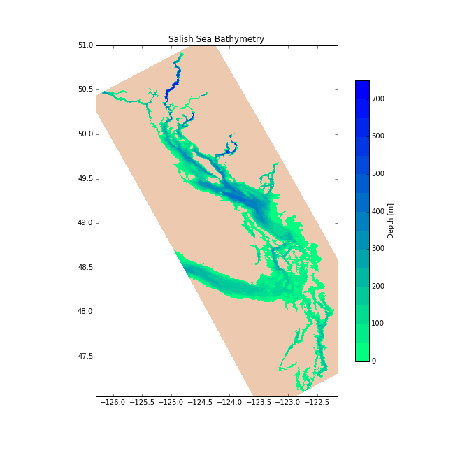

***********************************************
Set-up, Initial Conditions, Forcing, etc. Files
***********************************************

The collection of domain-specific set-up,
initial conditions,
forcing,
etc.
files used to run NEMO for the Salish Sea are maintained in the `NEMO-forcing`_ repo.

.. _NEMO-forcing: https://bitbucket.org/salishsea/nemo-forcing/

.. note::

    The `NEMO-forcing`_ repository is a private repository for members of the Salish Sea MEOPAR project team.
    That is because it contains files for which permission and/or licensing for public release have not been obtained.

    If you would like access to `NEMO-forcing`_,
    please contact `Susan Allen`_,
    the Salish Sea MEOPAR project leader.

    .. _Susan Allen: mailto://sallen@eos.ubc.ca

Getting the Repo
================

Team members using SSH key authentication on Bitbucket may clone the `NEMO-forcing`_ repo with:

.. code-block:: bash

    hg clone ssh://hg@bitbucket.org/salishsea/nemo-forcing NEMO-forcing

For password authentication use:

.. code-block:: bash

    hg clone https://<you>@bitbucket.org/salishsea/nemo-forcing NEMO-forcing

where :kbd:`<you>` is your Bitbucket user id.

Repo Contents
=============

:file:`grid/` Directory
-----------------------

The :file:`grid/` directory contains coordinates and bathymetry files.

NEMO has the file names of the coordinates and bathymetry files hard-coded as :file:`coordinates.nc` and :file:`bathy_meter.nc` so the files used for a particular run-set need to be copied or symlinked to those names.

Coordinates and bathymetry for the initial sub-domain test case known as :kbd:`JPP` or :kbd:`WCSD_RUN_tide_M2_OW_ON_file_DAMP_ANALY`:

* :file:`SubDom_coordinates_seagrid_WestCoast.nc`
* :file:`SubDom_bathy_meter_NOBCchancomp.nc`

.. _SalishSeaSubdomainBathy-image:

.. figure:: images/SalishSeaSubdomainBathy.png

    Sub-domain bathymetry used for initial tests.

Coordinates and bathymetry for the full Salish Sea domain:

* :file:`coordinates_seagrid_SalishSea.nc`
* :file:`bathy_meter_SalishSea.nc`

.. _SalishSeaBathy-image:

    Full Salish Sea domain bathymetry.

:file:`bdydta/` Directory
-------------------------

The :file:`bdydta/` directory contains forcing data for the open boundaries.

Currently there are three files that specify the M2 tidal components for the Western and Northern open boundaries of the West Coast SubDomain.  These files specify the cosine and sine components for the sea surface height (T), the x-direction velocity (U) and y-direction velocity (V).

* :file:`JPP_bdytide_M2_grid_T.nc`
* :file:`JPP_bdytide_M2_grid_U.nc`
* :file:`JPP_bdytide_M2_grid_V.nc`

:file:`initial_strat/` Directory
--------------------------------

The :file:`initial_strat/` directory contains initial data for the temperature and salinity fields.

Currently there are two files for the JPP Sub-domain based on 500 m maximum water depth and 40 vertical levels.  

* :file:`SoG0318_1y_temperature_nomask.nc`
* :file:`SoG0318_1y_salinity_nomask.nc`

The data is horizontally uniform, based on STRATOGEM profile at S4-1 in September 2003 from cruise 0318.  Original data file is

* :file:`sg0318006.cnv`

and the profile is plotted in

* :file:`sg0318006_profile.ps`
* :file:`sg0318006_profile.fig`

The preparation of the NetCDF files is done by the python notebook `Tools/I_Forcing/PrepareTS.ipynb`_

.. _Tools/I_Forcing/PrepareTS.ipynb: https://bitbucket.org/salishsea/tools/src/tip/I_ForcingFiles/PrepareTS.ipynb

