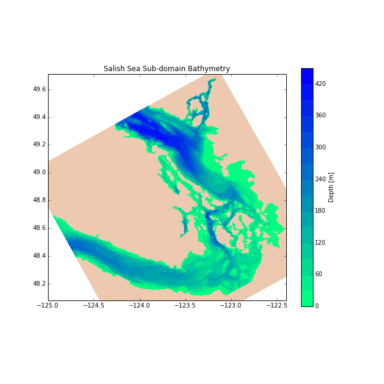

.. _NEMO-forcing:

Getting the Repo
================

Team members using SSH key authentication on Bitbucket may clone the :ref:`NEMO-forcing-repo` repo with:

.. code-block:: bash

    hg clone ssh://hg@bitbucket.org/salishsea/nemo-forcing NEMO-forcing

For password authentication use:

.. code-block:: bash

    hg clone https://<you>@bitbucket.org/salishsea/nemo-forcing NEMO-forcing

where :kbd:`<you>` is your Bitbucket user id.

Repo Contents
=============

:file:`atmospheric/` Directory
------------------------------

The :file:`atmospheric/` directory contains forcing data that supports the :ref:`AtmosphericForcing` of the model.

:file:`no_snow.nc`: A :ref:`CGRF-Dataset`-like file that can be used as annual climatology to impose the :ref:`NoSnowConstraint`. Created by the :ref:`tools-repo` repo `I_ForcingFiles/NoSnow.ipynb`_ notebook.

.. _I_ForcingFiles/NoSnow.ipynb: http://nbviewer.ipython.org/urls/bitbucket.org/salishsea/tools/raw/tip/I_ForcingFiles/NoSnow.ipynb

.. _grid-directory:

:file:`grid/` Directory
-----------------------

The :file:`grid/` directory contains coordinates,
bathymetry,
and interpolation weights files.

Full Salish Sea Domain
~~~~~~~~~~~~~~~~~~~~~~

NEMO has the file names of the coordinates and bathymetry files hard-coded as :file:`coordinates.nc` and :file:`bathy_meter.nc` so the files used for a particular run-set need to be copied or symlinked to those names.

Coordinates and bathymetry (original and with smoothed Juan de Fuca mouth)

* :file:`coordinates_seagrid_SalishSea.nc`
* :file:`bathy_meter_SalishSea.nc`
* :file:`bathy_meter_SalishSea2.nc`

.. _SalishSeaBathy-image:

.. figure:: images/SalishSeaBathy.png

    Full Salish Sea domain bathymetry.

Interpolation weights:

* :file:`weights-CGRF.nc`: :ref:`AtmosphericForcing` weights for Interpolation On the Fly
  (IOF)
  from the :ref:`CGRF-Dataset`

Initial Tests Sub-Domain
~~~~~~~~~~~~~~~~~~~~~~~~

Coordinates and bathymetry for the initial sub-domain test case known as :kbd:`JPP` or :kbd:`WCSD_RUN_tide_M2_OW_ON_file_DAMP_ANALY`:

* :file:`SubDom_coordinates_seagrid_WestCoast.nc`
* :file:`SubDom_bathy_meter_NOBCchancomp.nc`

.. _SalishSeaSubdomainBathy-image:

    Sub-domain bathymetry used for initial tests.

:file:`open_boundaries/west` Directory
---------------------------------------

The :file:`open_boundaries/` directory contains the open boundary forcing information for the full domain.  Currently we are only using the :file:`west/` subdirectory as we have the north boundary closed.

Original Files
++++++++++++++

Original file specifies set temperature and salinity (uniform across the boundary) from Thomson et al, 2007 winter picture.

* :file:`SalishSea_bdyT_tra.nc`

Two files keep the original TS until the model starts and then move the Thomson et al, 2007 winter picture.  Two files are for the two bathymetries.

* :file:`SalishSea_Soft_tra.nc`
* :file:`SalishSea2_Soft_tra.nc`

There are 5 files undergoing testing that specify the barotropic and baroclinic currents and the surface height.  These are uniform velocities across the boundary but vary in depth.  They are based on Thomson et al, 2007 but were then adjusted to ensure almost zero net velocity across the boundary.

The preparation of the NetCDF files is done by the python notebook `Tools/I_ForcingFiles/OBC/PrepareSimpleOBC.ipynb`_
and the soft start combination is done in the python notebook `Tools/I_ForcingFiles/OBC/TS_OBC_Softstart.ipynb`_

.. _Tools/I_ForcingFiles/PrepareSimpleOBC.ipynb: https://bitbucket.org/salishsea/tools/src/tip/I_ForcingFiles/OBC/PrepareSimpleOBC.ipynb
.. _Tools/I_ForcingFiles/TS_OBC_Softstart.ipynb: https://bitbucket.org/salishsea/tools/src/tip/I_ForcingFiles/OBC/TS_OBC_Softstart.ipynb

Seasonal Climatology
++++++++++++++++++++

Diane Masson through Wendy Callendar provided model results from Masson and Fine (2013) for all their model years at the mouth of Juan de Fuca.  These were interpolated onto our z-levels and then interpolated onto our horizontal grid.  

* :file:`SalishSea_TS_Masson.nc`

The multiple years were averaged and re-sampled on a weekly basis to give a climatology

* :file:`SalishSea2_Masson_Clim.nc`

Then the partial cells had their TS corrected to the proper depth (depth-corrected, DC)

* :file:`SalishSea2_Masson_DC.nc`

The three steps are done in the python notebooks `Tools/I_Forcing/OBC/MakeTSfromMasson.ipynb`_, `Tools/I_ForcingFiles/OBC/MassonClimatology.ipynb`_, and `Tools/I_ForcingFiles/OBC/MassonClimDC.ipynb`_, respectively.

.. _Tools/I_ForcingFiles/MakeTSfromMasson.ipynb: https://bitbucket.org/salishsea/tools/src/tip/I_ForcingFiles/OBC/MakeTSfromMasson.ipynb
.. _Tools/I_ForcingFiles/MassonClimatology.ipynb: https://bitbucket.org/salishsea/tools/src/tip/I_ForcingFiles/OBC/MassonClimatology.ipynb
.. _Tools/I_ForcingFiles/MassonClimDC.ipynb: https://bitbucket.org/salishsea/tools/src/tip/I_ForcingFiles/OBC/MassonClimDC.ipynb

:file:`open_boundaries/west/tides/` Directory
----------------------------------------------

The :file:`open_boundaries/west/tides/` sub-directory contains the tidal forcing files for the western boundary of the full domain.

Currently there are three preliminary files that specify the M2 tidal components.  These files specify the cosine and sine components for the sea surface height (T), the x-direction velocity (U) and y-direction velocity (V).

* :file:`SalishSea_west_sea_tide_M2_grid_T.nc`
* :file:`SalishSea_west_sea_tide_M2_grid_U.nc`
* :file:`SalishSea_west_sea_tide_M2_grid_V.nc`

:file:`initial_strat/` Directory
--------------------------------

The :file:`initial_strat/` directory contains initial data for the temperature and salinity fields.

Currently there are two files for the JPP Sub-domain based on 500 m maximum water depth and 40 vertical levels.

* :file:`SoG0318_1y_temperature_nomask.nc`
* :file:`SoG0318_1y_salinity_nomask.nc`

The data is horizontally uniform, based on STRATOGEM profile at S4-1 in September 2003 from cruise 0318.  Original data file is

* :file:`sg0318006.cnv`

and the profile is plotted in

* :file:`sg0318006_profile.ps`
* :file:`sg0318006_profile.fig`

The preparation of the NetCDF files is done by the python notebook `Tools/I_Forcing/PrepareTS.ipynb`_

.. _Tools/I_Forcing/PrepareTS.ipynb: https://bitbucket.org/salishsea/tools/src/tip/I_ForcingFiles/PrepareTS.ipynb

:file:`rivers/`: Directory
--------------------------

The :file:`rivers/` directory contains forcing data for the rivers.

Currently there are two files, for the full Salish Sea domain.  One that puts a constant 2000 m3/s out of the southern arm of the Fraser River.

* :file:`rivers_Fraser_only_cnst.nc`

and one that includes all three mouths of the Fraser, Burrard Inlet, Squamish River, Puntledge (Comox), Nanaimo and Cowichan.  All at constant values (yearly averages).

* :file:`rivers_Fraserplus_cnst.nc`

The preparation of the NetCDF file is done by the python notebook `Tools/I_Forcing/AddRivers.ipynb`_

.. _Tools/I_Forcing/AddRivers.ipynb: https://bitbucket.org/salishsea/tools/src/tip/I_ForcingFiles/AddRivers.ipynb

:file:`bdydta/` Directory
-------------------------

The :file:`bdydta/` directory contains forcing data for the open boundaries of the sub-domain used for initial tests.

Currently there are three files that specify the M2 tidal components for the Western and Northern open boundaries of the West Coast SubDomain.  These files specify the cosine and sine components for the sea surface height (T), the x-direction velocity (U) and y-direction velocity (V).

* :file:`JPP_bdytide_M2_grid_T.nc`
* :file:`JPP_bdytide_M2_grid_U.nc`
* :file:`JPP_bdytide_M2_grid_V.nc`
