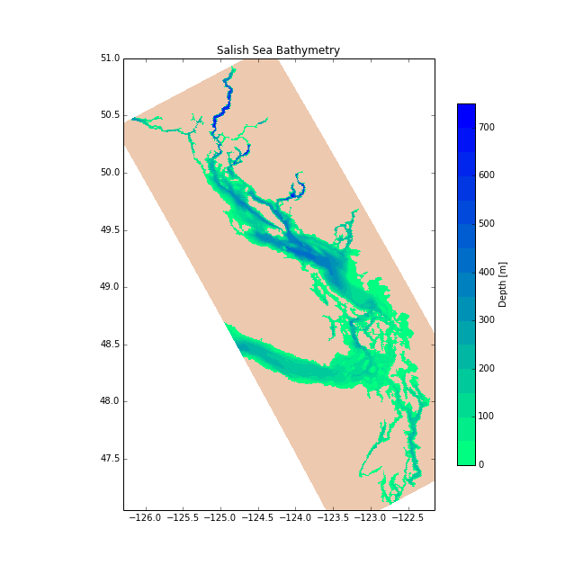

Getting the Repo
================

Team members using SSH key authentication on Bitbucket may clone the `NEMO-forcing`_ repo with:

.. code-block:: bash

    hg clone ssh://hg@bitbucket.org/salishsea/nemo-forcing NEMO-forcing

For password authentication use:

.. code-block:: bash

    hg clone https://<you>@bitbucket.org/salishsea/nemo-forcing NEMO-forcing

where :kbd:`<you>` is your Bitbucket user id.

.. _NEMO-forcing: https://bitbucket.org/salishsea/nemo-forcing/

Repo Contents
=============

:file:`grid/` Directory
-----------------------

The :file:`grid/` directory contains coordinates and bathymetry files.

NEMO has the file names of the coordinates and bathymetry files hard-coded as :file:`coordinates.nc` and :file:`bathy_meter.nc` so the files used for a particular run-set need to be copied or symlinked to those names.

Coordinates and bathymetry for the initial sub-domain test case known as :kbd:`JPP` or :kbd:`WCSD_RUN_tide_M2_OW_ON_file_DAMP_ANALY`:

* :file:`SubDom_coordinates_seagrid_WestCoast.nc`
* :file:`SubDom_bathy_meter_NOBCchancomp.nc`

.. _SalishSeaSubdomainBathy-image:

.. figure:: images/SalishSeaSubdomainBathy.png

    Sub-domain bathymetry used for initial tests.

Coordinates and bathymetry for the full Salish Sea domain:

* :file:`coordinates_seagrid_SalishSea.nc`
* :file:`bathy_meter_SalishSea.nc`

.. _SalishSeaBathy-image:

    Full Salish Sea domain bathymetry.

:file:`bdydta/` Directory
-------------------------

The :file:`bdydta/` directory contains forcing data for the open boundaries of sub-domain.

Currently there are three files that specify the M2 tidal components for the Western and Northern open boundaries of the West Coast SubDomain.  These files specify the cosine and sine components for the sea surface height (T), the x-direction velocity (U) and y-direction velocity (V).

* :file:`JPP_bdytide_M2_grid_T.nc`
* :file:`JPP_bdytide_M2_grid_U.nc`
* :file:`JPP_bdytide_M2_grid_V.nc`

:file:`open_boundaries/west` Directory
---------------------------------------

The :file:`open_boundaries/` directory contains the open boundary forcing information for the full domain.  Currently we are only using the :file:`west/` subdirectory as we have the north boundary closed.

There is currently one file in the main directory.  It specifies set temperature and salinity (uniform across the boundary) from Thomson et al, 2007 winter picture.

* :file:`SalishSea_bdyT_tra.nc`

The preparation of the NetCDF file is done by the python notebook `Tools/I_Forcing/PrepareSimpleOBC.ipynb`_

.. _Tools/I_Forcing/PrepareSimpleOBC.ipynb: https://bitbucket.org/salishsea/tools/src/tip/I_ForcingFiles/PrepareSimpleOBC.ipynb

:file:`open_boundaries/west/tides/` Directory
----------------------------------------------

The :file:`open_boundaries/west/tides/` sub-directory contains the tidal forcing files for the western boundary of the full domain.

Currently there are three preliminary files that specify the M2 tidal components.  These files specify the cosine and sine components for the sea surface height (T), the x-direction velocity (U) and y-direction velocity (V).

* :file:`SalishSea_west_sea_tide_M2_grid_T.nc`
* :file:`SalishSea_west_sea_tide_M2_grid_U.nc`
* :file:`SalishSea_west_sea_tide_M2_grid_V.nc`

:file:`initial_strat/` Directory
--------------------------------

The :file:`initial_strat/` directory contains initial data for the temperature and salinity fields.

Currently there are two files for the JPP Sub-domain based on 500 m maximum water depth and 40 vertical levels.

* :file:`SoG0318_1y_temperature_nomask.nc`
* :file:`SoG0318_1y_salinity_nomask.nc`

The data is horizontally uniform, based on STRATOGEM profile at S4-1 in September 2003 from cruise 0318.  Original data file is

* :file:`sg0318006.cnv`

and the profile is plotted in

* :file:`sg0318006_profile.ps`
* :file:`sg0318006_profile.fig`

The preparation of the NetCDF files is done by the python notebook `Tools/I_Forcing/PrepareTS.ipynb`_

.. _Tools/I_Forcing/PrepareTS.ipynb: https://bitbucket.org/salishsea/tools/src/tip/I_ForcingFiles/PrepareTS.ipynb

:file:`rivers/`: Directory
--------------------------

The :file:`rivers/` directory contains forcing data for the rivers.

Currently there is one file, for the full Salish Sea domain that puts a constant 2000 m3/s out of the southern arm of the Fraser River.

* :file:`rivers_Fraser_only_cnst.nc`

The preparation of the NetCDF file is done by the python notebook `Tools/I_Forcing/AddRivers.ipynb`_

.. _Tools/I_Forcing/AddRivers.ipynb: https://bitbucket.org/salishsea/tools/src/tip/I_ForcingFiles/AddRivers.ipynb
