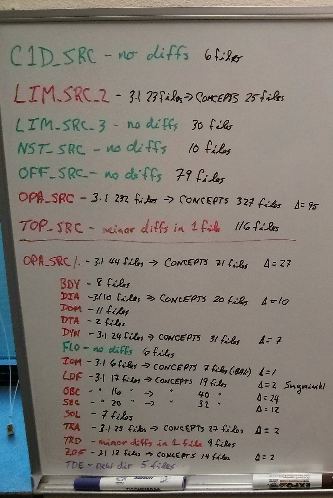

*****************************************
NEMO-3.1 and CONCEPTS-110 Reference Repos
*****************************************

These notes describe the `NEMO-3.1`_ and `CONCEPTS-110`_ reference repositories.

.. _NEMO-3.1: https://github.com/SalishSeaCast/NEMO-3.1/
.. _CONCEPTS-110: https://github.com/SalishSeaCast/CONCEPTS-110/

The construction of the `NEMO-3.1`_ repo is described in :ref:`nemo-3.1-repo-construction` below.
The `CONCEPTS-110`_ repo was constructed from the :file:`CODE.tar` tarball received on 2-Oct-2013 from J-P Paquin.

Also included here is an :ref:`analysis of the differences <nemo31-concepts110-diffs>` between the :file:`NEMO/` directory trees in the 2 repos that was done early in the Salish Sea MEOPAR project in Oct-2013.

.. _nemo-3.1-repo-construction:

NEMO-3.1
========

The following steps took the `NEMO-3.1`_ repo from initialization to a checkout of
``https://forge.ipsl.jussieu.fr/nemo/svn/tags/nemo_v3_1`` that could be built on :kbd:`jasper.westgrid.ca` and used to successfully run the :kbd:`GYRE` configuration:

* An :command:`svn` checkout of the trunk of the :kbd:`modipsl` framework was done from
  ``http://forge.ipsl.fr/igcmg/svn/modipsl/trunk``.
  That yielded revision 2163.
  The repo state was tagged as `modipsl-r2163`_.

  .. _modipsl-r2163: https://github.com/SalishSeaCast/NEMO-3.1/releases/tag/modipsl-r2163

  .. note::

      At this point the only directories in the :kbd:`modipsl` tree that are populated at :file:`doc/` and :file:`util/`.
      The :file:`bin/`,
      :file:`config/`,
      :file:`lib/`,
      :file:`modeles/`,
      and :file:`tmp/` directories are empty and therefore not included in the Mercurial repo.

* Added J-P Paquin's build script and :file:`util/AA_make.gdef` from 2-Oct-2013 :file:`CODE.tar` tarball.
  The latter is named :file:`AA_make.gdef_BIO`.

* Added definitions for :file:`util/model` script to :file:`util/mod.def` to get NEMO-3.1 based on those in that file in the 2-Oct-2013 :file:`CODE.tar` tarball.

* Used the :file:`modipsl/util/model` script to obtain the NEMO-3.1 code and other supporting files.
  The commands to do so were:

  .. code-block:: bash

      cd modipsl/util
      ./model NEMO_31

  Added the resulting 1295 files
  (some of which are in :file:`.svn/` directories).

* Added global makefile definitions for :kbd:`jasper.westgrid.ca` and the BIO :kbd:`HPC` cluster to :file:`util/AA_make.gdef`.
  The source for the former was Paul Myers' NEMO-3.1 installation on :kbd:`jasper` in :file:`/home/pmyers/NEMODRAK_3.1/DRAKKAR/modipsl/util/AA_make.gdef`.
  The latter came from :file:`uitl/AA_make.gdef` in the 2-Oct-2013 :file:`CODE.tar` tarball.

Build and Run NEMO-3.1
----------------------

.. note::

    These instructions are included for completeness.
    The Salish Sea MEOPAR project does not use pristine NEMO-3.1.

#. Clone the repository from Bitbucket and update it to the :kbd:`NEMO-3.1` tag state:

   .. code-block:: bash

      hg clone -u NEMO-3.1 ssh://hg@bitbucket.org/salishsea/nemo-code NEMO-code-3.1
      cd NEMO-code-3.1
      mkdir modipsl/bin modispl/lib modipsl/tmp

#. Set up a configuration.
   We'll use :kbd:`GYRE` as an example and assume that we are building and running on :kbd:`jasper`:

   .. code-block:: bash

      cd modispl/util
      ../modeles/UTIL/fait_config GYRE

#. Edit :file:`../config/GYRE/scripts/BB_make.ldef` to add the appropriate pre-processing prefix for the system you are working on (near the end of the file). For :kbd:`jasper` that is::

     #-Q- jasper  prefix = -D

   .. note::

      If you are working on a system other than those that already have global makefile definitions in :file:`modipsl/util/AA_make.gdef` you will need to add an appropriate block of definitions to that file.

#. Calculate compilation rules,
   options,
   and build dependencies so as to create :file:`modipsl/modelels/NEMO/WORK/AA_make`
   (which is symlinked to :file:`modipsl/config/GYRE/scripts/BB_make`):

   .. code-block:: bash

      cd ../modeles/NEMO
      ../UTIL/fait_AA_make

   .. note::

      :file:`fait_AA_make` *must* be run from the :file:`modipsl/modeles/NEMO/` directory.

#. Remove any existing :file:`Makefiles` and create new ones:

   .. code-block:: bash

      cd ../../util
      ./clr_make
      ./ins_make -t jasper

#. On :kbd:`jasper` several modules must be loaded prior to compiling and linking:

   .. code-block:: bash

       module load compiler/intel/12.1
       module load library/intelmpi/4.0.3.008
       module load library/netcdf/4.1.3
       module load library/szip/2.1

   That only needs to be done once per login so you may wish to add those commands to your :file:`$HOME/.bashrc` file
   (See :ref:`moaddocs:bashConfiguration`).

#. Compile and link the code:

   .. code-block:: bash

      cd ../config/GYRE
      make clean
      make

    The results of a successful build are:

    * a :file:`../../bin/opa` executable
    * a :file:`../../lib/libioipsl.a` library
    * a :file:`../../lib/oce/libopa.a` library

#. Run the model:

   .. code-block:: bash

      cd EXP00
      ../../../bin/opa

   On HPC clusters the above command is only appropriate for short test runs.
   Longer runs should be done using a job script submitted via the system's queue submission
   command.

.. _nemo31-concepts110-diffs:

Diffs Analysis
==============

The image below shows the results of an analysis of the file-level differences between the :file:`NEMO/` directory trees in the `NEMO-3.1`_ and `CONCEPTS-110`_ repos.

* Green indicates directories in which all files are identical
* Red indicates directories in which 1 or more files are different
* Black shows the number of files in the directories and the difference in the number of files between `NEMO-3.1`_ and `CONCEPTS-110`_ when applicable
* The :file:`OPA_SRC/TDE/` directory in purple is present only in the `CONCEPTS-110`_ directory

The numbers of files in each directory were calculated with commands like:

.. code-block:: bash

    find OPA_SRC/ZDF/* -prune ! -type d | wc -l

In the directories in which the number of files was the same checks for differences between files was done with commands like:

.. code-block:: bash

    CONCEPTS=CONCEPTS-110/CONCEPTS110_WCSD_OW_NOBC_tide/modipsl/modeles/NEMO
    cd NEMO-3.1/NEMO
    for file in $(find OPA_SRC/ZDF/* -prune ! -type d);
    do
      diff $CONCEPTS/$file $file;
    done
