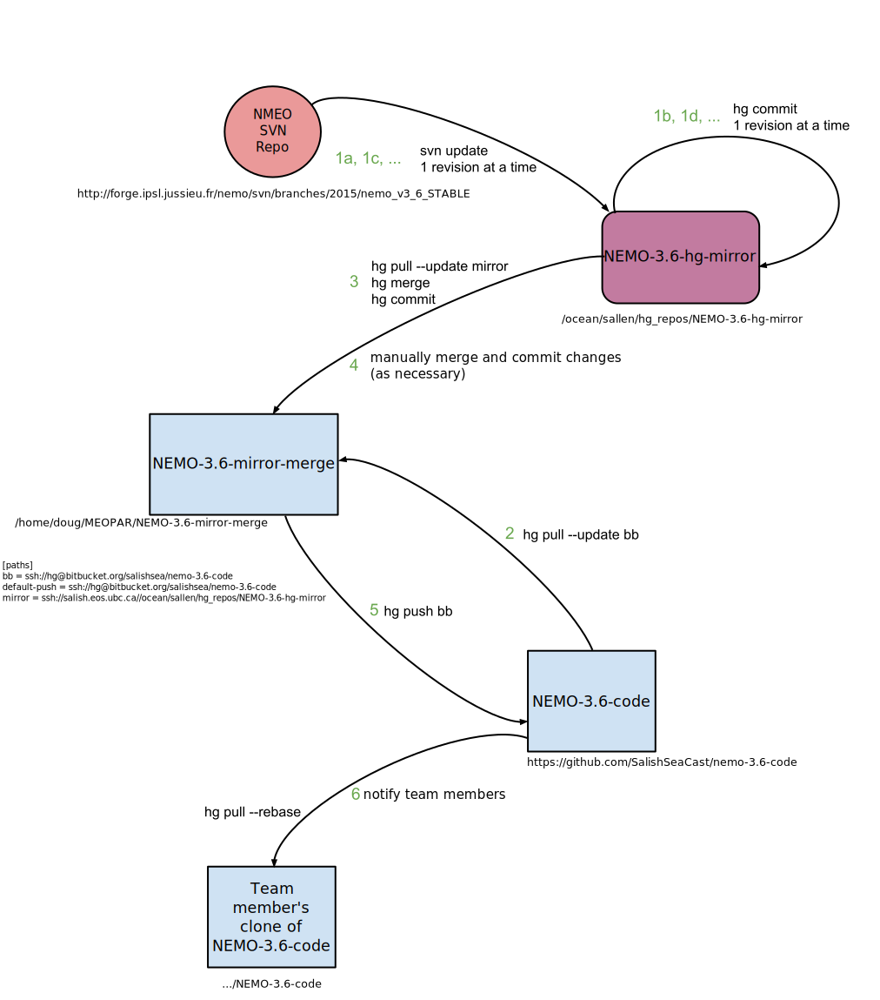

.. _NEMO-3.6CodeRepoMaintenance:

******************************
NEMO-3.6 Code Repo Maintenance
******************************

.. _NEMO-3.6MaintSetup:

Set-up
======

The :file:`/ocean/sallen/hg_repos/NEMO-3.6-hg-mirror` repository is an :command:`svn` checkout of http://forge.ipsl.jussieu.fr/nemo/svn/branches/2012/dev_v3_4_STABLE_2012 and also a read-only Mercurial repository.
It was initialized with:

.. code-block:: bash

    $ cd /ocean/sallen/hg_repos
    $ svn co -r 5072 http://forge.ipsl.jussieu.fr/nemo/svn/branches/2015/nemo_v3_6_STABLE NEMO-3.6-hg-mirror
    $ hg init NEMO-3.6-hg-mirror
    $ cd NEMO-3.6-hg-mirror
    $ cat > .hgignore
    syntax: glob
    .svn
    ctrl-d
    $ hg add
    $ hg ci -m"Initialize NEMO-3.6 svn mirror at r5072 of ^/trunk."

:command:`svn` v1.8.8 was used on :kbd:`skookum` for the :command:`svn` part of the initialization.

Doug maintains an :file:`NEMO-3.6-mirror-merge` repo on his laptop.
That repo is used to merge changes from the upstream Subversion repository that are brought in via the :file:`/ocean/sallen/hg_repos/NEMO-3.6-hg-mirror` repo,
and from the `Salish Sea team NEMO-3.6-code repo`_ on Bitbucket.
The :file:`NEMO-3.6-mirror-merge` repo was created by cloning the :file:`/ocean/sallen/hg_repos/NEMO-3.6-hg-mirror` repo:

.. _Salish Sea team NEMO-3.6-code repo: https://bitbucket.org/salishsea/NEMO-3.6-code

.. code-block:: bash

    hg clone ssh://skookum.eos.ubc.ca//ocean/sallen/hg_repos/NEMO-3.6-code-hg-mirror NEMO-3.6-code-mirror-merge

and setting the paths in its :file:`.hg/hgrc` to:

.. code-block:: ini

    [paths]
    bb = ssh://hg@bitbucket.org/salishsea/nemo-3.6-code
    default-push = ssh://hg@bitbucket.org/salishsea/nemo-3.6-code
    mirror = ssh://skookum.eos.ubc.ca//ocean/sallen/hg_repos/NEMO-3.6-code-hg-mirror

Those paths mean that the repo for :command:`hg pull` and :command:`hg incoming` commands must be specified explicitly.
The :kbd:`bb` and :kbd:`mirror` paths are provided to facilitate pulling from :kbd:`nemo-3.6-code` on Bitbucket and :file:`/ocean/sallen/hg_repos/NEMO-3.6-code-hg-mirror`,
respectively.
:command:`hg push` and :command:`hg outgoing` commands will act on the :kbd:`nemo-3.6-code` repo on Bitbucket,
unless otherwise specified.

The `Salish Sea team NEMO-3.6-code repo`_ on Bitbucket was created via the Bitbucket web interface and populated there by an :command:`hg push` from Doug's :file:`NEMO-3.6-mirror-merge` repo.

A working copy was then created by cloning the `Salish Sea team NEMO-3.6-code repo`_ on Bitbucket as :file:`NEMO-3.6-code`.
The workflow sections below explain how these 4 repo clones are used to pull changes from upstream and merge them with changes that Salish Sea team members push to Bitbucket.

   NEMO-3.6 code repositories and workflow to update and merge SVN and local changes

.. _PullChangesFromNEMO-3.6svn:

Workflow to Pull Changes from NEMO-3.6 :command:`svn` Repo
----------------------------------------------------------

The workflow to pull changes from the master NEMO :command:`svn` repo and commit them to our :file:`NEMO-3.6-hg-mirror` repo is somewhat automated by the :ref:`Marlin`.

#. Review the upstream changes in the source browser at http://forge.ipsl.jussieu.fr/nemo/svn/branches/2012/dev_v3_4_STABLE_2012 to select a range of changes to be pulled into our :file:`NEMO-3.6-hg-mirror` repo.

   .. note::

      Pay special attention to changes in the :file:`OPA_SRC/` and :file:`TOP_SRC/` trees that involve files that have been copied into :file:`NEMOGCM/CONFIG/SalishSea/MY_SRC/` or team members' :file:`MY_SRC/` directories.
      Those files must be *manually* merged with their :file:`MY_SRC/` counterparts.

#. Working on :kbd:`salish` in the :file:`/ocean/sallen/hg_repos/NEMO-3.6-hg-mirror` repo with an activated virtualenv in which :command:`marlin` is installed:

   .. code-block:: bash

       $ ssh salish
       $ workon marlin
       (marlin)$ cd /ocean/sallen/hg_repos/NEMO-3.6-hg-mirror

#. Use :kbd:`marlin incoming` information about the next SVN revision that will be pulled from upstream and confirm that it is the expected revision:

   .. code-block:: bash

       (marlin)$ marlin incoming
       r6482 2016-04-19 09:59:19 UTC
         #1687 - Add a consistency check for the setting of ln_useCT and nn_eos

   The :kbd:`--limit` option can be used to see more incoming revisions;
   see :command:`marlin help incoming` for details.

#. Use :kbd:`marlin update` to update the working copy to the next upstream commit and commit the SVN update as a Mercurial changeset with the SVN commit message as the body of the Mercurial commit message and echo that message:

   .. code-block:: bash

       (marlin)$ marlin update
       Update to svn r6482.

       #1687 - Add a consistency check for the setting of ln_useCT and nn_eos

   The :kbd:`--to-rev` option can be used to apply a series of upstream updates,
   committing them to Mercurial one at a time;
   see :command:`marlin help update` for details.

Workflow to Merge NEMO-3.6 :command:`svn` Repo and Salish Sea Revisions
-----------------------------------------------------------------------

Merging changes from NEMO :command:`svn` and the `Salish Sea team NEMO-3.6-code repo`_ on Bitbucket is done in a repo that is used for only that purpose.
Doug does the merges on his laptop.
The repo in which the merging is done was created by cloning the :file:`/ocean/sallen/hg_repos/NEMO-3.6-hg-mirror` repo as described in the :ref:`NEMO-3.6MaintSetup` section.

After the :ref:`PullChangesFromNEMOsvn` has been completed the workflow to merge those changes with Salish Sea MEOPAR project revisions is:

#. Pull and update recent changes from the `Salish Sea team NEMO-3.6-code repo`_ into :kbd:`NEMO-3.6-mirror-merge`:

   .. code-block:: bash

       cd NEMO-3.6-mirror-merge
       hg pull --update bb

#. Pull and update the changes from :file:`/ocean/sallen/hg_repos/NEMO-3.6-hg-mirror` into :kbd:`NEMO-3.6-mirror-merge`:

   .. code-block:: bash

       hg pull mirror

#. Because the changesets pulled from the `Salish Sea team NEMO-3.6-code repo`_ are public a branch merge is necessary:

   .. code-block:: bash

       hg merge
       hg commit -m"Merge svn updates."

#. Manually merge and commit changes that involve files that have been copied into :file:`NEMOGCM/CONFIG/SalishSea/MY_SRC/` or team members' :file:`MY_SRC/` directories.
   Those files are most likely to be in :file:`OPA_SRC/` and :file:`TOP_SRC/`.

#. Push the result of the updates and merges to the `Salish Sea team NEMO-3.6-code repo`_:

   .. code-block:: bash

       hg push bb

   If other users have pushed changes to the `Salish Sea team NEMO-3.6-code repo`_ while merge conflicts were being handled :command:`hg pull --rebase` can be used to bring in those changes and deal with any additional merge conflicts.

#. Notify team members of the upstream merge,
   especially if manual merges of :file:`MY_SRC/` files were required,
   so that they can manage merging changes into any untracked :file:`MY_SRC/` files they may have.
