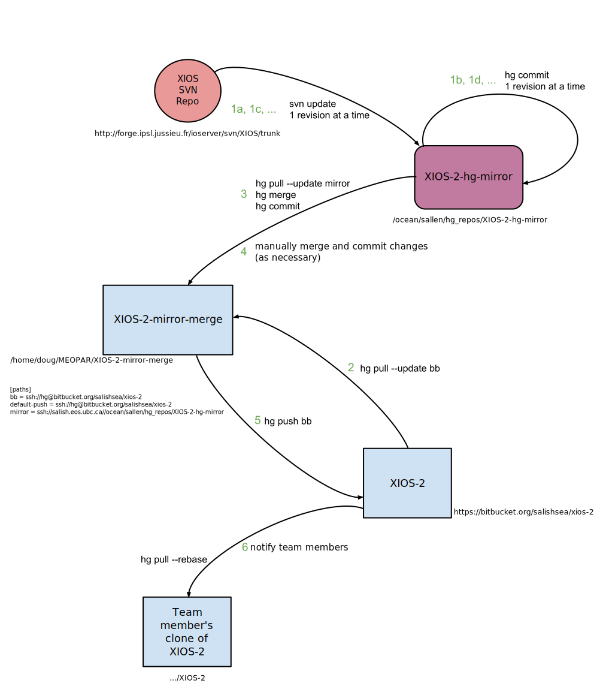

.. _XIOS-2CodeRepoMaintenance:

****************************
XIOS-2 Code Repo Maintenance
****************************

.. _XIOS-2MaintSetup:

Set-up
======

The :file:`/ocean/sallen/hg_repos/XIOS-2-hg-mirror` repository is an :command:`svn` checkout of http://forge.ipsl.jussieu.fr/nemo/svn/branches/2012/dev_v3_4_STABLE_2012 and also a read-only Mercurial repository.
It was initialized with:

.. code-block:: bash

    $ cd /ocean/sallen/hg_repos
    $ svn co -r 1066 http://forge.ipsl.jussieu.fr/ioserver/svn/XIOS/trunk XIOS-2-hg-mirror
    $ hg init XIOS-2-hg-mirror
    $ cd XIOS-2-hg-mirror
    $ cat > .hgignore
    syntax: glob
    .svn
    ctrl-d
    $ hg add
    $ hg ci -m"Initialize XIOS-2 svn mirror at r1066 of ^/trunk."

:command:`svn` v1.8.8 was used on :kbd:`skookum` for the :command:`svn` part of the initialization.

Doug maintains an :file:`XIOS-2-mirror-merge` repo on his laptop.
That repo is used to merge changes from the upstream Subversion repository that are brought in via the :file:`/ocean/sallen/hg_repos/XIOS-2-hg-mirror` repo,
and from the `Salish Sea team XIOS-2 repo`_ on Bitbucket.
The :file:`XIOS-2-mirror-merge` repo was created by cloning the :file:`/ocean/sallen/hg_repos/XIOS-2-hg-mirror` repo:

.. _Salish Sea team XIOS-2 repo: https://bitbucket.org/salishsea/xios-2

.. code-block:: bash

    hg clone ssh://skookum.eos.ubc.ca//ocean/sallen/hg_repos/XIOS-2-hg-mirror XIOS-2-mirror-merge

and setting the paths in its :file:`.hg/hgrc` to:

.. code-block:: ini

    [paths]
    bb = ssh://hg@bitbucket.org/salishsea/xios-2
    default-push = ssh://hg@bitbucket.org/salishsea/xios-2
    mirror = ssh://skookum.eos.ubc.ca//ocean/sallen/hg_repos/XIOS-2-hg-mirror

Those paths mean that the repo for :command:`hg pull` and :command:`hg incoming` commands must be specified explicitly.
The :kbd:`bb` and :kbd:`mirror` paths are provided to facilitate pulling from :kbd:`xios-2` on Bitbucket and :file:`/ocean/sallen/hg_repos/XIOS-2-hg-mirror`,
respectively.
:command:`hg push` and :command:`hg outgoing` commands will act on the :kbd:`xios-2` repo on Bitbucket,
unless otherwise specified.

The `Salish Sea team XIOS-2 repo`_ on Bitbucket was created via the Bitbucket web interface and populated there by an :command:`hg push` from Doug's :file:`XIOS-2-mirror-merge` repo.

A working copy was then created by cloning the `Salish Sea team XIOS-2 repo`_ on Bitbucket as :file:`XIOS-2`.

Getting the `Salish Sea team XIOS-2 repo`_ on Bitbucket to a state in which team members can clone it and easily build XIOS is annoyingly fiddly.
The difficulties largely stem from the fact that the svn checkout includes compressed tarballs in the :file:`archive/` directory.
On the first build,
those tarballs are decompressed into :file:`extern/` and :file:`tools/FCM/`.
Subsequent builds check to see if the tarballs have been decompressed,
so the tarballs can't be removed,
only their compressed forms.

Here are the steps that were done in a working copy on :kbd:`salish` cloned from the `Salish Sea team XIOS-2 repo`_ on Bitbucket:

* Tag :kbd:`XIOS-2r1066`
* Add :file:`README.rst` by copying and editing the one from the :file:`XIOS-1` repo
* Symlink the :file:`XIOS-ARCH/UBC-EOAS/arch-GCC_SALISH.*` files into :file:`arch/`
* Run :command:`make_xios`
* :command:`hg forget tools/archive/FCM.tar.gz tools/archive/blitz.tar.gz tools/archive/boost.tar.gz tools/archive/rapidxml.tar.gz`
* Add :kbd:`tools/archive/*.tar.gz` to :file:`.hgignore`
* :command:`hg add tools/archive/*.tar tools/FCM/ extern/blitz/ extern/boost/ extern/rapidxml/`
* :command:`hg commit -m"Replace tools/archive compressed tarballs with their extracted contents."`
* :command:`hg push`
* Clone the `Salish Sea team XIOS-2 repo`_ on Bitbucket on :kbd:`orcinus`
* Confirm that XIOS-2 builds successfully
* Return to the working copy on :kbd:`salish`
* Add the following lines to :file:`.hgignore`
  (it is *critical* that this not be done earlier because it will prevent needed files from being pushed to Bitbucket)::

    .cache/
    .void_file
    Makefile
    arch.*
    bin/
    cfg/
    config.fcm
    done/
    etc/libxios.cfg
    extern/netcdf4
    fcm_env.*
    flags/
    inc/
    lib/
    obj/
    ppsrc/

* :command:`hg commit -m"Don't track build products files and directories."`

The workflow sections below explain how these 4 repo clones are used to pull changes from upstream and merge them with changes that Salish Sea team members push to Bitbucket.

   XIOS-2 code repositories and workflow to update and merge SVN and local changes

.. _PullChangesFromXIOS-2svn:

Workflow to Pull Changes from XIOS-2 :command:`svn` Repo
========================================================

The workflow to pull changes from the master XIOS :command:`svn` repo and commit them to our :file:`XIOS-2-hg-mirror` repo is somewhat automated by the :ref:`Marlin`.

#. Review the upstream changes in the source browser at http://forge.ipsl.jussieu.fr/ioserver/log/ to select a range of changes to be pulled into our :file:`XIOS-2-hg-mirror` repo.

#. Working on :kbd:`salish` in the :file:`/ocean/sallen/hg_repos/XIOS-2-hg-mirror` repo with an activated virtualenv in which :command:`marlin` is installed:

   .. code-block:: bash

       $ ssh salish
       $ workon marlin
       (marlin)$ cd /ocean/sallen/hg_repos/XIOS-2-hg-mirror

#. Use :kbd:`marlin incoming` information about the next SVN revision that will be pulled from upstream and confirm that it is the expected revision:

   .. code-block:: bash

       (marlin)$ marlin incoming
       r1062 2017-02-23 17:32:17 UTC
         Bug fix in interpolation for cell boundaries generation.

   The :kbd:`--limit` option can be used to see more incoming revisions;
   see :command:`marlin help incoming` for details.

#. Use :kbd:`marlin update` to update the working copy to the next upstream commit and commit the SVN update as a Mercurial changeset with the SVN commit message as the body of the Mercurial commit message and echo that message:

   .. code-block:: bash

       (marlin)$ marlin update
       Update to svn r1062.

       Bug fix in interpolation for cell boundaries generation.

   The :kbd:`--to-rev` option can be used to apply a series of upstream updates,
   committing them to Mercurial one at a time;
   see :command:`marlin help update` for details.

Workflow to Merge XIOS-2 :command:`svn` Repo and Salish Sea Revisions
=====================================================================

Merging changes from NEMO :command:`svn` and the `Salish Sea team XIOS-2 repo`_ on Bitbucket is done in a repo that is used for only that purpose.
Doug does the merges on his laptop.
The repo in which the merging is done was created by cloning the :file:`/ocean/sallen/hg_repos/XIOS-2-hg-mirror` repo as described in the :ref:`XIOS-2MaintSetup` section.

After the :ref:`PullChangesFromNEMOsvn` has been completed the workflow to merge those changes with Salish Sea MEOPAR project revisions is:

#. Pull and update recent changes from the `Salish Sea team XIOS-2 repo`_ on Bitbucket into :kbd:`XIOS-2-mirror-merge`:

   .. code-block:: bash

       cd XIOS-2-mirror-merge
       hg pull --update bb

#. Pull and update the changes from :file:`/ocean/sallen/hg_repos/XIOS-2-hg-mirror` into :kbd:`XIOS-2-mirror-merge`:

   .. code-block:: bash

       hg pull mirror

#. Because the changesets pulled from the `Salish Sea team XIOS-2 repo`_ on Bitbucket are public a branch merge is necessary:

   .. code-block:: bash

       hg merge
       hg commit -m"Merge svn updates."

#. Push the result of the updates and merges to the `Salish Sea team XIOS-2 repo`_ on Bitbucket:

   .. code-block:: bash

       hg push bb

   If other users have pushed changes to the `Salish Sea team XIOS-2 repo`_ on Bitbucket while merge conflicts were being handled :command:`hg pull --rebase` can be used to bring in those changes and deal with any additional merge conflicts.

#. Notify team members of the upstream merge.
