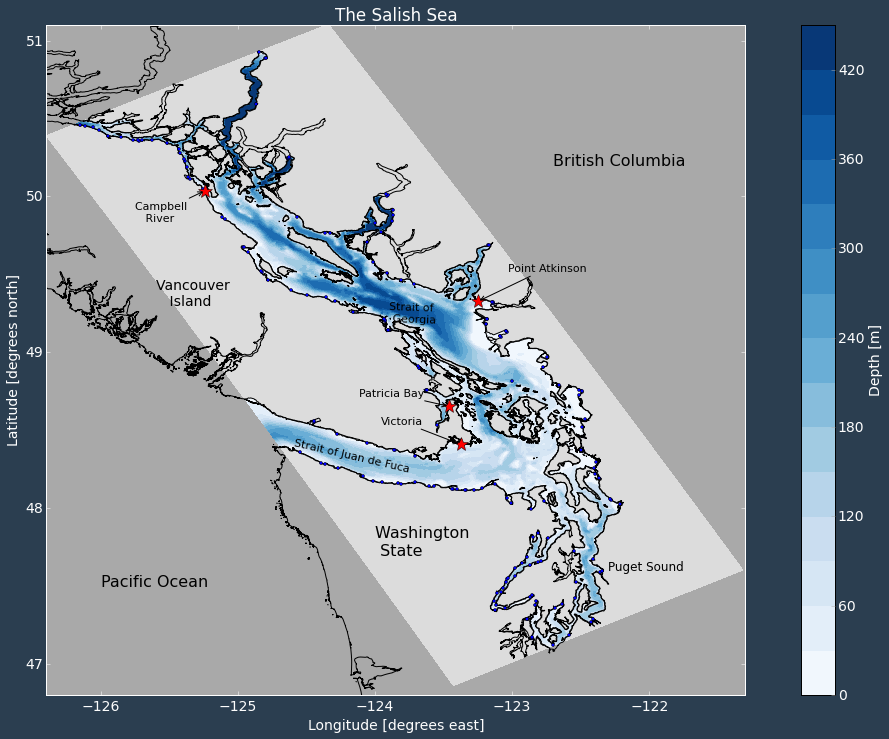

.. SalishSea-MEOPAR documentation master file

.. _SalishSeaDocs:

***************************************
Salish Sea MEOPAR Project Documentation
***************************************

This is a collection of documentation about the Salish Sea MEOPAR project.
There is a companion collection of :ref:`project tools documentation <SalishSeaToolsDocs>`.

.. _about:

About the Project
=================

The Salish Sea is home to a large population of Canadians living in coastal communities at risk to ocean related hazards.
There is an ongoing need to assess the impact of these hazards on human and marine environments through a multidisciplinary approach involving Canadian oceanographers,
biologists,
and social scientists.
The Marine Environmental Observation Prediction and Response network
(MEOPAR_)
provides a platform to accelerate this type of research.

.. _MEOPAR: https://meopar.ca/

The Salish Sea MEOPAR project team is developing a three-dimensional ocean model for the Strait of Georgia and Salish Sea.
Using the NEMO_ modelling architecture the Salish Sea model will be used to evaluate storm surge risk in coastal communities.
A long term goal is to include a coupled biogeochemical modelling component.

.. _NEMO: https://www.nemo-ocean.eu/

Contents
========

.. toctree::
   :maxdepth: 2

   repos_organization
   work_env/index
   code-notes/salishsea-nemo/index
   results_server/index
   NEMO36ModelEvaluation201702/index
   NEMO36ModelEvaluation201905/index
   tides/index
   tidalcurrents/index
   rivers/index
   stability/index
   SMELTDocs/index
   smelt_sensitivity_analysis/index
   storm_surges/index
   turbulence/index
   particles/index
   code-notes/dev-notes/index
   CITATION
   CONTRIBUTORS

.. include:: license_description.txt
