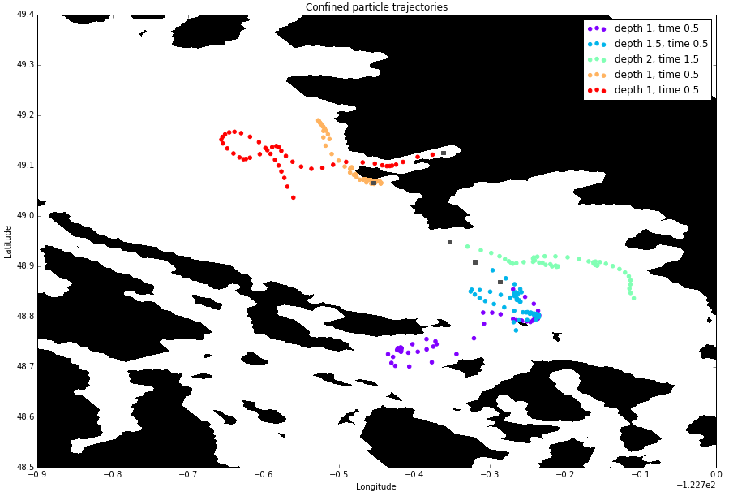
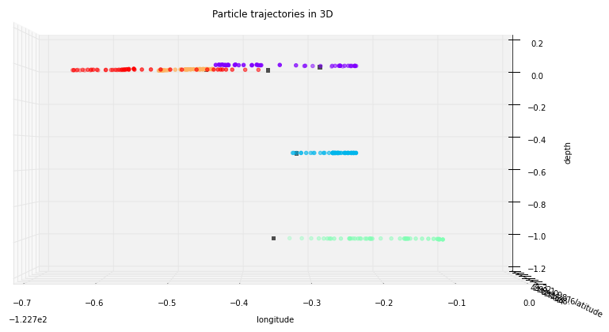

.. _Ariane:

Ariane
======================================================================================================
Ariane is a Fortran code used to compute 3D streamlines in a given velocity field.

Getting the code
--------------------------------------
* Go to  http://stockage.univ-brest.fr/~grima/Ariane/
* Under “What's new”, choose Ariane-v2.2.6

* Register and use your username and password to download the zip file with Ariane's source code

Installing on :kbd:`salish`
------------------------------------------
On :kbd:`salish` create an Ariane working directory:

.. code-block:: bash

	mkdir /ocean/username/MEOPAR/Ariane

Place the :kbd:`ariane-2.2.6_00.tar.gz` package in that directory and unpack it

.. code-block:: bash

	cd /ocean/username/MEOPAR/Ariane
	gunzip ariane-2.2.6_00.tar.gz
	tar -xf ariane-2.2.6_00.tar

Specify the locations of the :kbd:`netcdf` libraries to help the :kbd:`configure` script find them:

.. code-block:: bash

	cd ariane-2.2.6_00
        export NETCDF_INC=/usr/include
        export NETCDF_LIB=/usr/lib

Configure the installation:

.. code-block:: bash

	./configure --prefix=/ocean/$USER/MEOPAR/Ariane

The :kbd:`prefix` argument overwrites the default install directory into a customized directory.

Make and install Ariane:

.. code-block:: bash

	make
	make check
	make install

:kbd:`make` compiles source files, :kbd:`make check` tests Ariane's qualitative and quantitative modes, and :kbd:`make install` installs Ariane.

Add the path for the Ariane executable to your :kbd:`PATH` environment variable:

.. code-block:: bash

	export PATH=/ocean/username/MEOPAR/Ariane/bin:$PATH

Now you can run Ariane from any directory by typing :kbd:`ariane`.

Installing on :kbd:`orcinus`
------------------------------------------
On :kbd:`orcinus` create an Ariane working directory:

.. code-block:: bash

	mkdir $HOME/MEOPAR/Ariane

Place the :kbd:`ariane-2.2.6_00.tar.gz` package in that directory and unpack it:

.. code-block:: bash

	cd $HOME/MEOPAR/Ariane
	gunzip ariane-2.2.6_00.tar.gz
	tar -xf ariane-2.2.6_00.tar

Like :kbd:`salish`, we need to specify the locations of the :kbd:`netcdf` libraries on :kbd:`orcinus`:

.. code-block:: bash

	module load intel
    module load intel/14.0/netcdf_hdf5
    export NETCDF_INC=/global/software/lib64/intel/ncsa-tools/include
    export NETCDF_LIB=/global/software/lib64/intel/ncsa-tools/lib

Make and install Ariane:

.. code-block:: bash

	cd ariane-2.2.6_00
	./configure --prefix=$HOME/MEOPAR/Ariane
	make
	make check
	make install

The :kbd:`prefix` flag indicates where Ariane will be installed.
Here we have chosen :kbd:`$HOME/MEOPAR/Ariane`.
There should be several new directories in this folder: :kbd:`bin:`, :kbd:`docs`, :kbd:`examples`.
To run Ariane, add the path for the Ariane executable to your :kbd:`PATH` environment variable:

.. code-block:: bash

	export PATH=$HOME/MEOPAR/Ariane/bin:$PATH

Now you can run Ariane from any directory by typing :kbd:`ariane`.

On :kbd:`orcinus` Ariane runs can also be sumbitted to the queue.
An example :kbd:`.pbs` will be included soon.

Testing Ariane
------------------------
To test that you have everything set up correctly, run one of the Ariane examples.
For instance, try:

.. code-block:: bash

       cd examples/qualitative
       ariane

.. note::

   If you get an error about :kbd:`initial_positions.txt`, you may have to rename :kbd:`initial_positions` as :kbd:`initial_positions.txt` and remove all the the lines with the @ symbol.

You should notice several new files, such as :kbd:`ariane_trajectories_qualitative.nc` and :kbd:`traj.txt`.
These files contain the trajectory information.

* :kbd:`ariane_trajectories_qualitative.nc` can be loaded into a notebook to plot the particle locations over time and starting/finishing points, etc.
* :kbd:`traj.txt` is helpful if you want to get a general idea of what the resulting trajectory coordinates look like or to check if the simulation ran properly.

Running Ariane: An example for Salish Sea model
------------------------------------------------------------------------------
To run your own trajectory simulation with Salish Sea model output, create a run directory. For example, on your local machine:

.. code-block:: bash

	mkdir -p  /ocean/username/MEOPAR/Ariane/results/myexperiment
	cd /ocean/username/MEOPAR/Ariane/results/myexperiment

You will need :kbd:`namelist` and :kbd:`initial_positions.txt` files in this run directory (see below).

Type :kbd:`ariane` to  run the code.

:kbd:`intitial_positions.txt`
^^^^^^^^^^^^^^^^^^^^^^^^^^^^^
The :kbd:`initial_positions.txt` file is where you will specify the initial positions and initial times of the particles you are tracking. It contains 5 columns and as many rows as there are particles in the simulation you are running.

   .. code-block:: text

      	310	360	-1.0	0.5	1.0
	310	370	-1.5 	0.5    	1.0
	310	380   	-2.0  	1.5    	1.0
	310  	410   	-1.0  	0.5    	1.0
	331  	415	-1.0 	0.5    	1.0

This simulation, for example, will have 5 particles.

* Column 1: Spatial grid index (X)
* Column 2: Spatial grid index (Y)
* Column 3: Spatial grid index (Z)

	* A negative value tells Ariane to confine the particle to its original depth throughout its trajectory. If you would like to have the particle trajectory include vertical movement, enter positive values and provide Ariane with the W velocity components in :kbd:`namelist` if using NEMO data.
	* Since Ariane starts counting from 1, a "1" or "-1" here means the first depth grid box. The NEMO output grid boxes are 1 metre in height for the first few metres. This means that the second particle in this example (whose Z index is -1.5) would have a trajectory identical to that of a particle with Z index -1 if they shared the same X, Y, and T indices.
* Column 4: Time index or :kbd:`fl`

	* Use "0.5" if you want to start at NEMO time 00:00. Use "1" if you want to start at NEMO time 00:30.
* Column 5: Fifth parameter = 1.0

.. note::

    Ariane uses FORTAN indexing, which counts starting at 1. If you used Python to look up initial positions, which starts counting at 0, then you should add 1 to your initial positions.

:kbd:`namelist`
^^^^^^^^^^^^^^^

 .. note::

      Ariane can be run in 2 modes, quantitative and qualitative. This example, and therefore this version of the namelist, is qualitative.

An example Ariane namelist configured to a Salish Sea model run with hourly output over two days is provided below.
This namelist is also under version control in :file:`analysis/Nancy/Ariane_namelists/namelist`.

 .. code-block:: fortran

        &ARIANE
        	key_alltracers =.FALSE.,
        	key_sequential =.FALSE.,
	    	key_ascii_outputs =.TRUE.,
	    	mode ='qualitative',
	    	forback ='forward',
	    	bin ='nobin',
	    	init_final ='init',
	    	nmax =5,
	    	tunit =3600.,
	    	ntfic =1,
	    	tcyc =0.,
        /

        &OPAPARAM
        	imt =398,
	    	jmt =898,
	   	kmt =40,
	    	lmt =48,
	    	key_periodic =.FALSE.,
	    	key_jfold =.FALSE.,
	    	key_computew =.TRUE.,
	    	key_partialsteps =.TRUE.,
        /

        &QUALITATIVE
        	delta_t =3600.,
	    	frequency =1,
	    	nb_output =46,
	    	key_region =.FALSE.,
        /

        &ZONALCRT
        	c_dir_zo ='/data/nsoontie/MEOPAR/SalishSea/results/storm-surges/tide_fix/dec2006/all_forcing/1hour/',
        	c_prefix_zo ='SalishSea_1h_20061214_20061215_grid_U.nc',
	    	ind0_zo =-1,
	    	indn_zo =-1,
	    	maxsize_zo =-1,
	    	c_suffix_zo ='NONE',
	    	nc_var_zo ='vozocrtx',
	    	nc_var_eivu ='NONE',
	    	nc_att_mask_zo ='NONE',
        /

        &MERIDCRT
        	c_dir_me ='/data/nsoontie/MEOPAR/SalishSea/results/storm-surges/tide_fix/dec2006/all_forcing/1hour/',
	    	c_prefix_me ='SalishSea_1h_20061214_20061215_grid_V.nc',
	    	ind0_me =-1,
	    	indn_me =-1,
	    	maxsize_me =-1,
	    	c_suffix_me ='NONE',
	    	nc_var_me ='vomecrty',
	    	nc_var_eivv ='NONE',
	    	nc_att_mask_me ='NONE',
        /

        &MESH
        	dir_mesh ='/ocean/nsoontie/MEOPAR/Ariane/',
	    	fn_mesh ='mesh_mask.nc',
	    	nc_var_xx_tt ='glamt',
	    	nc_var_xx_uu ='glamu',
	    	nc_var_yy_tt ='gphit',
	    	nc_var_yy_vv ='gphiv',
	    	nc_var_zz_ww ='gdepw',
	    	nc_var_e2u ='e2u',
	    	nc_var_e1v ='e1v',
	    	nc_var_e1t ='e1t',
	    	nc_var_e2t ='e2t',
	    	nc_var_e3t ='e3t',
	    	nc_var_tmask ='tmask',
	    	nc_mask_val =0.,
        /

The general setup for the simulation is specified in the sections **ARIANE**, **OPAPARAM**, and **QUALITATIVE**.
Some of the parameters are described in the table below.
For a more detailed description of the parameters, please refer to the Ariane documentation: `Ariane Namelist`_

+------------------+---------------------------------------+------------------+---------------------------------------+
|    Parameter     |              Description              |    Parameter     |              Description              |
+==================+=======================================+==================+=======================================+
| :kbd:`nmax`      | Number of particles                   | :kbd:`kmt`       | Vertical space dimension (depth)      |
+------------------+---------------------------------------+------------------+---------------------------------------+
| :kbd:`tunit`     | Unit of time.                         | :kbd:`lmt`       | Number of time steps                  |
+                  +                                       +                  +                                       +
|                  | Example: 3600 for 1 hour              |                  | in input data                         |
+------------------+---------------------------------------+------------------+---------------------------------------+
| :kbd:`ntfic`     | x :kbd:`tunit` = Time period covered  | :kbd:`delta_t`   | Unit of time.                         |
+                  +                                       +                  +                                       +
|                  | by each time sample in input files    |                  | Example: 3600 for 1 hour              |
+------------------+---------------------------------------+------------------+---------------------------------------+
| :kbd:`imt`       | Horizontal space dimension            | :kbd:`frequency` | x :kbd:`delta_t` = Time interval      |
+                  +                                       +                  +                                       +
|                  | (longitude)                           |                  | between two sucessive position outputs|
+------------------+---------------------------------------+------------------+---------------------------------------+
| :kbd:`jmt`       | Horizontal space dimension            | :kbd:`nb_output` | Total number of position outputs for  |
+                  +                                       +                  +                                       +
|                  | (latitude)                            |                  | each trajectory.                      |
+------------------+---------------------------------------+------------------+---------------------------------------+

 .. note::

      **Condition 1: delta_t × frequency × nb_output < tunit × ntfic × lmt**

      **Condition 2: delta_t × frequency × nb_output < tunit × ntfic × (lmt + 0.5 - max(fl))**

      Condition 1 must be satisfied if the maximum time index is 0.5. Condition 2 must also be satisfied if any inital time index :kbd:`fl` is greater than 0.5.

We must also specify where Salish Sea model output is stored in sections **ZONALCRT** and **MERIDCRT**.
You can also input the vertical velocity component (recommended if using NEMO data) under **VERTICRT** or Ariane can compute it using the horizontal components.
There is also the option of specifying temperature, salinity, and density in the sections **TEMPERAT**, **SALINITY**, and **DENSITY** respectively.

+----------------------------------------+---------------------------------------+
|    Parameter                           |              Description              |
+========================================+=======================================+
| :kbd:`c_dir_zo`, :kbd:`c_dir_me`       | Directory where data is store         |
+----------------------------------------+---------------------------------------+
| :kbd:`c_prefix_zo`, :kbd:`c_prefix_me` | NetCDF file name with velocity data   |
+----------------------------------------+---------------------------------------+
| :kbd:`nc_var_zo`, :kbd:`nc_var_me`     | Variable name for velocity component  |
+----------------------------------------+---------------------------------------+
| :kbd:`dir_mesh`                        | Directory where grid is stored        |
+----------------------------------------+---------------------------------------+
| :kbd:`fn_mesh`                         | NetCDF file name with grid            |
+----------------------------------------+---------------------------------------+

Namelists can be constructed using the namelist assistant on the Ariane website: `Namelist Assistant`_

.. _Namelist Assistant: http://stockage.univ-brest.fr/~grima/Ariane/namelist/namelist.html

Finally, the **MESH** section indicates where information about the Salish Sea model grid is stored.
A file, :file:`mesh_mask.nc`, contains the mapping scale factors and grid masks needed by Ariane.
This is a large file not under version control but can be found in :file:`/ocean/nsoontie/MEOPAR/Ariane`.

Ariane output
------------------------
The trajectories can be plotted in a python notebook. Different colours are used to distinguish the different trajectories and their initial positions are marked by a gray square. A 3D plot may be helpful in viewing particles at varying depths.

Notebooks
-------------------------------
If you would like to see more examples of particle tracking, feel free to look at the following notebook:

* `ParticleTracking.ipynb`_

.. _ParticleTracking.ipynb: https://nbviewer.jupyter.org/urls/bitbucket.org/salishsea/analysis/raw/tip/Idalia/ParticleTracking.ipynb

References
-------------------------------
* Manual: `Compilation and Installation`_
* Manual: `Ariane Namelist`_
* Manual: `Ariane Tutorial`_
* Blanke, B., and S. Raynaud, 1997: Kinematics of the Pacific Equatorial Undercurrent: a Eulerian and Lagrangian approach from GCM results. J. Phys. Oceanogr., 27, 1038-1053.
* Blanke, B., M. Arhan, G. Madec, and S. Roche, 1999: Warm water paths in the equatorial Atlantic as diagnosed with a general circulation model. J. Phys. Oceanogr., 29, 2753-2768.
* Blanke, B., S. Speich, G. Madec, and K. Döös, 2001: A global diagnostic of interocean mass transfers. J. Phys. Oceanogr., 31, 1623-1632.

.. _Compilation and Installation: http://stockage.univ-brest.fr/~grima/Ariane/ariane_install_2.x.x_sep08.pdf
.. _Ariane Namelist: http://stockage.univ-brest.fr/~grima/Ariane/ariane_namelist_2.x.x_oct08.pdf
.. _Ariane Tutorial: http://stockage.univ-brest.fr/~grima/Ariane/ariane_tutorial_2.x.x_sep08.pdf
