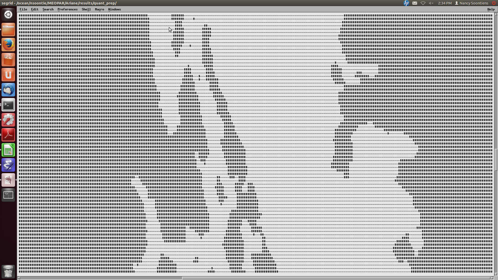
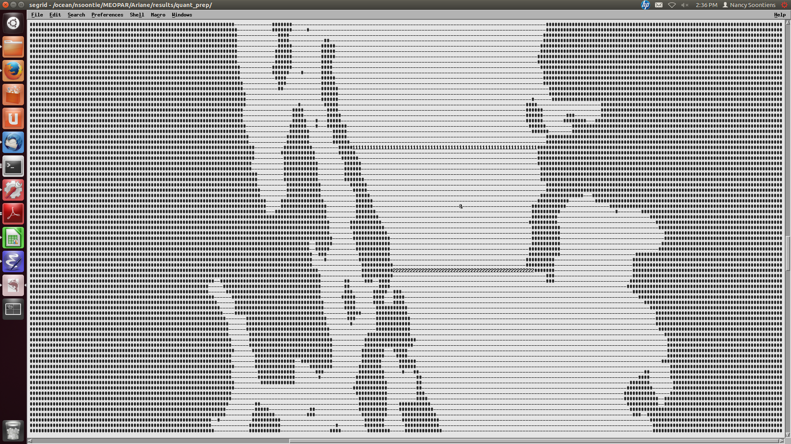

.. _Quantitative:

***********************************************
Quantitative Mode in Ariane
***********************************************

Ariane can be used to make estimates of transport through cross-sections by releasing a large number of particles and calculating how many particles pass through each section.
Next, we will go through how to set up a quantitative experiment in Ariane.

Namelists
=========

The namelist for quantitative mode is very similar to qualitative mode.
Here is an example of a quantitative namelist.

.. code-block:: fortran

   &ARIANE
       key_alltracers =.FALSE.,
       key_sequential =.FALSE.,
       key_ascii_outputs =.TRUE.,
       mode ='quantitative',
       forback ='forward',
       bin ='nobin',
       init_final ='init',
       nmax =30000,
       tunit =3600.,
       ntfic =1,
       key_computesigma=.FALSE.,
       zsigma=100.,
   /

   &OPAPARAM
       imt =398,
       jmt =898,
       kmt =40,
       lmt =24,
       key_periodic =.FALSE.,
       key_jfold =.FALSE.,
       key_computew =.FALSE.,
       key_partialsteps =.TRUE.,
   /

   &QUANTITATIVE
       key_eco        = .TRUE.,
       key_reducmem   = .TRUE.,
       key_unitm3     = .TRUE.,
       key_nointerpolstats = .FALSE.,
       max_transport  = 1.e4,
       lmin = 1,
       lmax = 6,
   /

   &ZONALCRT
       c_dir_zo ='/results/SalishSea/nowcast/01jan16/',
       c_prefix_zo ='SalishSea_1h_20160101_20160101_grid_U.nc',
       ind0_zo =-1,
       indn_zo =-1,
       maxsize_zo =-1,
       c_suffix_zo ='NONE',
       nc_var_zo ='vozocrtx',
       nc_var_eivu ='NONE',
       nc_att_mask_zo ='NONE',
   /

   &MERIDCRT
       c_dir_me ='/results/SalishSea/nowcast/01jan16/',
       c_prefix_me ='SalishSea_1h_20160101_20160101_grid_V.nc',
       ind0_me =-1,
       indn_me =-1,
       maxsize_me =-1,
       c_suffix_me ='NONE',
       nc_var_me ='vomecrty',
       nc_var_eivv ='NONE',
       nc_att_mask_me ='NONE',
   /

   &VERTICRT
       c_dir_ve     = '/results/SalishSea/nowcast/01jan16/',
       c_prefix_ve  = 'SalishSea_1h_20160101_20160101_grid_W.nc',
       ind0_ve      = -1,
       indn_ve      = -1,
       maxsize_ve   = -1,
       c_suffix_ve  = 'NONE',
       nc_var_ve    = 'vovecrtz',
       nc_var_eivw  = 'NONE',
       nc_att_mask_ve = 'NONE',
    /

    &TEMPERAT
       c_dir_te     = '/results/SalishSea/nowcast/01jan16/',
       c_prefix_te  = 'SalishSea_1h_20160101_20160101_grid_T.nc',
       ind0_te      = -1,
       indn_te      = -1,
       maxsize_te   = -1,
       c_suffix_te  = 'NONE',
       nc_var_te    = 'votemper',
       nc_att_mask_te = 'NONE',
    /

    &SALINITY
       c_dir_sa     = '/results/SalishSea/nowcast/01jan16',
       c_prefix_sa  = 'SalishSea_1h_20160101_20160101_grid_T.nc',
       ind0_sa      = -1,
       indn_sa      = -1,
       maxsize_sa   = -1,
       c_suffix_sa  = 'NONE',
       nc_var_sa    = 'vosaline',
       nc_att_mask_sa = 'NONE',
    /

    &MESH
       dir_mesh ='/data/nsoontie/MEOPAR/NEMO-forcing/grid/',
       fn_mesh ='mesh_mask_SalishSea2.nc',
       nc_var_xx_tt ='glamt',
       nc_var_xx_uu ='glamu',
       nc_var_yy_tt ='gphit',
       nc_var_yy_vv ='gphiv',
       nc_var_zz_ww ='gdepw',
       nc_var_e2u ='e2u',
       nc_var_e1v ='e1v',
       nc_var_e1t ='e1t',
       nc_var_e2t ='e2t',
       nc_var_e3t ='e3t',
       nc_var_tmask ='tmask',
       nc_mask_val =0.,
    /

Key namelist parameters
-----------------------

There are some key differences between the namelists in quantitative and qualitative mode.
Pay special attention to the following options:

* :kbd:`nmax`: The maximum number of particles. This parameter is typically much higher in quantitative mode.
* :kbd:`key_eco`: Setting to :kbd:`.TRUE.` reduces CPU time.
* :kbd:`key_reducmem`: Setting to :kbd:`.TRUE.` reduces memory by only reading model data over selected region.
* :kbd:`key_unitm3`: Setting to :kbd:`.TRUE.` prints transport calculation in m^3/s instead of Sverdrups.
* :kbd:`max_transport`: Maximum transport (in m^3/s) that should not be exceeded by the transport associated with each initial particle. A lower values means more initial particles and higher accuracy. Example values are 1e9 for one particle in one model cell and 1e4 for typical experiments.
* :kbd:`lmin`: First time step to generate particles.
* :kbd:`lmax`: Last time step to generate particles.
* :kbd:`key_alltracers`: :kbd:`.TRUE.` to print tracer information in diagnostics.
* :kbd:`key_computesigma`: :kbd:`.TRUE.` to compute density from temperature and salinity.
* :kbd:`zsigma`: reference level for sigma computation

Defining Sections
=================

You must define a closed region in your domain for transport calculations.
Ariane calculates the mass transport between an initial section in your region and the other sections.
Ariane provides a couple of useful tools for defining the sections.

* :kbd:`mkseg0`: This program reads your land-ocean mask and writes it as a text file. Run this program in the same directory as your namelist. You may need to add the ariane executables to your path.

.. code-block:: bash

    mkseg0

* :file:`segrid`: After you run :kbd:`mkseg0`, you should see a new file called :file:`segrid`. Edit this file with

.. code-block:: bash

   nedit segrid

* If you turn off text wrapping, you might see something like this:

Land points are :kbd:`#` and ocean points are :kbd:`-`.

* Add numbered sections to this file. Be sure your sections are over ocean points and not land points. Ariane will initialize particles along the section labelled as :kbd:`1` and will calculate transport through all other sections. Your sections must make up a closed volume. Place the :kbd:`@` symbol somewhere within your closed subdomain. Your final edit might look something like this.

* Run :kbd:`mkseg`

.. code-block:: bash

    mkseg

* Copy the section definitions into a file called :file:`sections.txt`. The section definitions can be found from the output of :kbd:`mkseg`. :file:`sections.txt` should look something like this::

     1   250   313  -409  -409     1    40 "1section"
     2   264   312   386   386     1    40 "2section"
     3     1   398     1   898     0     0 "Surface"

You can rename :kbd:`"1section"` and :kbd:`"2section"` to something more intuitive if you desire. You should also add a :kbd:`"Surface"` section as above.

* Run :file:`ariane`. Remember to check that you have added the :file:`ariane` executable to your path.

.. code-block:: bash

    ariane

* The output on the screen should indicate that ariane completed successfully. You should also see a new file called :file:`stats.txt`. This file contains statistics about the initial and final particles through each section and the transport calculations. It might look something like this::

     total transport (in m3/s):    230033.88767527405       ( x lmt =   5520813.3042065771      )
     max_transport (in m3/s)  :    1000000000.0000000
     # particles              :        20380

     initial state                #  20380
      stats. for:          x         y         z         a
             min:   -123.457    48.946     0.500     0.000
             max:   -123.134    49.063   226.275     0.000
            mean:   -123.347    48.986    74.893     0.000
       std. dev.:      0.062     0.022    61.722     0.000

     meanders        166079.1572 0
     1section        .0000 1
     2section        63952.7799 2
     Surface         .0000 3
               total 230033.8877
         except mnds 63954.7305
                lost 1.9506

     final state        meanders #  11094
     stats. ini:          x         y         z         a
            min:   -123.457    48.946     0.500     0.006
            max:   -123.134    49.063   226.275    16.858
           mean:   -123.343    48.987    91.665     0.606
      std. dev.:      0.055     0.020    61.438     1.010
     stats. fin:          x         y         z         a
            min:   -123.458    48.945     0.019     0.006
            max:   -123.132    49.064   238.621    16.858
           mean:   -123.329    48.992    91.483     0.606
      std. dev.:      0.052     0.019    62.670     1.010

     final state        2section #   9285
     stats. ini:          x         y         z         a
            min:   -123.457    48.946     0.500     0.191
            max:   -123.134    49.063   226.275    16.074
           mean:   -123.357    48.982    31.337     1.715
      std. dev.:      0.075     0.028    35.675     1.639
     stats. fin:          x         y         z         a
            min:   -123.317    48.883     0.058     0.191
            max:   -123.079    48.970   151.722    16.074
           mean:   -123.192    48.929    25.504     1.715
      std. dev.:      0.068     0.025    25.477     1.639

* :kbd:`lost` are the particles not intercepted by any section.
* :kbd:`meanders` are the particles that go back out the source section.

Time considerations
===================

Particles initialized later in the simulation do not have as much time to cross one of the sections so it could be beneficial to impose a maximum age of each particle. This can be achieved by modifying :file:`mod_criter1.f90` in :kbd:`src/ariane` as follows:

.. code-block:: fortran

    !----------------------------------------!
    !- ADD AT THE END OF EACH LINE "!!ctr1" -!
    !----------------------------------------!
    !criter1=.FALSE.                 !! ctr1
    !
    !------------!
    !- Examples -!
    !------------!
    !
         criter1=(abs(hl-fl).ge. lmt-lmax)   !! ctr1

* :kbd:`lmt` and :kbd:`lmax` should be substituted by the values you set in the namelist.
* You must remake and install ariane when making a change to any of the fortran files.
* In :file:`stats.txt`, you will now see the particles intercepted by this time criterion.

.. code-block:: fortran

    meanders        135298.2260 0
    1section        .0000 1
    2section        13650.4035 2
    Surface         .0000 3
    Criter1         81085.2582 4
              total 230033.8877
        except mnds 94735.6616
               lost -.0000

Defining and tracking water masses
==================================

You can also impose a density and/or salinity and/or temperature criteria on the initial particles in order to track different water masses. You can achieve this by editing :file:`mod_criter0.f90`.

.. code-block:: fortran

    !criter0=.TRUE.        !!ctr0
    !
    !------------!
    !- Examples -!
    !------------!
         criter0=(zinter(ss,hi,hj,hk,hl).le.29_rprec)     !!crt0

* Once again, you must remake and install ariane.
* You'll also need to make sure that :kbd:`key_alltracers` and :kbd:`key_computesigma` are :kbd:`.TRUE.` and :kbd:`zsigma` are defined in your namelist.
* Now particles will be initialized with salinity less than 29.
* There are other examples of useful criteria in :file:`mod_criter0.f90`.
* Once again, the output of :file:`stats.txt` will be different. Here is an example of part of :file:`stats.txt`::

     total transport (in m3/s):    76419.982459495324       ( x lmt =   1834079.5790278877      )
     max_transport (in m3/s)  :    1000000000.0000000
     # particles              :        16133

     initial state                #  16133
     stats. for:          x         y         z         a         t         s         r
            min:   -123.457    48.946     0.500     0.000     4.693    16.243    13.336
            max:   -123.134    49.063    45.041     0.000     9.960    29.000    22.816
           mean:   -123.333    48.991    15.077     0.000     8.526    27.842    22.038
      std. dev.:      0.075     0.027    10.570     0.000     0.973     1.458     1.040

     meanders        26404.6357 0
     1section        1057.5257 1
     2section        12998.1853 2
     Surface         .0000 3
     Criter1         35959.6357 4
              total 76419.9825
        except mnds 50015.3468
               lost .0000

* From the initial state statistics, you can see that the particles satisfy the salinity criteria. This might not be true of the final particles.

0ther files
===========

Ariane will also produce netCDF files :file:`ariane_positions_quantitative.nc` and :file:`ariane_statistics_quantitative.nc` that can be used to plot the particle trajectories and statistics.
