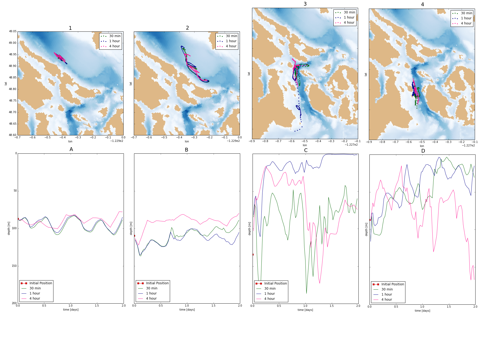

.. _Frequency Sensitivity Studies:

***********************************************
Frequency Sensitivity Studies
***********************************************

The model produces datasets containing information about the velocity field for a region. Ariane uses this information to produce particle trajectories. We wanted to know at what frequency would the model output need to be to produce the most reliable particle trajectories.

For the frequency sensitivity studies, we used model outputs with 30 minute, 1 hour, and 4 hour frequencies. This data was used in Ariane to generate particle trajectories with points at 30 minute intervals. We did this for particles starting their trajectories at the Fraser River and at various points along the thalweg.

:command:`Color scheme:`
* 30 minute: green
* 1 hour: blue
* 4 hour: pink 

On the Surface
===================

.. figure:: images/Sensitivity2D.png

At the Fraser River, we found that the particle trajectory generated using data at a 4 hour frequency does not capture subtleties in particle motion as do the trajectories derived from data at 30 minute and 1 hour frequencies.

The trajectory that used 1 hour frequency data very closely resembles the trajectory that used 30 minute data.

:command:`Conclusion: We can use 1 hour or 30 minute NEMO output data when particle trajectories start at the Fraser River.`

At Depth
===================

Figures 1, 2, 3, and 4 show particle trajectories with initial positions along the thalweg, but the initial positions in figures 3 and 4 are located in regions with stronger mixing. Figures A, B, C, and D show the change in depth of the particles as they progressed in their trajectories.

Figures A and B show many differences in the evolution of depths between the 4 hour frequency cases and the 30 minute or 1 hour cases. In fact, the 1 hour case also deviates from the 30 minute case.

Figures C and D 

:command:`Conclusion:` 
