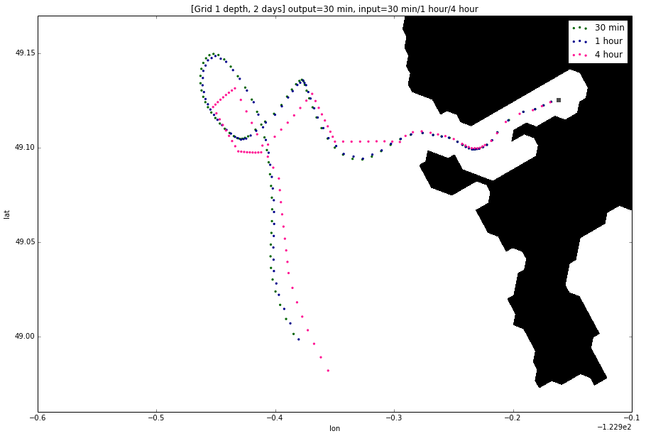

.. _Frequency Sensitivity Studies:

***********************************************
Frequency Sensitivity Studies
***********************************************

The model produces datasets containing information about the velocity field for a region. Ariane uses this information to produce particle trajectories. We wanted to know at what frequency would the NEMO output need to be to produce reliable particle trajectories.

How different would the trajectory of a particle be if it were generated by model data at a 30 minute frequency compared to that generated by data at a 1 hour frequency? What if the model data has a longer frequency, say 4 hours?

On the Surface
===================

At Depth
===================
.. figure:: images/Sensitivity3D.png
