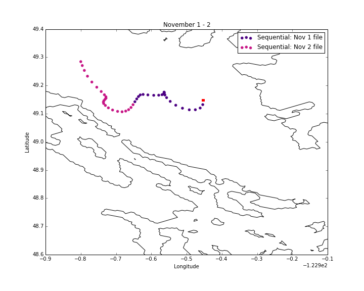

.. _Sequential Mode in Ariane:

***********************************************
Sequential Mode in Ariane
***********************************************

Until now, we have entered only one input file into Ariane. Use Ariane's sequential mode to enter multiple files.

Input Files
===========

The NetCDF files used as input must have the following format:
*prefix_number_suffix*

If the file names do not follow this format, create symbolic links that do. Create this link by using the command :kbd:`ln -s [target file directory] [symbolic link name]`

For example, you may consider:

* *prefix* = **SalishSea_**
* *number* = **01**, **02**, **etc**
* *suffix* = **_grid_T.nc**, **_grid_U.nc**, **_grid_V.nc**

Note: *number* must contain a constant digit number and its value must increase by one in chronological order. For example, file **SalishSea_01_grid_T.nc** contains tracers for November 1st and **SalishSea_02_grid_T.nc** contains tracers for November 2nd.

Namelist: Modify Sections
=========================

First, let's take a closer look at the parameteres in the namelist sections. The parameter names are :kbd:`c_dir_X`, :kbd:`c_prefix_X`, :kbd:`ind0_X`, :kbd:`indn_X`, :kbd:`maxsize_X`, and :kbd:`c_suffix_X` where :kbd:`X` is :kbd:`zo`, :kbd:`me`, :kbd:`te`, :kbd:`sa` for the **ZONALCRT**, **MERIDCRT**, **TEMPERAT**, and **SALINITY** sections, respectively.

Input File Directory
--------------------
:kbd:`c_dir_X` is the directory with the symbolic links for the input files, the namelist, and the initial positions text file.

New Input Filename
------------------
Previously, we have been entering the full filename, *SalishSea_t_yyyymmdd_yyyymmdd_grid_T.nc*, into :kbd:`c_prefix_X`.

Now that we have formatted the filenames as *prefix_number_suffix*, :kbd:`c_prefix_me` takes on the value of the *prefix* and :kbd:`c_suffix_me` takes the value of *suffix*.

:kbd:`ind0_X` is the *number* for the earliest input file and :kbd:`indn_X` is the latest.

:kbd:`maxsize_X` is the number of digits in *number*.

For example, the **ZONALCRT** section would look like the following for input files **SalishSea_01_grid_U.nc** and **SalishSea_02_grid_U.nc** :

 .. code-block:: fortran

        &ZONALCRT
        	c_dir_zo ='/ocean/imachuca/MEOPAR/Ariane/results/drifter_compare/sequential/',
        	c_prefix_zo ='SalishSea_',
	    	ind0_zo =01,
	    	indn_zo =02,
	    	maxsize_zo =2,
	    	c_suffix_zo ='_grid_U.nc',
	    	nc_var_zo ='vozocrtx',
	    	nc_var_eivu ='NONE',
	    	nc_att_mask_zo ='NONE',
        /

Sequential Parameter
--------------------
Under the **ARIANE** section in :kbd:`namelist`, change :kbd:`key_sequential` to TRUE.

Namelist: Add Section
======================

Add a **SEQUENTIAL** section in namelist. This section has one parameter, :kbd:`maxcycles`. We recommend the value of this parameter to be 1 since this tells Ariane to stop generating trajectory points once it has run out of input data.

Sequential
----------

 .. code-block:: fortran

	&SEQUENTIAL
	maxcycles =1,
	/

Results
=======
The results produced for the example above:

Notebooks
=========
* `Ariane_Sequential.ipynb`_

.. _Ariane_Sequential.ipynb: http://nbviewer.jupyter.org/urls/bitbucket.org/salishsea/analysis/raw/tip/Idalia/Ariane_Sequential.ipynb

