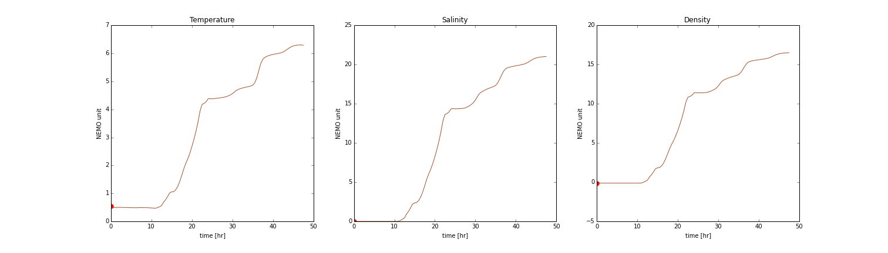

.. _Tracers with Ariane:

*******************
Tracers with Ariane
*******************

In addition to a particle's trajectory (longitude and latitude) and depth, Ariane can also help us analyze tracers along the particle's trajectory.

* Temperature
* Salinity
* Density

We will be making changes in :kbd:`namelist`.

Namelist: Add Sections
======================

Ariane requires both salinity and temperature data as input. It also requires density data or an indication that density should instead be calculated using salinity and temperature.

Our model produces files with filenames that follow this format: *SalishSea_t_yyyymmdd_yyyymmdd_grid_T.nc*. These files contain salinity and temperature. Therefore, Ariane will be calculating density.

Add the following sections to :kbd:`namelist`. Remember to modify the directory and filename of your input files.

Temperature
^^^^^^^^^^^

 .. code-block:: fortran

        &TEMPERAT
	    c_dir_te ='/ocean/nsoontie/MEOPAR/SalishSea/results/storm-surges/final/dec2006/all_forcing/30min/',
	    c_prefix_te ='SalishSea_30m_20061214_20061215_grid_T.nc',
	    ind0_te =-1,
	    indn_te =-1,
	    maxsize_te =-1,
	    c_suffix_te ='NONE',
	    nc_var_te ='votemper',
	    nc_att_mask_te ='NONE',
        /

Salinity
^^^^^^^^

.. code-block:: fortran

        &SALINITY
	    c_dir_sa ='/ocean/nsoontie/MEOPAR/SalishSea/results/storm-surges/final/dec2006/all_forcing/30min/',
	    c_prefix_sa ='SalishSea_30m_20061214_20061215_grid_T.nc',
	    ind0_sa =-1,
	    indn_sa =-1,
	    maxsize_sa =-1,
	    c_suffix_sa ='NONE',
	    nc_var_sa ='vosaline',
	    nc_att_mask_sa ='NONE',
        /

:kbd:`votemper` and :kbd:`vosaline` are the variable names for temperature and salinity in our input file.

Namelist: Add Parameters
========================

Add the following parameters to the :kbd:`ARIANE` section of the namelist:

* :kbd:`key_computesigma`: False if density is read into Ariane; True if Ariane calculates density.
* :kbd:`zsigma`: Reference depth for calculation of density.

And change:

* :kbd:`key_alltracers`: True if tracers are required.

Ariane
^^^^^^

 .. code-block:: fortran

        &ARIANE
        	key_alltracers =.TRUE.,
        	key_sequential =.FALSE.,
	    	key_ascii_outputs =.TRUE.,
	    	mode ='qualitative',
	    	forback ='forward',
	    	bin ='nobin',
	    	init_final ='init',
	    	nmax =5,
	    	tunit =3600.,
	    	ntfic =1,
	    	tcyc =0.,
		key_computesigma =.TRUE.,
		zsigma =1.,
        /

Results
=======

The variables names for the tracers are:

* traj_temp
* traj_salt
* traj_dens

Plots
^^^^^

The results produced for the example above:

Notebooks
=========
* `Ariane_Tracers.ipynb`_

.. _Ariane_Tracers.ipynb: https://nbviewer.jupyter.org/github/SalishSeaCast/analysis/blob/master/Idalia/Ariane_Tracers.ipynb
