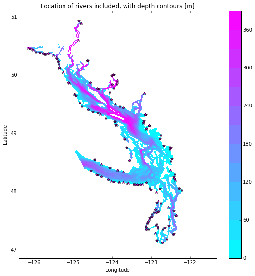

.. _RiverImplementation:

River Implementation
=========================

Creating input files for NEMO
-----------------------------

The grid point of the location of each river mouth was found. A large dictionary of the grid points and flow mapping is the `rivertools.py`_ script. The Jupyter Notebook `Add Rivers Month and Constant.ipynb`_ creates a NetCDF files containing the river flow at the respective grid cell for each river throughout the domain. Where the river mouth was not included in the domain, the river was added to the closest grid point to the river mouth.

.. _rivertools.py: https://github.com/SalishSeaCast/tools/blob/master/SalishSeaTools/salishsea_tools/rivertools.py
.. _Add Rivers Month and Constant.ipynb: https://github.com/SalishSeaCast/tools/blob/master/I_ForcingFiles/Rivers/Add%20Rivers%20Month%20and%20Constant.ipynb

In some cases (e.g. the end of Jervis inlet, Puget Sound) numerous rivers were not included in the domain, so the sum of all the omitted rivers' flow was added to the closest grid point.

Everywhere the depth of freshwater is set to 3 m so that the freshwater is distributed over the top 3 m at the specified grid cell.

Everywhere the temperature of the freshwater is set to the temperature of the Fraser at Hope.

Two files are created `rivers_month_201702.nc`_ and `rivers_cnst_201702.nc`_.  The first contains the monthly climatology, the second the yearly average.

.. _rivers_month_201702.nc: https://github.com/SalishSeaCast/rivers-climatology/blob/master/rivers_month_201702.nc
.. _rivers_cnst_201702.nc: https://github.com/SalishSeaCast/rivers-climatology/blob/master/rivers_cnst_201702.nc

Nowcast Files
----------------

For the nowcast runs, the Fraser River is split into the amount that enters at Hope and amount downstream of that.  The amount at Hope is taken from the published measurements (Environment Canada, WaterOffice via `data mart`_) and distributed appropriately to the Fraser River mouths.  All other freshwater is set to climatology.

.. _data mart: http://dd.meteo.gc.ca/about_dd_apropos.txt
