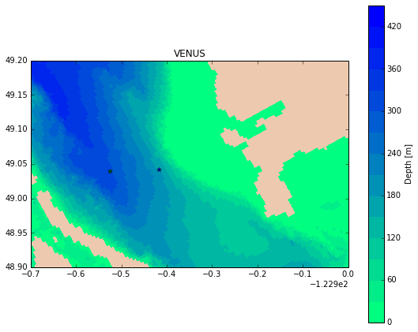
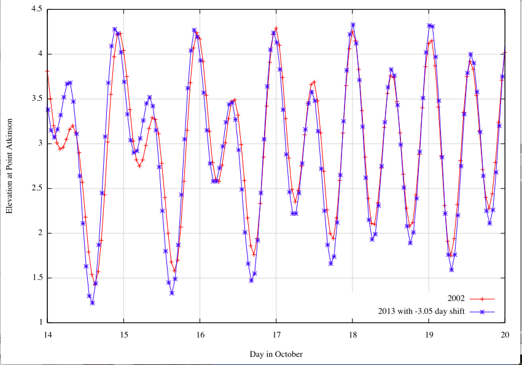
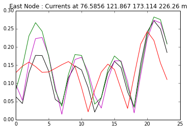
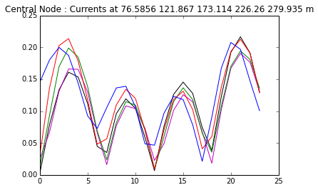

Stability: Evaluation of Velocities
===================================

Are the velocities in the model similar to those in the field.  For field velocities, we will use ADCP data from VENUS at the two Strait of Georgia Stations: East and Central.  East is at 49o2.531N, 123o19.055'W which is close to python grid points [416,282].  Central is at 49o2.4083N, 123o25.5287W which is close to python grid points [424,267]

To do this, we ran the model for Oct 18, 2002 and output average 1-hr velocities throughout the day.  Of course, VENUS was not running in 2002.  We found a similar day (slightly higher amplitudes at Point Atkinson) in Oct 15, 2013.  Note that there is a shift of 0.05 days between the two for best match.  These tidal predictions are downloaded from:
`Integrated Science Data Managment <http://www.isdm-gdsi.gc.ca/isdm-gdsi/twl-mne/inventory-inventaire/sd-ds-eng.asp?no=7795&user=isdm-gdsi&region=PAC>`_.

Model velocities at these two points at various depths are given in the following two plots.

