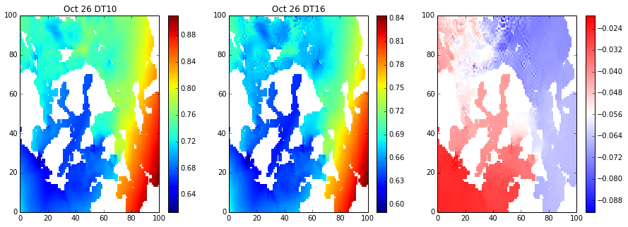

Vertical CFL Condition
======================

In NEMO advection is through the leap-frog scheme.  (NEMO book section 3.1 and 6.2)
Thus it should be subject to a vertical CFL condition.

Vertical velocities in the model are high.  Using a one day run for Oct 18, 2002 (near neap tides), with one-hour averaged output, vertical velocities as high as 18 cm/s were found.  Plot below is for level 28 (160 m) at 21 hours in the Boundary Pass region.

.. figure:: images/vertical_velocity.png

One can calculate the time for the flow to cross one grid cell vertically using the maximum velocity at each depth over the whole horizontal domain and all 24 hours.

.. figure:: images/logdzw.png

Note that the above is log plot.  The minimum value is 21.5 s.  Given that the CFL condition is 1/2 of this for a leapfrog scheme with staggered grids, that would imply a CFL time step of 10.75 s or less!

Testing
-------

The code was run with baroclinic time step of 10s, and the barotropic time step unchanged at 2s. Started Oct 26, with density fields from spin up.  Ran 1 day on Salish and a further 4 days on Jasper with horizontal viscosity of 20 m2/s and vertical evd at 20 m2/s.  The code was stable and the output looks reasonable.  Velocities and mixing increased, particularly in the island.  Current widths decreases (deep current into SoG for example).

Code is now slow!  The four days on Jasper took over 4 hours.  The day on Salish took 8 hours.

Tried with a baroclinic time step of 16s, and the barotropic time step unchanged at 2s.  Repeated Oct 26.  Noise seen in surface height as in the large dt cases.  So need to be smaller.

