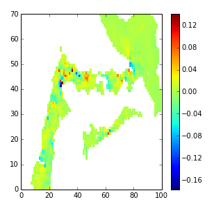

Vertical CFL Condition
======================

In NEMO advection is through the leap-frog scheme.  (NEMO book section 3.1 and 6.2)
Thus it should be subject to a vertical CFL condition.

Vertical velocities in the model are high.  Using a one day run for Oct 18, 2002 (near neap tides), with one-hour averaged output, vertical velocities as high as 18 cm/s were found.  Plot below is for level 28 (160 m) at 21 hours in the Boundary Pass region.

One can calculate the time for the flow to cross one grid cell vertically using the maximum velocity at each depth over the whole horizontal domain and all 24 hours.

Note that the above is log plot.  The minimum value is 21.5 s.  Given that the CFL condition is 1/2 of this for a leapfrog scheme with staggered grids, that would imply a CFL time step of 10.75 s or less!
