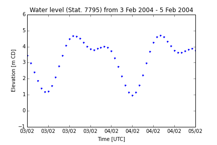

.. _StormOverview:

Storm surge overview
======================================================================================================

We need to test our model to see how well it can represent storm surge events in the Salish Sea. We have wind forcing available from 2002-2010, so storms need to be in this period.

High water levels can be due to a combination of high seasonal tide, strong winds, low atmospheric pressure and sea level height anomalies due to ENSO events.

What classifies as a storm?
--------------------------------------

How long is a storm? 
	* More than 6 hours => the algorithm below finds 65 'storms' from 2002-2012
	* More than 12 hours => the algorithm below finds 25 'storms' from 2002-2012
	* Decision: more than 12 hours is a more appropriate number to test

What is the water level elevation during a storm? 
	* Decision: sea surface anomaly greater than 40cm

Does the storm affect the whole domain or does it not matter?
	* For now, look at the DFO water level sites that are in the domain and have water level data for the period of interest (2002 - 2010). These sites are:

		* Point Atkinson
			* lat/lon: 49.34,-123.25
			* grid co-ordinates: i=468, j=328
		* Victoria
			* lat/lon: 48.42,-123.37
			* grid co-ordinates: i=298, j=195
		* Patricia Bay
			* lat/lon: 48.65,-123.45
			* grid co-ordinates: i=351, j=213
		* Campbell River
			* lat/lon: 50.04,-125.25
			* grid co-ordinates: i=747, j=124 

Finding storms in the record
------------------------------------------

Compare predicted tide with measured water level using t_tide (Pawlowicz et al, 2002) and the following MATLAB scripts: ::

	get_tidal_anomaly.m
	find_storm_events.m

Usage: ::

	[pred,wlev,anomaly,tim] = get_tidal_anomaly(csvfilename)
	[startind,endind,lengthstorm] = find_storm_events(anomaly,tim,anomthres,stormlength)

where:

* csvfilename - name of csv file of hourly measured water level at Point Atkinson
* pred - predicted tides from t_tide (m CD)
* wlev - measured water level at Point Atkinson (m CD)
* anomaly - difference between prediction and water level (m)
* tim - time vector for pred, wlev and anomaly (MATLAB date format)
* startind - indice in tim for start of each storm (-)
* endind - indice in tim for end of each storm (-)
* lengthstorm - length of each storm (hours)
* anomthres - water level elevation defined as a storm (m)
* stormlength - minimum length defined as a storm (hrs)

Outputs a text file called 'storms.txt' that contains a list of the start dates of storms and the length of each storm in hours. e.g.: ::

	[pred,wlev,anomaly,tim] = get_tidal_anomaly('wlev_ts_for_storms.csv');
	[startind,endind,lengthstorm] = find_storm_events(anomaly,tim,0.4,12);

gives for Point Atkinson: ::

	Start date 	 	 Duration (hrs) 
	02-Jan-2003 04:00:00 	 13
	13-Mar-2003 04:00:00 	 27
	14-Mar-2003 23:00:00 	 16
	05-Dec-2003 20:00:00 	 13
	22-Dec-2005 04:00:00 	 14
	31-Dec-2005 00:00:00 	 17
	31-Jan-2006 18:00:00 	 13
	04-Feb-2006 01:00:00 	 18
	15-Nov-2006 09:00:00 	 15
	14-Dec-2006 18:00:00 	 15
	12-Nov-2007 04:00:00 	 14
	03-Dec-2007 02:00:00 	 35
	04-Jan-2008 12:00:00 	 27
	11-Jan-2010 20:00:00 	 13
	18-Jan-2010 02:00:00 	 16
	19-Jan-2010 02:00:00 	 45
	21-Jan-2010 02:00:00 	 43
	29-Mar-2010 01:00:00 	 16
	23-Oct-2010 23:00:00 	 19
	22-Nov-2011 23:00:00 	 21
	20-Jan-2012 20:00:00 	 14
	12-Mar-2012 07:00:00 	 13
	29-Mar-2012 02:00:00 	 26
	30-Nov-2012 21:00:00 	 15
	01-Dec-2012 16:00:00 	 22

Water level at Point Atkinson 
------------------------------------------

Example of hourly water level at Point Atkinson during the storm on 4 February 2004:

.. _PtAtkinsonWLev_Feb04-image:

Outputting water level data at each hour (or perhaps every 30 minutes?) from the NEMO model should be therefore be appropriate for assessing storm surge performance. 

Literature search for big storms 
-----------------------------------------

* Jan 02, 2003, Victoria
* Dec 24, 2003, Vancouver
* Nov 2006, Vancouver
* Dec 15, 2006, Vancouver 
* Dec 25, 2008, Vancouver
* Nov 24, 2011, Vancouver (not within range)
* Jan 05, 2012, Vancouver (not within range)
* Dec 17, 2012, Vancouver (not within range)
* Sep 30, 2013, Vancouver (not within range)

Prediction for 2013/2014 from Storm Surge Almanac:

`Flooding risk is greatest during the seasonal perigean spring tides, which correspond to times of extreme high tidal levels during the winter months. This year the highest tides for the Lower Mainland are expected in the first weeks of December, January and February; for Victoria the highest tides are expected in the first and last weeks of December, and the final week of January.`

Also, from Abeysirigunawardena et al (2011), extremes generally occur from October to March.

Existing storm surge models
---------------------------------------

The Government of British Columbia launched the `BC Storm Surge Forecast System <http://stormsurgebc.ca/index.html>`_ in 2011. This model is driven by the Pacific Ocean Model (which is driven by 7 day weather forecasts from NOAA) and a 6 day forecast from Environment Canada. Forecast bulletins are available for Point Atkinson, Victoria and Campbell River. There is no hindcasting available in the model.

References
-------------------------------

* Abeysirigunawardena, D.S., D.J. Smith and B. Taylor, 2011. Extreme Sea Surge Responses to Climate Variability in Coastal British Columbia, Canada, Annals of the Association of American Geographers, 101:5, 992-1010, DOI: 10.1080/00045608.2011.585929

* Pawlowicz, R., B. Beardsley, and S. Lentz, 2002. Classical tidal harmonic analysis including error estimates in MATLAB using T_TIDE, Computers and Geosciences, 28,  929-937

