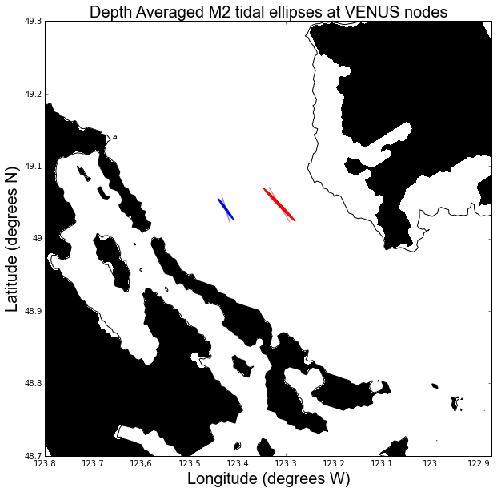
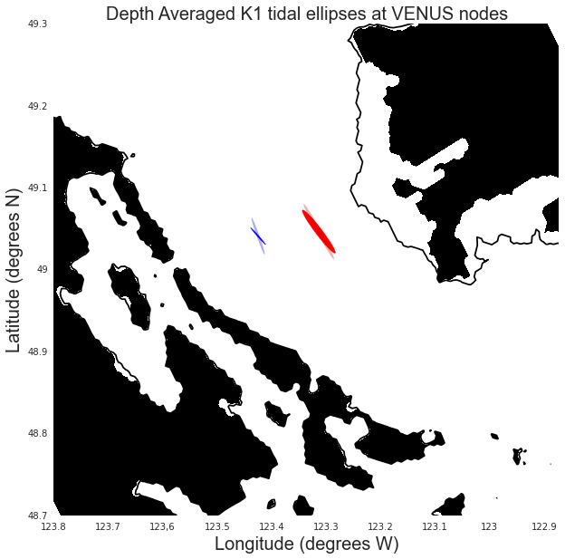
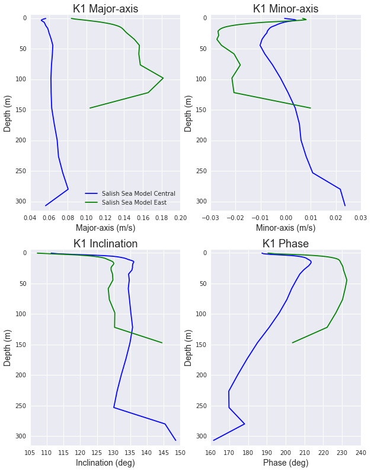
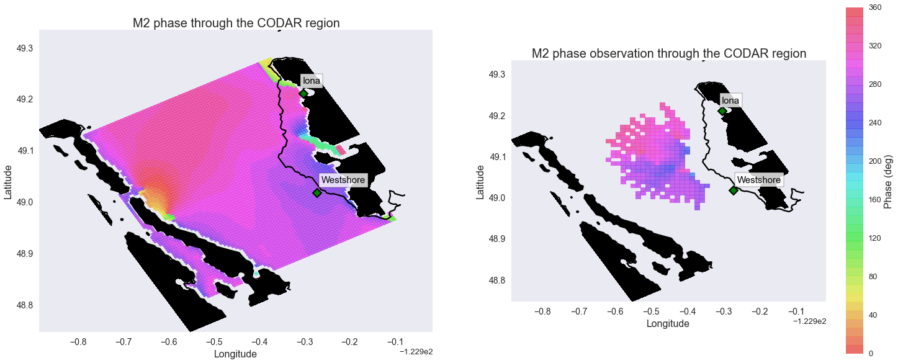
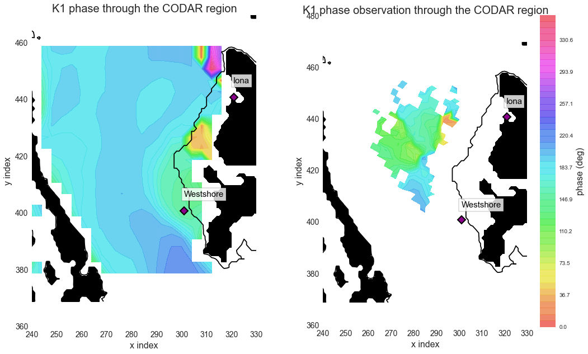

Tidal current comparisons
===========================================

* Comparisons of the model to observations and other models is very important in evalutating the model output.
* It gives information about which physical processes are poorly represented and may even give hints towards how we can improve these.

Ocean Networks Canada VENUS nodes
-----------------------------------

* ONC VENUS had three seafloor nodes in the Salish Sea; Central, East and Delta. The nodes are equipped with an extensive amount of equipment.
* The comparisons below use the Acoustic Doppler Current Profiler (ADCP) at the Central and East nodes.

Nodes
~~~~~~~~

* The ONC VENUS data has been processed by Dr. Rich Pawlowicz and Dr. Mark Halverson, these are the ADCP values in the table below and the opaque ellipses in the figure.
* Note that the observational values are averaged over approximately 10-11 months where as the model output values were averaged over 8 months.

Comparison of the M2 harmonic constituent
********************************************
+---------+------------+------------+-----------------+
|         | Major-Axis | Minor-Axis |  Inclination    |
|         |    (m/s)   |   (m/s)    |  (deg ccw E)    |
+---------+------------+------------+-----------------+
| M2 - Central - (35-290m)                            |
+---------+------------+------------+-----------------+
| Model   | 0.17       | 0.014      | 130             |
+---------+------------+------------+-----------------+
| ADCP    | 0.18       | 0.006      | 109             |
+---------+------------+------------+-----------------+
| M2 - East - (20-160m)                               |
+---------+------------+------------+-----------------+
| Model   | 0.31       | -0.018     | 137             |
+---------+------------+------------+-----------------+
| ADCP    | 0.26       | -0.005     | 125             |
+---------+------------+------------+-----------------+

* The figure shows that the depth averaged observational and model output values agree quite well.
* The model output's semi-minor axis is larger than the observations, this informs us that the model flow is too circular.
* Also the Salish Sea model output is angled slightly more to the West. This may be due to too much mixing or the Fraser River outflow.

* Scale = 50

.. _M2_node_comparison:

* Here we are plotting individual parameters to be able to see what aspects are well represented with the model.

.. _profile_node_comparison:

.. figure:: profnodescompM2.png

Comparison of the K1 harmonic constituent
********************************************
+---------+------------+------------+-----------------+
|         | Major-Axis | Minor-Axis |  Inclination    |
|         |    (m/s)   |   (m/s)    |  (deg ccw E)    |
+---------+------------+------------+-----------------+
| K1 - Central - (35-290m)                            |
+---------+------------+------------+-----------------+
| Model   | 0.07       | 0.004      | 135             |
+---------+------------+------------+-----------------+
| ADCP    | 0.11       | 0.007      | 112             |
+---------+------------+------------+-----------------+
| K1 - East - (20-160m)                               |
+---------+------------+------------+-----------------+
| Model   | 0.15       | -0.020     | 131             |
+---------+------------+------------+-----------------+
| ADCP    | 0.17       | -0.011     | 122             |
+---------+------------+------------+-----------------+

.. _K1_node_comparison:

.. _profile_node_comparison_K1:

CODAR
~~~~~~~~
* The Fraser River plume creates some very interesting surface currents where it meets the Georgia Strait. These currents can be studied using the two High Frequency coastal radars installed by ONC that can measure surface current velocities, the system is called the Coastal Ocean Dynamics Applications Radar system (CODAR).
* The figure below is the phase of the M2 tidal constituents from the model output throughout the CODAR region compared to the observational values processed by Dr. Mark Halverson.
.. _CODAR_phase:

* We can see that the model and the observations are in the same range of values, however the observations has steep gradients and variations in the center of the Strait of Georgia unlike the model. The accuracy of the CODAR values are still in the process of being determined therefor it is unwise to pull any conclusions from this.

* This figure below is the phase of the K1 tidal constituent.

* There is similar features as with M2 phase, the steep changes in gradient. The zone at the mouth of the Fraser that has a smaller phase than the rest of the area in the model seems like it may extend further out in the observations.

Foreman Model (2004)
------------------------
A two dimensional, high-resolution barotropic model of the Puget Sound and around Vancouver Island. We use this model and a comparison tool because it can help identify which aspects we are representing similarly or differently to the Foreman model which of these are or aren't comparable to the observations he has reported from current meter deployments. 

Along the thalweg
~~~~~~~~~~~~~~~~~~~~~
* The thalweg is the set of grid points that follow along the deepest point of the Strait of Georgia from every cross section. 

* When looking along the thalweg we can see that both models are resonable through the Juan de Fuca Strait, the Salish Sea model is a bit closer to the observations. Through Haro Strait both models seem to be off by 0.3 m/s. Through the center of the Strait both model have very low velocities as expected. The northern part of the Strait is better resolved by the Foreman model. The Salish Sea model is more focused on getting the southern area correct and many rivers and passages are closed off in this model which causes this discrepancy. Foreman (2004) says the differences in the northern Strait is due to either the grid resolution being too corse and/or the observations being inaccurate.

.. figure:: Foremanthalwegcomp.png

