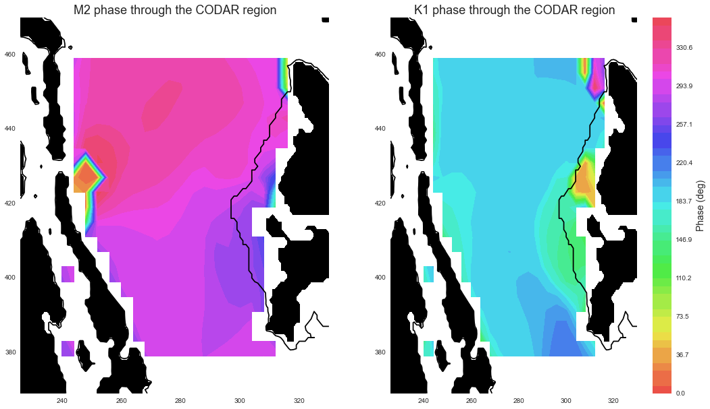

Tidal current comparisons
===========================================

* Comparisons of the model to observations and other models is very important in evalutating the model output. 
* It can not only show us what is right and what is wrong but it also gives information about which physical processes are poorly represented and may even give hints towards how we can improve these. 

Ocean Networks Canada VENUS nodes
-----------------------------------

* ONC VENUS had three seafloor nodes in the Salish Sea; Central, East and Delta. The nodes are equipped with an extensive amount of equipment. 
* The comparisons below use the Acoustic Doppler Current Profiler (ADCP) at the Central and East nodes.

Nodes
~~~~~~~~

* The ONC VENUS data has been processed by Dr. Rich Pawlowicz and Dr. Mark Halverson, these are the ADCP values in the table below and the opaque ellipses in the figure.
* Note that the observational values are averaged over approximately 10-11 months where as the model output values were averaged over 8 months.

Comparison of the M2 harmonic constituent
********************************************
+---------+------------+------------+-----------------+
|         | Major-Axis | Minor-Axis |  Inclination    |
|         |    (m/s)   |   (m/s)    |  (deg ccw E)    |
+---------+------------+------------+-----------------+
| M2 - Central - (35-290m)                            |
+---------+------------+------------+-----------------+
| Model   | 0.17       | 0.014      | 130             |
+---------+------------+------------+-----------------+
| ADCP    | 0.18       | 0.006      | 109             |
+---------+------------+------------+-----------------+
| M2 - East - (20-160m)                               |
+---------+------------+------------+-----------------+
| Model   | 0.31       | -0.018     | 137             |
+---------+------------+------------+-----------------+
| ADCP    | 0.26       | -0.005     | 125             |
+---------+------------+------------+-----------------+

* The figure shows that the depth averaged observational and model output values agree quite well.
* The model output's semi-minor axis is larger than the observations, this informs us that the model flow is too circular.
* Also the Salish Sea model output is angled slightly more to the West. This may be due to too much mixing or the Fraser River outflow. 

*Scale = 50
.. _node_comparison:

.. figure:: depavnodecomp.png

* Here we are plotting individual parameters to be able to see what aspects are well represented with the model.

.. _profile_node_comparison:

.. figure:: profnodescompM2.png

Comparison of the K1 harmonic constituent
********************************************
+---------+------------+------------+-----------------+
|         | Major-Axis | Minor-Axis |  Inclination    |
|         |    (m/s)   |   (m/s)    |  (deg ccw E)    |
+---------+------------+------------+-----------------+
| K1 - Central - (35-290m)                            |
+---------+------------+------------+-----------------+
| Model   | 0.07       | 0.004      | 135             |
+---------+------------+------------+-----------------+
| ADCP    | 0.11       | 0.007      | 112             |
+---------+------------+------------+-----------------+
| K1 - East - (20-160m)                               |
+---------+------------+------------+-----------------+
| Model   | 0.15       | -0.020     | 131             |
+---------+------------+------------+-----------------+
| ADCP    | 0.17       | -0.011     | 122             |
+---------+------------+------------+-----------------+

.. _node_comparison:

.. figure:: depavnodecompK1.png

.. _profile_node_comparison_K1:

.. figure:: profnodesK1.png

CODAR
~~~~~~~~
* The Fraser River plume creates some very interesting surface currents where it meets the Georgia Strait. ONC has installed two High Frequency coastal radars to measure surface current velocities, it is called the Coastal Ocean Dynamics Applications Radar system (CODAR). 
* The figure below is the phase form the model output throughout the CODAR region.
.. _CODAR_phase:

Foreman Model (2004)
------------------------

Along the thalweg
~~~~~~~~~~~~~~~~~~~~~

At model locations
~~~~~~~~~~~~~~~~~~~~~~~~~~

