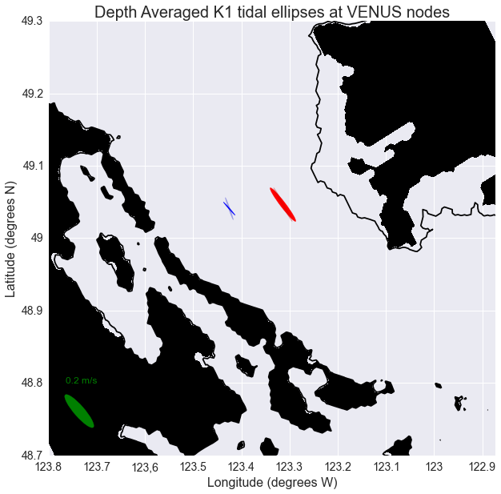

Tidal current comparisons
===========================================

* Comparisons of the model to observations and other models is very important in evaluating the model output.
* These comparisons give information about which physical processes are poorly represented and may even give hints towards how we can improve model performance.

Ocean Networks Canada VENUS nodes
-----------------------------------

* ONC VENUS has three seafloor nodes in the Salish Sea; Central, East and Delta. The nodes are equipped with many sensors.
* The comparisons below use the Acoustic Doppler Current Profiler (ADCP) at the Central and East nodes.

Nodes
~~~~~~~~

* The ONC VENUS data has been processed by Dr. Rich Pawlowicz and Dr. Mark Halverson, these are the ADCP values in the table below and the opaque ellipses in the figure.
* Note that the observational values are averaged over approximately 10-11 months where as the model output values were averaged over 8 months - Nov 26, 2014 to Jul 13, 2015. 

Comparison of the M2 harmonic constituent
********************************************
+---------+------------+------------+-----------------+-------------+
|         | Major-Axis | Minor-Axis |  Inclination    | Phase       |
|         |    (m/s)   |   (m/s)    |  (deg ccw E)    | (deg GMT)   |
+---------+------------+------------+-----------------+-------------+
| M2 - Central - (35-290m)                                          |
+---------+------------+------------+-----------------+-------------+
| Model   | 0.16       | 0.013      | 130             | 305         |
+---------+------------+------------+-----------------+-------------+
| ADCP    | 0.18       | 0.006      | 109             | 311         |
+---------+------------+------------+-----------------+-------------+
| M2 - East - (20-160m)                                             |
+---------+------------+------------+-----------------+-------------+
| Model   | 0.29       | -0.017     | 137             | 324         |
+---------+------------+------------+-----------------+-------------+
| ADCP    | 0.26       | -0.005     | 125             | 320         |
+---------+------------+------------+-----------------+-------------+

* The figure shows that the depth averaged observational and model output values agree quite well.
* The model output's semi-minor axis is larger than the observations, this informs us that the model flow is too circular.
* Also the Salish Sea model output is angled slightly more to the West, this discrepancy is within a resonable error window.

* Scale = 50

.. _M2_node_comparison:

.. figure:: depavnodecomp.png

* Here we are plotting individual parameters to be able to see what aspects are well represented with the model.

.. _profile_node_comparison:

.. figure:: profnodescompM2.png

Comparison of the K1 harmonic constituent
********************************************
+---------+------------+------------+-----------------+-----------+
|         | Major-Axis | Minor-Axis |  Inclination    | Phase     |
|         |    (m/s)   |   (m/s)    |  (deg ccw E)    | (deg GMT) |
+---------+------------+------------+-----------------+-----------+
| K1 - Central - (35-290m)                                        |
+---------+------------+------------+-----------------+-----------+
| Model   | 0.08       | 0.005      | 135             | 184       |
+---------+------------+------------+-----------------+-----------+
| ADCP    | 0.11       | 0.007      | 112             | 188       |
+---------+------------+------------+-----------------+-----------+
| K1 - East - (20-160m)                                           |
+---------+------------+------------+-----------------+-----------+
| Model   | 0.19       | -0.025     | 131             | 226       |
+---------+------------+------------+-----------------+-----------+
| ADCP    | 0.17       | -0.011     | 122             | 220       |
+---------+------------+------------+-----------------+-----------+

.. _K1_node_comparison:

.. _profile_node_comparison_K1:

.. figure:: profnodesK1.png

CODAR
~~~~~~~~
* The Fraser River plume creates some very interesting surface currents where it meets the Georgia Strait. These currents can be studied using the two High Frequency coastal radars installed by ONC that measure surface current velocities. The system is called the Coastal Ocean Dynamics Applications Radar system (CODAR).

* The tidal ellipses at 0.5 m depth at both nodes are very large for the M2 constituent but there is quite a good agreement for the K1 values. These ellipses were calculated over a 5 months period, form November 26th 2014 to April 26th 2015, to avoid the freshet. The ellipses with the freshet, 8 month time series, are slighter wider and the inclination does not match the observations as well as the values without the freshet.

+---------+------------+------------+-----------------+-------------+
|         | Major-Axis | Minor-Axis |  Inclination    | Phase       |
|         |    (m/s)   |   (m/s)    |  (deg ccw E)    | (deg GMT)   |
+---------+------------+------------+-----------------+-------------+
| M2 - Central - (0.5m)                                             |
+---------+------------+------------+-----------------+-------------+
| Model   | 0.18       | -0.057     | 139             | 317         |
+---------+------------+------------+-----------------+-------------+
| CODAR   | 0.11       | 0.008      | 126             | 273         |
+---------+------------+------------+-----------------+-------------+
| M2 - East - (0.5m)                                                |
+---------+------------+------------+-----------------+-------------+
| Model   | 0.37       | -0.151     | 129             | 299         |
+---------+------------+------------+-----------------+-------------+
| CODAR   | 0.14       | -0.037     | 134             | 282         |
+---------+------------+------------+-----------------+-------------+
| K1 - Central - (0.5m)                                             |
+---------+------------+------------+-----------------+-------------+
| Model   | 0.06       | 0.003      | 130             | 203         |
+---------+------------+------------+-----------------+-------------+
| CODAR   | 0.07       | 0.006      | 134             | 131         |
+---------+------------+------------+-----------------+-------------+
| K1 - East - (0.5m)                                                |
+---------+------------+------------+-----------------+-------------+
| Model   | 0.10       |  0.007     | 119             | 204         |
+---------+------------+------------+-----------------+-------------+
| CODAR   | 0.08       | -0.009     | 129             | 187         |
+---------+------------+------------+-----------------+-------------+

.. _CODAR_ellipse:

.. figure:: surfaceM2.png

.. figure:: surfaceK1.png

Full Surface Comparisons
************************

We have performed additional comparisons of the model phase over the full CODAR region. In the following plots, a harmonic analysis was performeder at the model surface grid cells (0.5m) from Nov. 26, 2014 to Apr. 26, 2015.

* The figure below is the phase of the M2 tidal constituents from the model output at 0.5 m depth throughout the CODAR region compared to the observational values processed by Dr. Mark Halverson.

.. _CODAR_phase:

* We can see that the model and the observations are in the same range of values, however, the observations has steep gradients and variations in the center of the Strait of Georgia unlike the model. The accuracy of the CODAR values are still in the process of being determined therefore it is unwise to pull any conclusions from this.

* This figure below is the phase of the K1 tidal constituent.

.. figure:: CODARK1pha.png

* There is similar features as with M2 phase, the steep changes in gradient. The zone at the mouth of the Fraser that has a smaller phase than the rest of the area in the model seems like it may extend further out in the observations.

Foreman Model (2004)
------------------------
In addition to observations, we have compared with a two dimensional, high-resolution barotropic model of the Puget Sound and around Vancouver Island (Foreman et al, 2004). We use this model and a comparison tool because it can help identify which aspects we are represented similarly or differently to the Foreman model and which of these are or aren't comparable to the observations he has reported from current meter deployments. 

Along the thalweg
~~~~~~~~~~~~~~~~~~~~~
* The thalweg is the set of grid points that follow along the deepest point of the Strait of Georgia from every cross section. 

* When looking along the thalweg we can see that both models are reasonable through the Juan de Fuca Strait. The Salish Sea model is a bit closer to the observations. Through Haro Strait both models seem to be off by 0.3 m/s in the semi-major axis. Through the center of the Strait both models have very low velocities as expected. The northern part of the Strait is better resolved by the Foreman model. The Salish Sea model is more focused on getting the southern area correct and many rivers and passages are closed off in this model which causes this discrepancy. Foreman et al (2004) reports that their discrepancies in the northern Strait either due to either the grid resolution being too coarse and/or the observations being inaccurate.

.. figure:: Foremanthalwegcomp.png

