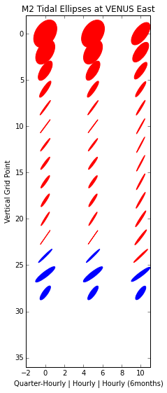

Tidal current sensitivity
===========================================

* The Salish Sea MEOPAR model outputs daily averages and hourly averages of tracers and velocities at every grid point. It also outputs quarter-hourly results at the Ocean Networks Canada VENUS Central and East nodes. The image below indicates where the Central and East nodes are located.

.. _VENUSlocation:

* We wonder if it is beneficial to compile the quarter-hourly data for the velocities and whether or not it would produce a more accurate tidal ellipse.
* The quarter-hourly output has started on May 9th 2015, where as the hourly output has been produced with the current tidal configuration since November 26th 2014. 
* The separation of harmonic tidal constituents is important when we want to look at a single constituent's effect on the current. This is accomplished with a long time series. Therefore, we want to see the effects of the length of a time series on the tidal ellipses.
* The figure below is a comparison of the depth profile of tidal ellipses for one month of quarter-hourly output, one month of hourly output and 6 months hourly output.

.. _FrequencySensitivity-image:

.. figure:: freqsens.png

* The table below is populated with the values that were used to create the figure above. 

Table 1: Sensitivity to Frequency and Length Comparison
~~~~~~~~~~~~~~~~~~~~~~~~~~~~~~~~~~~~~~~~~~~~~~~~~~~~~~~~~~~~~~~~~

+---------+------------+------------+---------------+------------+------------+---------------+------------+------------+---------------+
| Central |  Quarter-Hourly                         | Hourly                                  | Hourly (6months)                        |
|         |                                         |                                         |                                         |
+=========+============+============+===============+============+============+===============+============+============+===============+
| Depth   | Major-Axis | Minor-Axis |  Inclination  | Major-Axis | Minor-Axis |  Inclination  | Major-Axis | Minor-Axis |  Inclination  |  
| (m)     |  (m/s)     |   (m/s)    | (deg. ccw E)  |  (m/s)     |   (m/s)    | (deg. ccw E)  |  (m/s)     |   (m/s)    | (deg. ccw E)  |
+---------+------------+------------+---------------+------------+------------+---------------+------------+------------+---------------+
| 0.5     | 0.29       | -0.13      | 129           | 0.29       | -0.13      | 129           | 0.20       | -0.08      | 135           |
+---------+------------+------------+---------------+------------+------------+---------------+------------+------------+---------------+
| 2.5     | 0.26       | -0.12      | 129           | 0.26       | -0.12      | 129           | 0.19       | -0.07      | 135           |
+---------+------------+------------+---------------+------------+------------+---------------+------------+------------+---------------+
| 4.5     | 0.22       | -0.10      | 129           | 0.22       | -0.09      | 129           | 0.18       | -0.06      | 135           |
+---------+------------+------------+---------------+------------+------------+---------------+------------+------------+---------------+
| 6.5     | 0.20       | -0.09      | 130           | 0.20       | -0.09      | 130           | 0.17       | -0.06      | 136           |
+---------+------------+------------+---------------+------------+------------+---------------+------------+------------+---------------+
| 8.5     | 0.20       | -0.08      | 131           |  0.19      | -0.08      | 131           | 0.17       | -0.06      | 136           |
+---------+------------+------------+---------------+------------+------------+---------------+------------+------------+---------------+
| 10.5    | 0.19       | -0.08      | 131           | 0.19       | -0.08      | 131           | 0.17       | -0.05      | 136           |
+---------+------------+------------+---------------+------------+------------+---------------+------------+------------+---------------+
| 12.5    | 0.19       | -0.07      | 132           | 0.19       | -0.07      | 132           | 0.17       | -0.05      | 136           |
+---------+------------+------------+---------------+------------+------------+---------------+------------+------------+---------------+
| 14.6    | 0.18       | -0.06      | 132           | 0.18       | -0.06      | 132           |  0.17      | -0.04      | 136           |
+---------+------------+------------+---------------+------------+------------+---------------+------------+------------+---------------+
| 16.8    | 0.17       | -0.05      | 131           | 0.17       | -0.05      | 131           | 0.16       | -0.04      | 136           |
+---------+------------+------------+---------------+------------+------------+---------------+------------+------------+---------------+
| 19.5    | 0.16       | -0.04      | 129           | 0.16       | -0.04      | 129           | 0.16       | -0.03      | 135           |  
+---------+------------+------------+---------------+------------+------------+---------------+------------+------------+---------------+
| 24.1    | 0.15       | -0.02      | 125           | 0.15       | -0.02      | 125           | 0.16       | -0.02      | 132           |
+---------+------------+------------+---------------+------------+------------+---------------+------------+------------+---------------+
| 34.7    | 0.14       | -0.00      | 119           | 0.13       | -0.00      | 119           | 0.15       | -0.01      | 127           |
+---------+------------+------------+---------------+------------+------------+---------------+------------+------------+---------------+
| 58.5    | 0.12       | 0.02       | 116           | 0.12       | 0.02       | 116           | 0.15       | -0.00      | 124           |
+---------+------------+------------+---------------+------------+------------+---------------+------------+------------+---------------+
| 98.1    | 0.13       | 0.03       | 134           | 0.13       | 0.03       | 134           | 0.15       | 0.02       | 130           |
+---------+------------+------------+---------------+------------+------------+---------------+------------+------------+---------------+
| 147.1   | 0.18       | 0.00       | 144           | 0.18       | 0.00       | 144           | 0.17       | 0.01       | 140           |
+---------+------------+------------+---------------+------------+------------+---------------+------------+------------+---------------+
| 199.6   | 0.19       | 0.00       | 137           | 0.19       | 0.00       | 137           | 0.18       | 0.01       | 133           |
+---------+------------+------------+---------------+------------+------------+---------------+------------+------------+---------------+
| 253.1   | 0.22       | -0.00      | 120           | 0.22       | -0.00      | 120           | 0.20       | 0.01       | 123           |
+---------+------------+------------+---------------+------------+------------+---------------+------------+------------+---------------+
| 306.8   | 0.15       | 0.05       | 109           | 0.15       | 0.05       | 109           | 0.14       | 0.06       | 110           |
+---------+------------+------------+---------------+------------+------------+---------------+------------+------------+---------------+
  
 
Frequency
~~~~~~~~~~

* One month of quarter-hourly values makes no significant difference on the tidal ellipse parameters at the ONC VENUS Central node. The changes are sparse and minimal.
* We will need to wait until we have a longer quarter-hourly data set to see if it is beneficial for tidal ellipses, or try other more sensitive locations.

Length
~~~~~~~~~

* The 6 months time series has two significant differences that lead us to believe that these ellipses are a better representation of the currents:

    * The smaller surface currents indicates that it averages out some of the surface currents that are due to winds or Fraser River outflow.
    * The smoother variations throughout the water column. It is not logical for the flow to fluctuate every couple of meters throughout the water column.
      
* A longer time series enables us to separate and resolve the individual harmonic constituents, we can be certain that we are only looking at the M2 tidal constituent.
* We observe the benefits of a longer time series at the ONC VENUS East node as well.

.. _FrequencySensitivityE:

Seasons
~~~~~~~~~~~

Table 2: The effect of seasonality on tidal ellipse parameters
~~~~~~~~~~~~~~~~~~~~~~~~~~~~~~~~~~~~~~~~~~~~~~~~~~~~~~~~~~~~~~~~

+---------+------------+-----------+--------------+-------------+-----------+--------------+
| East    |  Winter (Nov 26, 2014 - Feb 26, 2015) | Spring (Feb 27, 2015 - May 27, 2015)   |
|         |                                       |                                        |
+=========+============+===========+==============+=============+===========+==============+
| Depth   | Major-Axis | Minor-Axis| Inclination  |  Major-Axis | Minor-Axis| Inclination  |
| (m)     |  (m/s)     |   (m/s)   | (deg. ccw E) |    (m/s)    |   (m/s)   | (deg. ccw E) |
+---------+------------+-----------+--------------+-------------+-----------+--------------+
| 0.5     | 0.38       | -0.14     | 127          | 0.40        | -0.20     | 128          | 
+---------+------------+-----------+--------------+-------------+-----------+--------------+
| 2.5     | 0.33       | -0.11     | 127          | 0.35        | -0.16     | 128          |
+---------+------------+-----------+--------------+-------------+-----------+--------------+
| 4.5     | 0.29       | -0.06     | 125          | 0.30        | -0.09     | 126          |
+---------+------------+-----------+--------------+-------------+-----------+--------------+
| 6.5     | 0.27       | -0.04     | 122          | 0.26        | -0.04     | 124          | 
+---------+------------+-----------+--------------+-------------+-----------+--------------+
| 8.5     | 0.27       | -0.03     | 118          | 0.24        | -0.01     | 122          | 
+---------+------------+-----------+--------------+-------------+-----------+--------------+
| 10.5    | 0.27       | -0.03     | 115          | 0.24        | 0.01      | 119          | 
+---------+------------+-----------+--------------+-------------+-----------+--------------+
| 12.5    | 0.28       | -0.04     | 115          | 0.24        | 0.01      | 117          | 
+---------+------------+-----------+--------------+-------------+-----------+--------------+
| 14.6    | 0.29       | -0.04     | 116          | 0.25        | 0.00      | 116          | 
+---------+------------+-----------+--------------+-------------+-----------+--------------+
| 16.8    | 0.30       | -0.05     | 117          | 0.26        | -0.01     | 117          |
+---------+------------+-----------+--------------+-------------+-----------+--------------+
| 19.5    | 0.31       | -0.05     | 119          | 0.27        | -0.02     | 119          |
+---------+------------+-----------+--------------+-------------+-----------+--------------+
| 24.1    | 0.32       | -0.06     | 123          | 0.29        | -0.03     | 122          |
+---------+------------+-----------+--------------+-------------+-----------+--------------+
| 34.7    | 0.31       | -0.05     | 127          | 0.29        | -0.03     | 127          |
+---------+------------+-----------+--------------+-------------+-----------+--------------+
| 58.5    | 0.31       | -0.03     | 136          | 0.28        | -0.02     | 134          |
+---------+------------+-----------+--------------+-------------+-----------+--------------+
| 98.1    | 0.35       | -0.05     | 143          | 0.36        | -0.07     | 142          |
+---------+------------+-----------+--------------+-------------+-----------+--------------+
| 147.1   | 0.25       | 0.09      | 124          | 0.25        | 0.08      | 125          |
+---------+------------+-----------+--------------+-------------+-----------+--------------+

* Larger, more circular currents at the surface in the spring
* Narrower and smaller currents at mid-depths in the spring
* The deep bottom currents are almost identical.

.. _SeasonalityBoth:

* The Central node has similar but muted differences between the seasons. 
* The bottom ~150m are mostly the same throughout winter and spring. We expect this because there isn't much movement there.
* The semi-major and semi-minor axis are larger throughout the upper part of the water column in the spring. 

