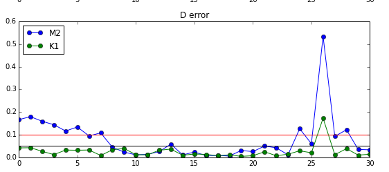

Tidal comparisons
===========================================

Harmonics comparisons
-------------------------------------------

Water level
************

* All 8 components (M2, K1, O1, S2, P1, N2, Q1 and K2) computed by NEMO can be compared to harmonics from water level (calculated by Mike Foreman, Institute of Ocean Sciences and for M2 and K1 shown in his papers Foreman et al (1995, 2000)).

* Jupyter Notebook: `Analysis8Components.ipynb`_

.. _Analysis8Components.ipynb: http://nbviewer.ipython.org/urls/bitbucket.org/salishsea/analysis/raw/tip/compare_tides/Analysis8Components.ipynb

* This notebook focuses on a set of 31 stations that form a line from Juan de Fuca up through the Strait of Georgia into Discovery Passage and the North End of the Model.

.. _Station_map-image:

* Tidal harmonics are calculated using a least squares fit to the last 37.5 days of a 40-day model run without wind.  Scatter plots comparing the measured and modelled harmonics are made, example:

.. _K1scatter-image:

* The notebook calculates differences (as described by Foreman et al (1995)) for M2 and K1 and saves them to a text file and plots them.

.. _fit-image:

* This image clearly shows that other than at Seymour Narrows (station 26) the model K1 tide is within 5 cm of the measured tide.  However, the M2 tide is poor not only in the Discovery Passage area (stations 24-28) but also in the Strait of Juan de Fuca.  The latter is a choice.  The model was tuned to match in Strait of Georgia (SoG).  Due to over-prediction of the amphidrome near Victoria the model cannot reproduce both the M2 tide in Juan de Fuca and in SoG at the same time.  This error is the only significant error with the tides.  We think it is due to over mixing in the Gulf/San Juan Island region and are working on that.

.. _alltidecomparison:

In the above figure, green circles represent errors less than 5 cm, yellow circles represent errors between 5 and 10 cm and red circles mark errors greater than 10 cm.

Currents
************

M2 and K1
+++++++++++++++++++

* M2 and K1 tidal ellipses calculated from current measurements at the ONC nodes have been compared to the model output.  The agreement is generally good, but the model currents are somewhat lower.

* M2 and K1 tidal ellipses calculated from CODAR current measurements have also been compared to the model output.  The agreement is generally good, but the model currents are somewhat higher!

* Drifter measurements to be made in Sep 2014 will also be used to compare to the modelled tidal ellipses.

